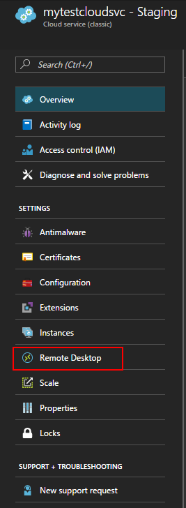

# Enable Remote Desktop Connection for a Role in Azure Cloud Services (classic)

[!INCLUDE [Cloud Services (classic) deprecation announcement](includes/deprecation-announcement.md)]

> [!div class="op_single_selector"]
> * [Azure portal](cloud-services-role-enable-remote-desktop-new-portal.md)
> * [PowerShell](cloud-services-role-enable-remote-desktop-powershell.md)
> * [Visual Studio](cloud-services-role-enable-remote-desktop-visual-studio.md)

Remote Desktop enables you to access the desktop of a role running in Azure. You can use a Remote Desktop connection to troubleshoot and diagnose problems with your application while it is running.

You can enable a Remote Desktop connection in your role during development by including the Remote Desktop modules in your service definition or you can choose to enable Remote Desktop through the Remote Desktop Extension. The preferred approach is to use the Remote Desktop extension as you can enable Remote Desktop even after the application is deployed without having to redeploy your application.

## Configure Remote Desktop from the Azure portal

The Azure portal uses the Remote Desktop Extension approach so you can enable Remote Desktop even after the application is deployed. The **Remote Desktop** settings for your cloud service allows you to enable Remote Desktop, change the local Administrator account used to connect to the virtual machines, the certificate used in authentication and set the expiration date.

1. Click **Cloud Services**, select the name of the cloud service, and then select **Remote Desktop**.

    

2. Choose whether you want to enable Remote Desktop for an individual role or for all roles, then change the value of the switcher to **Enabled**.

3. Fill in the required fields for user name, password, expiry, and certificate.

    

   > [!WARNING]
   > All role instances will be restarted when you first enable Remote Desktop and select **OK** (checkmark). To prevent a reboot, the certificate used to encrypt the password must be installed on the role. To prevent a restart, [upload a certificate for the cloud service](cloud-services-configure-ssl-certificate-portal.md#step-3-upload-a-certificate) and then return to this dialog.

4. In **Roles**, select the role you want to update or select **All** for all roles.

5. When you finish your configuration updates, select **Save**. It will take a few moments before your role instances are ready to receive connections.

## Remote into role instances

Once Remote Desktop is enabled on the roles, you can initiate a connection directly from the Azure portal:

1. Click **Instances** to open the **Instances** settings.
2. Select a role instance that has Remote Desktop configured.
3. Click **Connect** to download an RDP file for the role instance.

    

4. Click **Open** and then **Connect** to start the Remote Desktop connection.

>[!NOTE]
> If your cloud service is sitting behind an NSG, you may need to create rules that allow traffic on ports **3389** and **20000**.  Remote Desktop uses port **3389**.  Cloud Service instances are load balanced, so you can't directly control which instance to connect to.  The *RemoteForwarder* and *RemoteAccess* agents manage RDP traffic and allow the client to send an RDP cookie and specify an individual instance to connect to.  The *RemoteForwarder* and *RemoteAccess* agents require that port **20000** is open, which may be blocked if you have an NSG.

## Additional resources

[How to Configure Cloud Services](cloud-services-how-to-configure-portal.md)
