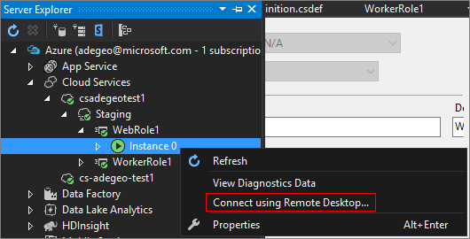

<properties 
pageTitle="Enable Remote Desktop Connection for a Role in Azure Cloud Services" 
description="How to configure your azure cloud service application to allow remote desktop connections" 
services="cloud-services" 
documentationCenter="" 
authors="sbtron" 
manager="timlt" 
editor=""/>
<tags 
ms.service="cloud-services" 
ms.workload="tbd" 
ms.tgt_pltfrm="na" 
ms.devlang="na" 
ms.topic="article" 
ms.date="02/17/2016" 
ms.author="saurabh"/>

# Enable Remote Desktop Connection for a Role in Azure Cloud Services

>[AZURE.SELECTOR]
- [Azure classic portal](cloud-services-role-enable-remote-desktop.md)
- [PowerShell](cloud-services-role-enable-remote-desktop-powershell.md)
- [Visual Studio](../vs-azure-tools-remote-desktop-roles.md)


Remote Desktop enables you to access the desktop of a role running in Azure. You can use a Remote Desktop connection to troubleshoot and diagnose problems with your application while it is running. 

You can enable a Remote Desktop connection in your role during development by including the Remote Desktop modules in your service definition or you can choose to enable Remote Desktop through the Remote Desktop Extension. The preferred approach is to use the Remote Desktop extension as you can enable Remote Desktop even after the application is deployed without having to redeploy your application. 


## Configure Remote Desktop from the Azure classic portal
The Azure classic portal uses the Remote Desktop Extension approach so you can enable Remote Desktop even after the application is deployed. The **Configure** page for your cloud service allows you to enable Remote Desktop, change the local Administrator account used to connect to the virtual machines, the certificate used in authentication and set the expiration date. 


1. Click **Cloud Services**, click the name of the cloud service, and then click **Configure**.

2. Click **Remote**.
    
    
    
    > [AZURE.WARNING] All role instances will be restarted when you first enable Remote Desktop and click OK (checkmark). To prevent a reboot, the certificate used to encrypt the password must be installed on the role. To prevent a restart, [upload a certificate for the cloud service](cloud-services-how-to-create-deploy/#how-to-upload-a-certificate-for-a-cloud-service) and then return to this dialog.
    

3. In **Roles**, select the role you want to update or select **All** for all roles.

4. Make any of the following changes:
    
    - To enable Remote Desktop, select the **Enable Remote Desktop** check box. To disable Remote Desktop, clear the check box.
    
    - Create an account to use in Remote Desktop connections to the role instances.
    
    - Update the password for the existing account.
    
    - Select an uploaded certificate to use for authentication (upload the certificate using **Upload** on the **Certificates** page) or create a new certificate. 
    
    - Change the expiration date for the Remote Desktop configuration.

5. When you finish your configuration updates, click **OK** (checkmark).


## Remote into role instances
Once Remote Desktop is enabled on the roles you can remote into a role instance through various tools.

To connect to a role instance from the Azure classic portal:
    
  1.   Click **Instances** to open the **Instances** page.
  2.   Select a role instance that has Remote Desktop configured.
  3.   Click **Connect**, and follow the instructions to open the desktop. 
  4.   Click **Open** and then **Connect** to start the Remote Desktop connection. 


### Use Visual Studio to remote into a role instance

In Visual Studio, Server Explorer:

1. Expand the **Azure\\Cloud Services\\[cloud service name]** node.
2. Expand either **Staging** or **Production**.
3. Expand the individual role.
4. Right-click one of the role instances, click **Connect using Remote Desktop...**, and then enter the user name and password. 




### Use PowerShell to get the RDP file
You can use the [Get-AzureRemoteDesktopFile](https://msdn.microsoft.com/library/azure/dn495261.aspx) cmdlet to retrieve the RDP file. You can then use the RDP file with Remote Desktop Connection to access the cloud service.

### Programmatically download the RDP file through the Service Management REST API
You can use the [Download RDP File](https://msdn.microsoft.com/library/jj157183.aspx) REST operation to download the RDP file. 


## To configure Remote Desktop in the service definition file

This method allows you to enable Remote Desktop for the application during development. This approach requires encrypted passwords be stored in your service configuration file and any updates to the remote desktop configuration would require a redeployment of the application. If you want to avoid these downsides you should use the remote desktop extension based approach described above.  

You can use Visual Studio to [enable a remote desktop connection](../vs-azure-tools-remote-desktop-roles.md) using the service definition file approach.  
The steps below describe the changes needed to the service model files to enable remote desktop. Visual Studio will automatically makes these changes when publishing.

### Set up the connection in the service model 
Use the **Imports** element to import the **RemoteAccess** module and the **RemoteForwarder** module to the [ServiceDefinition.csdef](cloud-services-model-and-package.md#csdef) file.

The service definition file should be similar to the following example with the `<Imports>` element added.

```xml
<ServiceDefinition name="<name-of-cloud-service>" xmlns="http://schemas.microsoft.com/ServiceHosting/2008/10/ServiceDefinition" schemaVersion="2013-03.2.0">
    <WebRole name="WebRole1" vmsize="Small">
        <Sites>
            <Site name="Web">
                <Bindings>
                    <Binding name="Endpoint1" endpointName="Endpoint1" />
                </Bindings>
            </Site>
        </Sites>
        <Endpoints>
            <InputEndpoint name="Endpoint1" protocol="http" port="80" />
        </Endpoints>
        <Imports>
            <Import moduleName="Diagnostics" />
            <Import moduleName="RemoteAccess" />
            <Import moduleName="RemoteForwarder" />
        </Imports>
    </WebRole>
</ServiceDefinition>
```
The [ServiceConfiguration.cscfg](cloud-services-model-and-package.md#cscfg) file should be similar to the following example, note the `<ConfigurationSettings>` and `<Certificates>` elements. The Certificate specified must be [uploaded to the cloud service](../cloud-services-how-to-create-deploy.md#how-to-upload-a-certificate-for-a-cloud-service).

```xml
<?xml version="1.0" encoding="utf-8"?>
<ServiceConfiguration serviceName="<name-of-cloud-service>" xmlns="http://schemas.microsoft.com/ServiceHosting/2008/10/ServiceConfiguration" osFamily="3" osVersion="*" schemaVersion="2013-03.2.0">
    <Role name="WebRole1">
        <Instances count="2" />
        <ConfigurationSettings>
            <Setting name="Microsoft.WindowsAzure.Plugins.RemoteAccess.Enabled" value="true" />
            <Setting name="Microsoft.WindowsAzure.Plugins.RemoteAccess.AccountUsername" value="[name-of-user-account]" />
            <Setting name="Microsoft.WindowsAzure.Plugins.RemoteAccess.AccountEncryptedPassword" value="[base-64-encrypted-user-password]" />
            <Setting name="Microsoft.WindowsAzure.Plugins.RemoteAccess.AccountExpiration" value="[certificate-expiration]" />
            <Setting name="Microsoft.WindowsAzure.Plugins.RemoteForwarder.Enabled" value="true" />
        </ConfigurationSettings>
        <Certificates>
            <Certificate name="Microsoft.WindowsAzure.Plugins.RemoteAccess.PasswordEncryption" thumbprint="[certificate-thumbprint]" thumbprintAlgorithm="sha1" />
        </Certificates>
    </Role>
</ServiceConfiguration>
```


## Additional Resources

[How to Configure Cloud Services](cloud-services-how-to-configure.md)