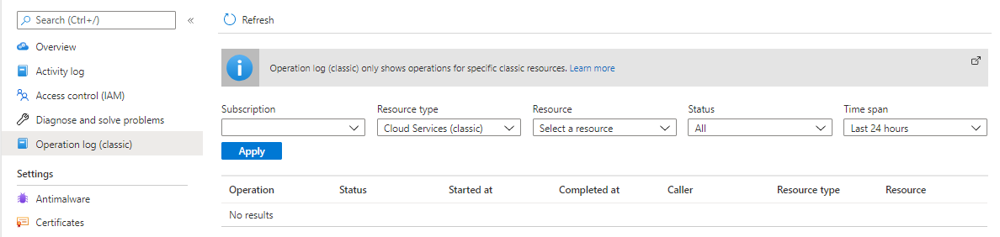

# Troubleshoot ConstrainedAllocationFailed when deploying a Cloud service (classic) to Azure

In this article, you'll troubleshoot allocation failures where Azure Cloud services (classic) can't deploy because of allocation constraints.

When you deploy instances to a Cloud service (classic) or add new web or worker role instances, Microsoft Azure allocates compute resources.

You may occasionally receive errors during these operations even before you reach the Azure subscription limit.

> [!TIP]
> The information may also be useful when you plan the deployment of your services.

## Symptom

In Azure portal, navigate to your Cloud service (classic) and in the sidebar select *Operation log (classic)* to view the logs.

When you're inspecting the logs of your Cloud service (classic), you'll see the following exception:

|Exception Type  |Error Message  |
|---------|---------|
|ConstrainedAllocationFailed     |Azure operation '`{Operation ID}`' failed with code Compute.ConstrainedAllocationFailed. Details: Allocation failed; unable to satisfy constraints in request. The requested new service deployment is bound to an Affinity Group, or it targets a Virtual Network, or there is an existing deployment under this hosted service. Any of these conditions constrains the new deployment to specific Azure resources. Retry later or try reducing the VM size or number of role instances. Alternatively, if possible, remove the aforementioned constraints or try deploying to a different region.|

## Cause

When the first instance is deployed to a Cloud service (in either staging or production), that Cloud service gets pinned to a cluster.

Over time, the resources in this cluster may become fully utilized. If a Cloud service (classic) makes an allocation request for more resources when insufficient resources are available in the pinned cluster, the request will result in an allocation failure. For more information, see the [allocation failure common issues](cloud-services-allocation-failures.md#common-issues).

## Solution

Existing cloud services are *pinned* to a cluster. Any further deployments for the Cloud service (classic) will happen in the same cluster.

When you experience an allocation error in this scenario, the recommended course of action is to redeploy to a new Cloud service (classic) (and update the *CNAME*).

> [!TIP]
> This solution is likely to be most successful as it allows the platform to choose from all clusters in that region.

> [!NOTE]
> This solution should incur zero downtime.

1. Deploy the workload to a new Cloud service (classic).
    - See the [How to create and deploy a Cloud service (classic)](cloud-services-how-to-create-deploy-portal.md) guide for further instructions.

    > [!WARNING]
    > If you do not want to lose the IP address associated with this deployment slot, you can use [Solution 3 - Keep the IP address](cloud-services-allocation-failures.md#solutions).

1. Update the *CNAME* or *A* record to point traffic to the new Cloud service (classic).
    - See the [Configuring a custom domain name for an Azure Cloud service (classic)](cloud-services-custom-domain-name-portal.md#understand-cname-and-a-records) guide for further instructions.

1. Once zero traffic is going to the old site, you can delete the old Cloud service (classic).
    - See the [Delete deployments and a Cloud service (classic)](cloud-services-how-to-manage-portal.md#delete-deployments-and-a-cloud-service) guide for further instructions.
    - To see the network traffic in your Cloud service (classic), see the [Introduction to Cloud service (classic) monitoring](cloud-services-how-to-monitor.md).

See [Troubleshooting Cloud service (classic) allocation failures | Microsoft Docs](cloud-services-allocation-failures.md#common-issues) for further remediation steps.

## Next steps

For more allocation failure solutions and background information:

> [!div class="nextstepaction"]
> [Allocation failures - Cloud service (classic)](cloud-services-allocation-failures.md)

If your Azure issue isn't addressed in this article, visit the Azure forums on [MSDN and Stack Overflow](https://azure.microsoft.com/support/forums/). You can post your issue in these forums, or post to [@AzureSupport on Twitter](https://twitter.com/AzureSupport). You also can submit an Azure support request. To submit a support request, on the [Azure support](https://azure.microsoft.com/support/options/) page, select *Get support*.