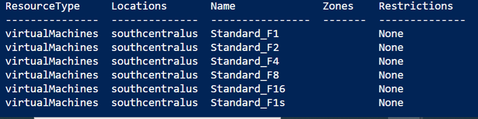

# Troubleshoot ConstrainedAllocationFailed when deploying a cloud service to Azure

In this article, you'll troubleshoot allocation failures where Azure Cloud Services can't deploy because of constraints.

Microsoft Azure allocates when you are:

- Upgrading cloud services instances

- Adding new web or worker role instances

- Deploying instances to a cloud service

You may occasionally receive errors during these operations even before you reach the Azure subscription limit.

> [!TIP]
> The information may also be useful when you plan the deployment of your services.

## Symptom

In Azure portal, navigate to your cloud service and in the sidebar select *Operation logs (classic)* to view the logs.

When you're inspecting the logs of your cloud service, you'll see the following exception:

|Exception Type  |Error Message  |
|---------|---------|
|ConstrainedAllocationFailed     |Azure operation '`{Operation ID}`' failed with code Compute.ConstrainedAllocationFailed. Details: Allocation failed; unable to satisfy constraints in request. The requested new service deployment is bound to an Affinity Group, or it targets a Virtual Network, or there is an existing deployment under this hosted service. Any of these conditions constrains the new deployment to specific Azure resources. Retry later or try reducing the VM size or number of role instances. Alternatively, if possible, remove the aforementioned constraints or try deploying to a different region.|

## Cause

There's a capacity issue with the region or cluster that you're deploying to. It occurs when the resource SKU you've selected isn't available for the location specified.

> [!NOTE]
> When the first node of a cloud service is deployed, it is *pinned* to a resource pool. A resource pool may be a single cluster, or a group of clusters.
>
> Over time, the resources in this resource pool may become fully utilized. If a cloud service makes an allocation request for additional resources when insufficient resources are available in the pinned resource pool, the request will result in an [allocation failure](cloud-services-allocation-failures.md).

## Solution

In this scenario, you should select a different region or SKU to deploy your cloud service to. Before deploying or upgrading your cloud service, you can determine which SKUs are available in a region or availability zone. Follow the [Azure CLI](#list-skus-in-region-using-azure-cli), [PowerShell](#list-skus-in-region-using-powershell), or [REST API](#list-skus-in-region-using-rest-api) processes below.

### List SKUs in region using Azure CLI

You can use the [az vm list-skus](https://docs.microsoft.com/cli/azure/vm.html#az_vm_list_skus) command.

- Use the `--location` parameter to filter output to location you're using.
- Use the `--size` parameter to search by a partial size name.
- For more information, see the [Resolve error for SKU not available](../azure-resource-manager/templates/error-sku-not-available.md#solution-2---azure-cli) guide.

    **For example:**

    ```azurecli
    az vm list-skus --location southcentralus --size Standard_F --output table
    ```

    **Example results:**
    

#### List SKUs in region using PowerShell

You can use the [Get-AzComputeResourceSku](https://docs.microsoft.com/powershell/module/az.compute/get-azcomputeresourcesku) command.

- Filter the results by location.
- You must have the latest version of PowerShell for this command.
- For more information, see the [Resolve error for SKU not available](../azure-resource-manager/templates/error-sku-not-available.md#solution-1---powershell) guide.

**For example:**

```azurepowershell
Get-AzComputeResourceSku | where {$_.Locations -icontains "centralus"}
```

**Some other useful commands:**

Filter out the locations that contain size (Standard_DS14_v2):

```azurepowershell
Get-AzComputeResourceSku | where {$_.Locations.Contains("centralus") -and $_.ResourceType.Contains("virtualMachines") -and $_.Name.Contains("Standard_DS14_v2")}
```

Filter out all the locations that contain size (V3):

```azurepowershell
Get-AzComputeResourceSku | where {$_.Locations.Contains("centralus") -and $_.ResourceType.Contains("virtualMachines") -and $_.Name.Contains("v3")} | fc
```

#### List SKUs in region using REST API

You can use the [Resource Skus - List](https://docs.microsoft.com/rest/api/compute/resourceskus/list) operation. It returns available SKUs and regions in the following format:

```json
{
  "value": [
    {
      "resourceType": "virtualMachines",
      "name": "Standard_A0",
      "tier": "Standard",
      "size": "A0",
      "locations": [
        "eastus"
      ],
      "restrictions": []
    },
    {
      "resourceType": "virtualMachines",
      "name": "Standard_A1",
      "tier": "Standard",
      "size": "A1",
      "locations": [
        "eastus"
      ],
      "restrictions": []
    },
        The rest of your file is located here...
        ...
        ...
  ]
}
    
```

## Next steps

For more allocation failure solutions and to better understand how they're generated:

> [!div class="nextstepaction"]
> [Allocation failures (cloud services)](cloud-services-allocation-failures.md)

If your Azure issue isn't addressed in this article, visit the Azure forums on [MSDN and Stack Overflow](https://azure.microsoft.com/support/forums/). You can post your issue in these forums, or post to [@AzureSupport on Twitter](https://twitter.com/AzureSupport). You also can submit an Azure support request. To submit a support request, on the [Azure support](https://azure.microsoft.com/support/options/) page, select *Get support*.
