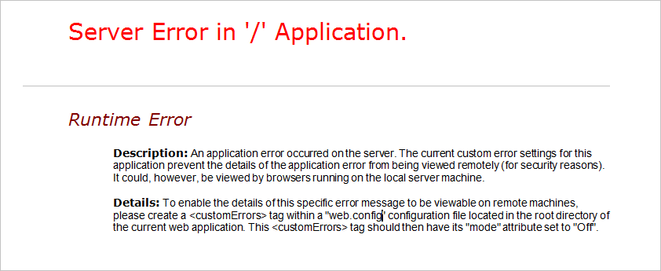

# Troubleshoot Cloud Service roles that fail to start
Here are some common problems and solutions related to Azure Cloud Services roles that fail to start.

[!INCLUDE [support-disclaimer](../../includes/support-disclaimer.md)]

## Missing DLLs or dependencies
Unresponsive roles and roles that are cycling between **Initializing**, **Busy**, and **Stopping** states can be caused by missing DLLs or assemblies.

Symptoms of missing DLLs or assemblies can be:

* Your role instance is cycling through **Initializing**, **Busy**, and **Stopping** states.
* Your role instance has moved to **Ready** but if you navigate to your web application, the page does not appear.

There are several recommended methods for investigating these issues.

## Diagnose missing DLL issues in a web role
When you navigate to a website that is deployed in a web role, and the browser displays a server error similar to the following, it may indicate that a DLL is missing.



## Diagnose issues by turning off custom errors
More complete error information can be viewed by configuring the web.config for the web role to set the custom error mode to Off and redeploying the service.

To view more complete errors without using Remote Desktop:

1. Open the solution in Microsoft Visual Studio.
2. In the **Solution Explorer**, locate the web.config file and open it.
3. In the web.config file, locate the system.web section and add the following line:

    ```xml
    <customErrors mode="Off" />
    ```
4. Save the file.
5. Repackage and redeploy the service.

Once the service is redeployed, you will see an error message with the name of the missing assembly or DLL.

## Diagnose issues by viewing the error remotely
You can use Remote Desktop to access the role and view more complete error information remotely. Use the following steps to view the errors by using Remote Desktop:

1. Ensure that Azure SDK 1.3 or later is installed.
2. During the deployment of the solution by using Visual Studio, enable Remote Desktop. For more information, see [Enable Remote Desktop Connection for a Role in Azure Cloud Services using Visual Studio](cloud-services-role-enable-remote-desktop-visual-studio.md).
3. In the Microsoft Azure portal, once the instance shows a status of **Ready**, remote into the instance. For more information on using the remote desktop with Cloud Services, see [Remote into role instances](cloud-services-role-enable-remote-desktop-new-portal.md#remote-into-role-instances).
5. Sign in to the virtual machine by using the credentials that were specified during the Remote Desktop configuration.
6. Open a command window.
7. Type `IPconfig`.
8. Note the IPV4 Address value.
9. Open Internet Explorer.
10. Type the address and the name of the web application. For example, `http://<IPV4 Address>/default.aspx`.

Navigating to the website will now return more explicit error messages:

* Server Error in '/' Application.
* Description: An unhandled exception occurred during the execution of the current web request. Please review the stack trace for more information about the error and where it originated in the code.
* Exception Details: System.IO.FIleNotFoundException: Could not load file or assembly ‘Microsoft.WindowsAzure.StorageClient, Version=1.1.0.0, Culture=neutral, PublicKeyToken=31bf856ad364e35’ or one of its dependencies. The system cannot find the file specified.

For example:


## Diagnose issues by using the compute emulator
You can use the Microsoft Azure compute emulator to diagnose and troubleshoot issues of missing dependencies and web.config errors.

For best results in using this method of diagnosis, you should use a computer or virtual machine that has a clean installation of Windows. To best simulate the Azure environment, use Windows Server 2008 R2 x64.

1. Install the standalone version of the [Azure SDK](https://azure.microsoft.com/downloads/).
2. On the development machine, build the cloud service project.
3. In Windows Explorer, navigate to the bin\debug folder of the cloud service project.
4. Copy the .csx folder and .cscfg file to the computer that you are using to debug the issues.
5. On the clean machine, open an Azure SDK Command Prompt window and type `csrun.exe /devstore:start`.
6. At the command prompt, type `run csrun <path to .csx folder> <path to .cscfg file> /launchBrowser`.
7. When the role starts, you will see detailed error information in Internet Explorer. You can also use standard Windows troubleshooting tools to further diagnose the problem.

## Diagnose issues by using IntelliTrace
For worker and web roles that use .NET Framework 4, you can use [IntelliTrace](/visualstudio/debugger/intellitrace), which is available in Microsoft Visual Studio Enterprise.

Follow these steps to deploy the service with IntelliTrace enabled:

1. Confirm that Azure SDK 1.3 or later is installed.
2. Deploy the solution by using Visual Studio. During deployment, check the **Enable IntelliTrace for .NET 4 roles** check box.
3. Once the instance starts, open the **Server Explorer**.
4. Expand the **Azure\\Cloud Services** node and locate the deployment.
5. Expand the deployment until you see the role instances. Right-click on one of the instances.
6. Choose **View IntelliTrace logs**. The **IntelliTrace Summary** will open.
7. Locate the exceptions section of the summary. If there are exceptions, the section will be labeled **Exception Data**.
8. Expand the **Exception Data** and look for **System.IO.FileNotFoundException** errors similar to the following:


## Address missing DLLs and assemblies
To address missing DLL and assembly errors, follow these steps:

1. Open the solution in Visual Studio.
2. In **Solution Explorer**, open the **References** folder.
3. Click the assembly identified in the error.
4. In the **Properties** pane, locate **Copy Local property** and set the value to **True**.
5. Redeploy the cloud service.

Once you have verified that all errors have been corrected, you can deploy the service without checking the **Enable IntelliTrace for .NET 4 roles** check box.

## Next steps
View more [troubleshooting articles](https://azure.microsoft.com/documentation/articles/?tag=top-support-issue&product=cloud-services) for cloud services.

To learn how to troubleshoot cloud service role issues by using Azure PaaS computer diagnostics data, see [Kevin Williamson's blog series](https://blogs.msdn.com/b/kwill/archive/2013/08/09/windows-azure-paas-compute-diagnostics-data.aspx).
