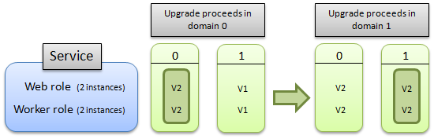
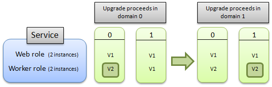
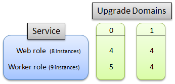

# How to update a cloud service

Updating a cloud service, including both its roles and guest OS, is a three step process. First, the binaries and configuration files for the new cloud service or OS version must be uploaded. Next, Azure reserves compute and network resources for the cloud service based on the requirements of the new cloud service version. Finally, Azure performs a rolling upgrade to incrementally update the tenant to the new version or guest OS, while preserving your availability. This article discusses the details of this last step – the rolling upgrade.

## Update an Azure Service
Azure organizes your role instances into logical groupings called upgrade domains (UD). Upgrade domains (UD) are logical sets of role instances that are updated as a group.  Azure updates a cloud service one UD at a time, which allows instances in other UDs to continue serving traffic.

The default number of upgrade domains is 5. You can specify a different number of upgrade domains by including the upgradeDomainCount attribute in the service’s definition file (.csdef). For more information about the upgradeDomainCount attribute, see [Azure Cloud Services Definition Schema (.csdef File)](https://docs.microsoft.com/azure/cloud-services/schema-csdef-file).

When you perform an in-place update of one or more roles in your service, Azure updates sets of role instances according to the upgrade domain to which they belong. Azure updates all of the instances in a given upgrade domain – stopping them, updating them, bringing them back on-line – then moves onto the next domain. By stopping only the instances running in the current upgrade domain, Azure makes sure that an update occurs with the least possible impact to the running service. For more information, see [How the update proceeds](#howanupgradeproceeds) later in this article.

> [!NOTE]
> While the terms **update** and **upgrade** have slightly different meaning in the context Azure, they can be used interchangeably for the processes and descriptions of the features in this document.
>
>

Your service must define at least two instances of a role for that role to be updated in-place without downtime. If the service consists of only one instance of one role, your service will be unavailable until the in-place update has finished.

This topic covers the following information about Azure updates:

* [Allowed service changes during an update](#AllowedChanges)
* [How an upgrade proceeds](#howanupgradeproceeds)
* [Rollback of an update](#RollbackofanUpdate)
* [Initiating multiple mutating operations on an ongoing deployment](#multiplemutatingoperations)
* [Distribution of roles across upgrade domains](#distributiondfroles)

## Allowed service changes during an update
The following table shows the allowed changes to a service during an update:

| Changes permitted to hosting, services, and roles | In-place update | Staged (VIP swap) | Delete and re-deploy |
| --- | --- | --- | --- |
| Operating system version |Yes |Yes |Yes |
| .NET trust level |Yes |Yes |Yes |
| Virtual machine size1 |Yes2 |Yes |Yes |
| Local storage settings |Increase only2 |Yes |Yes |
| Add or remove roles in a service |Yes |Yes |Yes |
| Number of instances of a particular role |Yes |Yes |Yes |
| Number or type of endpoints for a service |Yes2 |No |Yes |
| Names and values of configuration settings |Yes |Yes |Yes |
| Values (but not names) of configuration settings |Yes |Yes |Yes |
| Add new certificates |Yes |Yes |Yes |
| Change existing certificates |Yes |Yes |Yes |
| Deploy new code |Yes |Yes |Yes |

1 Size change limited to the subset of sizes available for the cloud service.

2 Requires Azure SDK 1.5 or later versions.

> [!WARNING]
> Changing the virtual machine size will destroy local data.
>
>

The following items are not supported during an update:

* Changing the name of a role. Remove and then add the role with the new name.
* Changing of the Upgrade Domain count.
* Decreasing the size of the local resources.

If you are making other updates to your service's definition, such as decreasing the size of local resource, you must perform a VIP swap update instead. For more information, see [Swap Deployment](/previous-versions/azure/reference/ee460814(v=azure.100)).

## How an upgrade proceeds
You can decide whether you want to update all of the roles in your service or a single role in the service. In either case, all instances of each role that is being upgraded and belong to the first upgrade domain are stopped, upgraded, and brought back online. Once they are back online, the instances in the second upgrade domain are stopped, upgraded, and brought back online. A cloud service can have at most one upgrade active at a time. The upgrade is always performed against the latest version of the cloud service.

The following diagram illustrates how the upgrade proceeds if you are upgrading all of the roles in the service:

This next diagram illustrates how the update proceeds if you are upgrading only a single role:

  

During an automatic update, the Azure Fabric Controller periodically evaluates the health of the cloud service to determine when it’s safe to walk the next UD. This health evaluation is performed on a per-role basis and considers only instances in the latest version (i.e. instances from UDs that have already been walked). It verifies that a minimum number of role instances, for each role, have achieved a satisfactory terminal state.

### Role Instance Start Timeout
The Fabric Controller will wait 30 minutes for each role instance to reach a Started state. If the timeout duration elapses, the Fabric Controller will continue walking to the next role instance.

### Impact to drive data during Cloud Service upgrades

When upgrading a service from a single instance to multiple instances your service will be brought down while the upgrade is performed due to the way Azure upgrades services. The service level agreement guaranteeing service availability only applies to services that are deployed with more than one instance. The following list describes how the data on each drive is affected by each Azure service upgrade scenario:

|Scenario|C Drive|D Drive|E Drive|
|--------|-------|-------|-------|
|VM reboot|Preserved|Preserved|Preserved|
|Portal reboot|Preserved|Preserved|Destroyed|
|Portal reimage|Preserved|Destroyed|Destroyed|
|In-Place Upgrade|Preserved|Preserved|Destroyed|
|Node migration|Destroyed|Destroyed|Destroyed|

Note that, in the above list, the E: drive represents the role’s root drive, and should not be hard-coded. Instead, use the **%RoleRoot%** environment variable to represent the drive.

To minimize the downtime when upgrading a single-instance service, deploy a new multi-instance service to the staging server and perform a VIP swap.

## Rollback of an update
Azure provides flexibility in managing services during an update by letting you initiate additional operations on a service, after the initial update request is accepted by the Azure Fabric Controller. A rollback can only be performed when an update (configuration change) or upgrade is in the **in progress** state on the deployment. An update or upgrade is considered to be in-progress as long as there is at least one instance of the service which has not yet been updated to the new version. To test whether a rollback is allowed, check the value of the RollbackAllowed flag, returned by [Get Deployment](/previous-versions/azure/reference/ee460804(v=azure.100)) and [Get Cloud Service Properties](/previous-versions/azure/reference/ee460806(v=azure.100)) operations, is set to true.

> [!NOTE]
> It only makes sense to call Rollback on an **in-place** update or upgrade because VIP swap upgrades involve replacing one entire running instance of your service with another.
>
>

Rollback of an in-progress update has the following effects on the deployment:

* Any role instances which had not yet been updated or upgraded to the new version are not updated or upgraded, because those instances are already running the target version of the service.
* Any role instances which had already been updated or upgraded to the new version of the service package (\*.cspkg) file or the service configuration (\*.cscfg) file (or both files) are reverted to the pre-upgrade version of these files.

This functionally is provided by the following features:

* The [Rollback Update Or Upgrade](/previous-versions/azure/reference/hh403977(v=azure.100)) operation, which can be called on a configuration update (triggered by calling [Change Deployment Configuration](/previous-versions/azure/reference/ee460809(v=azure.100))) or an upgrade (triggered by calling [Upgrade Deployment](/previous-versions/azure/reference/ee460793(v=azure.100))) as long as there is at least one instance in the service which has not yet been updated to the new version.
* The Locked element and the RollbackAllowed element, which are returned as part of the response body of the [Get Deployment](/previous-versions/azure/reference/ee460804(v=azure.100)) and [Get Cloud Service Properties](/previous-versions/azure/reference/ee460806(v=azure.100)) operations:

  1. The Locked element allows you to detect when a mutating operation can be invoked on a given deployment.
  2. The RollbackAllowed element allows you to detect when the [Rollback Update Or Upgrade](/previous-versions/azure/reference/hh403977(v=azure.100)) operation can be called on a given deployment.

  In order to perform a rollback, you do not have to check both the Locked and the RollbackAllowed elements. It suffices to confirm that RollbackAllowed is set to true. These elements are only returned if these methods are invoked by using the request header set to “x-ms-version: 2011-10-01” or a later version. For more information about versioning headers, see [Service Management Versioning](/previous-versions/azure/gg592580(v=azure.100)).

There are some situations where a rollback of an update or upgrade is not supported, these are as follows:

* Reduction in local resources - If the update increases the local resources for a role the Azure platform does not allow rolling back.
* Quota limitations - If the update was a scale down operation you may no longer have sufficient compute quota to complete the rollback operation. Each Azure subscription has a quota associated with it that specifies the maximum number of cores which can be consumed by all hosted services that belong to that subscription. If performing a rollback of a given update would put your subscription over quota then that a rollback will not be enabled.
* Race condition - If the initial update has completed, a rollback is not possible.

An example of when the rollback of an update might be useful is if you are using the [Upgrade Deployment](/previous-versions/azure/reference/ee460793(v=azure.100)) operation in manual mode to control the rate at which a major in-place upgrade to your Azure hosted service is rolled out.

During the rollout of the upgrade you call [Upgrade Deployment](/previous-versions/azure/reference/ee460793(v=azure.100)) in manual mode and begin to walk upgrade domains. If at some point, as you monitor the upgrade, you note some role instances in the first upgrade domains that you examine have become unresponsive, you can call the [Rollback Update Or Upgrade](/previous-versions/azure/reference/hh403977(v=azure.100)) operation on the deployment, which will leave untouched the instances which had not yet been upgraded and rollback instances which had been upgraded to the previous service package and configuration.

## Initiating multiple mutating operations on an ongoing deployment
In some cases you may want to initiate multiple simultaneous mutating operations on an ongoing deployment. For example, you may perform a service update and, while that update is being rolled out across your service, you want to make some change, e.g. to roll the update back, apply a different update, or even delete the deployment. A case in which this might be necessary is if a service upgrade contains buggy code which causes an upgraded role instance to repeatedly crash. In this case, the Azure Fabric Controller will not be able to make progress in applying that upgrade because an insufficient number of instances in the upgraded domain are healthy. This state is referred to as a *stuck deployment*. You can unstick the deployment by rolling back the update or applying a fresh update over top of the failing one.

Once the initial request to update or upgrade the service has been received by the Azure Fabric Controller, you can start subsequent mutating operations. That is, you do not have to wait for the initial operation to complete before you can start another mutating operation.

Initiating a second update operation while the first update is ongoing will perform similar to the rollback operation. If the second update is in automatic mode, the first upgrade domain will be upgraded immediately, possibly leading to instances from multiple upgrade domains being offline at the same point in time.

The mutating operations are as follows: [Change Deployment Configuration](/previous-versions/azure/reference/ee460809(v=azure.100)), [Upgrade Deployment](/previous-versions/azure/reference/ee460793(v=azure.100)), [Update Deployment Status](/previous-versions/azure/reference/ee460808(v=azure.100)), [Delete Deployment](/previous-versions/azure/reference/ee460815(v=azure.100)), and [Rollback Update Or Upgrade](/previous-versions/azure/reference/hh403977(v=azure.100)).

Two operations, [Get Deployment](/previous-versions/azure/reference/ee460804(v=azure.100)) and [Get Cloud Service Properties](/previous-versions/azure/reference/ee460806(v=azure.100)), return the Locked flag which can be examined to determine whether a mutating operation can be invoked on a given deployment.

In order to call the version of these methods which returns the Locked flag, you must set request header to “x-ms-version: 2011-10-01” or a later. For more information about versioning headers, see [Service Management Versioning](/previous-versions/azure/gg592580(v=azure.100)).

## Distribution of roles across upgrade domains
Azure distributes instances of a role evenly across a set number of upgrade domains, which can be configured as part of the service definition (.csdef) file. The max number of upgrade domains is 20 and the default is 5. For more information about how to modify the service definition file, see [Azure Service Definition Schema (.csdef File)](cloud-services-model-and-package.md#csdef).

For example, if your role has ten instances, by default each upgrade domain contains two instances. If your role has 14 instances, then four of the upgrade domains contain three instances, and a fifth domain contains two.

Upgrade domains are identified with a zero-based index: the first upgrade domain has an ID of 0, and the second upgrade domain has an ID of 1, and so on.

The following diagram illustrates how a service than contains two roles are distributed when the service defines two upgrade domains. The service is running eight instances of the web role and nine instances of the worker role.

> [!NOTE]
> Note that Azure controls how instances are allocated across upgrade domains. It's not possible to specify which instances are allocated to which domain.
>
>

## Next steps
[How to Manage Cloud Services](cloud-services-how-to-manage-portal.md)  
[How to Monitor Cloud Services](cloud-services-how-to-monitor.md)  
[How to Configure Cloud Services](cloud-services-how-to-configure-portal.md)  

