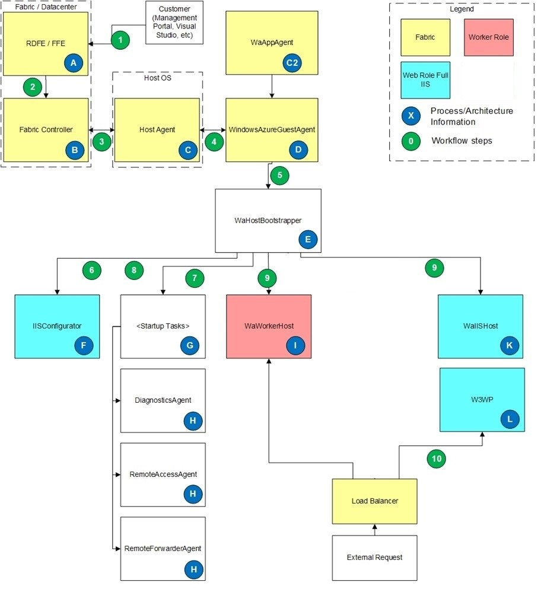

#   Azure architecture workflow
This article provides overview of the workflow processes when you deploy or update an Azure resource such as virtual machine. 

> [!NOTE]
>Azure has two different deployment models for creating and working with resources: Resource Manager and classic. This article covers using the classic deployment model.

The following diagram presents the architecture of Azure resource.

## Workflow basics
   
**A**. RDFE / FFE is the communication path from the user to the fabric.  RDFE (RedDog Front End) is the publicly exposed API which is the front end to the Management Portal and the Service Management API such as Visual Studio, Azure MMC, etc.  All requests from the user go through RDFE.  FFE (Fabric Front End) is the layer which translates requests from RDFE into the fabric commands.  All requests from RDFE go through the FFE to reach the fabric controllers.

**B**. Fabric controller is responsible for maintaining and monitoring all of the resources in the data center.  It communicates with fabric host agents on the fabric OS sending information such as the Guest OS version, service package, service configuration, service state, etc.

**C**. Host Agent lives on the Host OS and is responsible for setting up Guest OS and communicating with Guest Agent (WindowsAzureGuestAgent) in order to drive the role towards goal state and to do heartbeat checks with the guest agent.  If host agent does not receive heartbeat response for 10 minutes, host agent will restart the guest OS.

**C2**. WaAppAgent is responsible for installing, configuring, and updating WindowsAzureGuestAgent.exe.

**D**.  WindowsAzureGustAgent is responsible for:

1. Configuring the guest OS including firewall, ACLs, LocalStorage resources, service package and configuration, certificates.
1. Setting up the SID for the user account which the role will run under.
1. Communicating role status to the fabric.
1. Starting WaHostBootstrapper and monitoring it to ensure role is in goal state.

**E**. WaHostBootstrapper is responsible for:
1. Reading the role configuration and starting up all of the appropriate tasks and processes to configure and run the role.
1. Monitoring all of its child processes.
1. Raising the StatusCheck event on the role host process.

**F**. IISConfigurator runs when the role is configured as a Full IIS web role (it will not run for SDK 1.2 HWC roles).  It is responsible for:
1. Starting the standard IIS services
1. Configuring rewrite module in web config
1. Setting up the AppPool for the <Sites> configured in the service model.
1. Setting up IIS logging to point to the DiagnosticStore LocalStorage folder
1. Configuring permissions and ACLs
1. The website resides in %roleroot%:\sitesroot\0 and the apppool is pointed to this location to run IIS. 
**G**. Startup tasks are defined by the role model and started by WaHostBootstrapper.  Startup tasks can be configured to run in the Background asynchronously and the host bootstrapper will start the startup task and then continue on to other startup tasks.  Startup tasks can also be configured to run in Simple (default) mode where the host bootstrapper will wait for the startup task to finish running and return with a success (0) exit code before continuing on to the next startup task.

**H**. These tasks are part of the SDK and defined as plugins in the role’s service definition (.csdef).  When expanded into startup tasks the **DiagnosticsAgent** and **RemoteAccessAgent** are unique in that they define 2 startup tasks each, one regular and one with a /blockStartup parameter. The normal startup task is defined as a Background startup task so that it can run in the background while the role itself is running.  The /blockStartup startup task is defined as a Simple startup task so that WaHostBootstrapper will wait for it to exit before continuing. The **/blockStartup** task simply waits for the regular task to finish initializing and then it will exit and allow the host bootstrapper to continue.  The reason this is done is so that diagnostics and RDP access can be configured prior to the role processes starting up (this is done via the /blockStartup task), and that diagnostics and RDP access can continue running after the host bootstrapper has finished with startup tasks (this is done via the normal task).

**I**. WaWorkerHost is the standard host process for normal worker roles.  This host process will host all of the role’s DLLs and entry point code such as OnStart and Run.

**J**. WaWebHost is the standard host process for web roles when they are configured to use the SDK 1.2 compatible Hostable Web Core (HWC).  Roles can enable the HWC mode by removing the <Sites> element from the service definition (.csdef).  In this mode all of the service’s code and DLLs run from the WaWebHost process.  IIS (w3wp) is not used and there are no AppPools configured in IIS Manager because IIS is hosted inside of WaWebHost.exe.

**K**. WaIISHost is the host process for role entry point code for web roles using Full IIS.  This process will load the first DLL found which implements the RoleEntryPoint class (this DLL is defined in E:\__entrypoint.txt) and execute the code from this class (OnStart, Run, OnStop).  Any RoleEnvironment events (ie. StatusCheck, Changed, etc) created in the RoleEntryPoint class will be raised in this process.

**L**. W3WP is the standard IIS worker process which will be used when the role is configured to use Full IIS.  This will run the AppPool configured from IISConfigurator.  Any RoleEnvironment events (ie. StatusCheck, Changed, etc) created here will be raised in this process.  Note that RoleEnvironment events will fire in both locations (WaIISHost and w3wp.exe) if you subscribe to events from both processes.

## Workflow processes

1. An user makes a request such as uploading a .cspkg and .cscfg, telling a role to stop, doing a configuration change, etc.  This can be done through the Azure portal or a tool that uses the Service Management API such as Visual Studio’s Publish feature. This request goes to RDFE which does all of the subscription related work and then communicates the request to FFE. The rest of these workflow steps will assume the process of deploying a new package and starting it.
1. FFE finds the correct machine pool (based on customer input such as affinity group or geo location, and input from fabric such as machine availability) and communicates with the master fabric controller in that machine pool.
1. he fabric controller finds a host with available CPU cores (or spins up a new host).  The service package and configuration is copied to the host and the fabric controller communicates with the host agent on the host OS to deploy the package (configure DIPs, ports, guest OS, etc).
1. The host agent starts the Guest OS and communicates with the guest agent (WindowsAzureGuestAgent).  The host sends heartbeats to the guest to make sure that the role is working towards its goal state.
1. WindowsAzureGuestAgent sets up the guest OS (firewall, ACLs, LocalStorage, etc), copies a new XML configuration file to c:\Config, then starts the WaHostBootstrapper process.
1. For Full IIS web roles, WaHostBootstrapper starts IISConfigurator and tells it to delete any existing AppPools for the webrole from IIS.
1. WaHostBootstrapper reads the <Startup> tasks from E:\RoleModel.xml and begins executing startup tasks.  WaHostBootstrapper will wait until all Simple startup tasks have finished and returned a success.
1. For Full IIS web roles, WaHostBootstrapper tells IISConfigurator to configure the IIS AppPool and points the site to E:\Sitesroot\<index> where <index>  is a 0 based index into the number of <Sites> elements defined for the service.
1. WaHostBootstrapper will start the host process depending on the role type:
1. Worker Role: WaWorkerHost.exe is started.  WaHostBootstrapper executes the OnStart() method, and once it returns it starts to execute the Run() method and simultaneously marks the role as Ready and puts it into the load balancer rotation (if InputEndpoints are defined).  WaHostBootsrapper will then go into a loop of checking the role status.
1. SDK 1.2 HWC Web Role: WaWebHost is started.  WaHostBootstrapper executes the OnStart() method, and once it returns it starts to execute the Run() method and simultaneously marks the role as Ready and puts it into the load balancer rotation.  WaWebHost issues a warmup request (GET /do.__rd_runtime_init__).  All web requests are sent to WaWebHost.exe.  WaHostBootsrapper will then go into a loop of checking the role status.
1. Full IIS Web Role: WaIISHost is started.  WaHostBootstrapper executes the OnStart() method, and once it returns it starts to execute the Run() method and simultaneously marks the role as Ready and puts it into the load balancer rotation.  WaHostBootsrapper will then go into a loop of checking the role status.
1. Incoming web requests to a Full IIS web role will trigger IIS to start the W3WP process and serve the request just like it would in an on-prem IIS environment.

## Log File locations

**WindowsAzureGuestAgent**

- C:\Logs\AppAgentRuntime.Log.  
This log contains changes to the service including starts, stops, and new configurations.  If the service does not change then there is expected to be large gaps of time in this log file.
- C:\Logs\WaAppAgent.Log.  
This log contains status updates and heartbeat notifications and is updated every 2-3 seconds.  This log will contain a historic view of the status of the instance and will tell you when the instance was not in the Ready state.
 
**WaHostBootstrapper**

C:\Resources\Directory\<deploymentID>.<role>.DiagnosticStore\WaHostBootstrapper.log
 
**WaWebHost**

C:\Resources\Directory\<guid>.<role>\WaWebHost.log
 
**WaIISHost**

C:\Resources\Directory\<deploymentID>.<role>\WaIISHost.log
 
**IISConfigurator**

C:\Resources\Directory\<deploymentID>.<role>\IISConfigurator.log
 
**IIS Logs**

C:\Resources\Directory\<guid>.<role>.DiagnosticStore\LogFiles\W3SVC1
 
**Windows Event Logs**

D:\Windows\System32\Winevt\Logs
 

