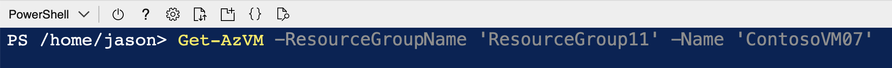
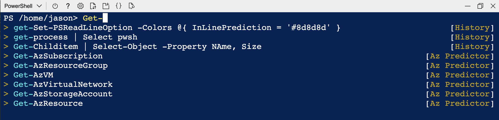

# Predictive IntelliSense in Azure Cloud Shell

Beginning January 2023 Azure Cloud Shell uses the version of [PSReadLine][01] that has Predictive
IntelliSense enabled by default. We've also installed and enabled the Azure PowerShell predictor
[Az.Tools.Predictor][02]] module. Together, these changes enhance the command-line experience by
providing suggestions that help new and experienced users of Azure discover, edit, and execute
complete commands.

## What is Predictive IntelliSense?

Predictive IntelliSense is a feature of the **PSReadLine** module. It provides suggestions for
complete commands based on items from your history and from predictor modules, like
**Az.Tools.Predictor**.

Prediction suggestions appear as colored text following the user's cursor. The following image shows
the default `InlineView` of the suggestion. Pressing <kbd>RightArrow</kbd> key accepts an inline
suggestion. After accepting the suggestion, you can edit the command line before hitting
<kbd>Enter</kbd> to run the command.



PSReadLine also offers a `ListView` presentation of the suggestions.



In `ListView` mode, use the arrow keys to scroll through the available suggestions. List view also
shows the source of the prediction.

You can switch between `InlineView` and `ListView` by pressing the <kbd>F2</kbd> key.

## How to change the prediction color

The default color of the suggestions may be difficult for some people. **PSReadLine** allows you to
configure the color of the suggestions.

The following command changes the color of inline suggestions to white text on a gray background.

```powershell
Set-PSReadLineOption -Colors @{ InlinePrediction = $PSStyle.Foreground.White + $PSStyle.Background.BrightBlack }
```

Learn more about color settings for [Set-PSReadLineOption][03].

## How to disable Predictive IntelliSense

If you don't want to take advantage of these updated features, **PSReadLine** allows you to turn off
Predictive IntelliSense.

To disable Predictive IntelliSense, execute the following `Set-PSReadLineOption` command or add to
the PowerShell profile script.

```powershell
Set-PSReadLineOption -PredictionSource None
```

## Keep your changes permanent

The commands to change the prediction color and enable or disable predictions only affect the
current session. Add these commands to your PowerShell profile so that they're available every time
you start Cloud Shell. The following instructions will guide you through configuring a profile for
Cloud Shell. For more information on PowerShell profiles, see [About_Profiles][06]

### How to check if you have a PowerShell profile in Cloud Shell

A PowerShell profile is a script that runs when PowerShell starts. Use `Test-Path` to check if the
profile exists in Cloud Shell.

```powershell
Test-Path -Path $Profile
```

### How to Create a PowerShell profile in Cloud Shell

If the output is **False**, create a profile and add the customized color and behavior commands.

To store configuration commands for Predictive IntelliSense, Use the `New-Item` cmdlet to create a
PowerShell profile.

```powershell
New-Item -Path $Profile -ItemType File -Force
```

```output

    Directory: /home/jason/.config/PowerShell

UnixMode   User             Group                 LastWriteTime           Size Name
--------   ----             -----                 -------------           ---- ----
-rw-r--r-- jason            jason              11/19/2022 18:21              0 Microsoft.PowerShell_profile.ps1
```

Use the built-in open-source editor to edit the profile. To learn more, see [Azure Cloud Shell editor][04].

The following example shows the profile commands that set the prediction color to default light grey
and enables History predictions.

```powershell
Set-PSReadLineOption -PredictionSource History
Set-PSReadLineOption -Colors @{ InLinePrediction = '#8d8d8d' }
```

### How to Edit a PowerShell profile in Cloud Shell

If the output is **True**, then a profile already exists. Edit the existing profile to add the
commands to configure the color and behavior of Predictive IntelliSense. Use the built-in
open-source editor to edit the profile. To learn more, see [Azure Cloud Shell editor][04].

Use the built-in Cloud Shell editor to edit the profile:

```powershell
code $Profile
```

## Next steps

For more information about configuring PSReadLine and managing predictors, see
[Using predictors in PSReadLine][05].

For more information on PowerShell profiles, see [About_Profiles][06].


<!-- link references -->
[01]: /powershell/module/psreadline/about/about_psreadline
[02]: /powershell/azure/az-predictor
[03]: /powershell/module/psreadline/set-psreadlineoption
[04]: ./using-cloud-shell-editor.md
[05]: /powershell/scripting/learn/shell/using-predictors
[06]: /powershell/module/microsoft.powershell.core/about/about_profiles
