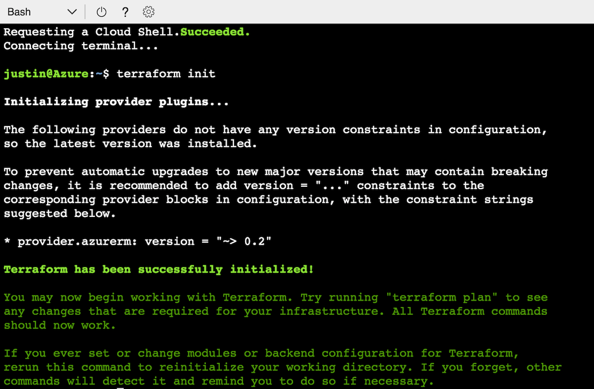
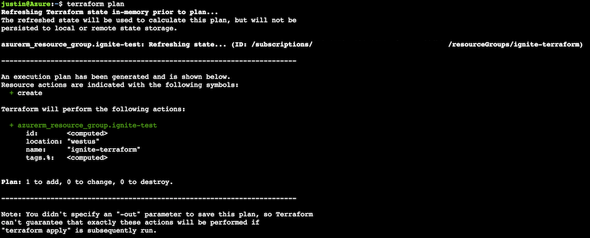
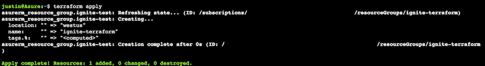

This article walks you through creating a resource group with the [Terraform AzureRM provider](https://www.terraform.io/docs/providers/azurerm/index.html). 

[Hashicorp Terraform](https://www.terraform.io/) is an open source tool that codifies APIs into declarative configuration files that can be shared amongst team members, treated as code, edited, reviewed, and versioned. The Microsoft AzureRM provider is used to interact with the many resources supported by Azure Resource Manager via the AzureRM APIs. 

# Terraform and Cloud Shell
Terraform is installed in Bash in Cloud Shell by default. Additionally, Cloud Shell automatically authenticates your default Azure CLI 2.0 subscription to deploy resources through the Terraform Azure modules.

Terraform uses the default Azure CLI 2.0 subscription that is set. If you need to update default subscriptions run:
```azurecli-interactive
az account set --subscription mySubscriptionName
```

# Walkthrough
## Create the template
Create a new Terraform template named main.tf
1. Launch vim in a new main.tf file
```azurecli-interactive
vim main.tf
```
2. Enter insert mode by typing `i`
3. Copy/paste the following code into Cloud Shell
```
resource "azurerm_resource_group" "myterraformgroup" {
    name = "myRgName"
    location = "West US"

    tags {
        environment = "Terraform Demo"
    }
}
```
4. Save and quit vim by exiting insert mode and typing `:wq`

## Terraform init
Begin by running terraform init.

```azurecli-interactive
terraform init
```



The [terraform init command](https://www.terraform.io/docs/commands/init.html) is used to initialize a working directory containing Terraform configuration files. The `terraform init` command is the first command that should be run after writing a new Terraform configuration or cloning an existing one from version control. It is safe to run this command multiple times.

## Terraform plan
Preview the resources to be created by the Terraform template.

```azurecli-interactive
terraform plan
```


The [terraform plan command](https://www.terraform.io/docs/commands/plan.html) is used to create an execution plan. Terraform performs a refresh, unless explicitly disabled, and then determines what actions are necessary to achieve the desired state specified in the configuration files. The plan can be saved using -out, and then provided to terraform apply to ensure only the pre-planned actions are executed.

## Terraform apply
Provision the Azure resources with the apply command.

```azurecli-interactive
terraform apply
```



The [terraform apply command](https://www.terraform.io/docs/commands/apply.html) is used to apply the changes required to reach the desired state of the configuration.

## Verify deployment with Azure CLI 2.0
Run `az group show -n myRgName` to verify the resources has succeeded provisioning.

## Clean up
Run `az group delete -n myRgName` to delete the resource group you created.

## Next Steps
[Learn about the Terraform Azure provider](https://www.terraform.io/docs/providers/azurerm/#)<br>
[Bash in Cloud Shell quickstart](quickstart.md)