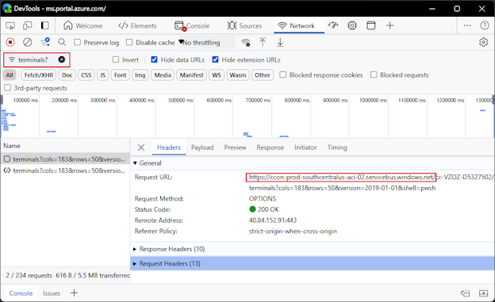

# Azure Cloud Shell frequently asked questions (FAQ)

This article answers common questions and explains how to troubleshoot Cloud Shell issues.

## Browser support

Cloud Shell supports the latest versions of following browsers:

- Microsoft Edge
- Google Chrome
- Mozilla Firefox
- Apple Safari
  - Safari in private mode isn't supported.

### Copy and paste

The keys used for copy and paste vary by operating system and browser. The following list contains
the most common key combinations:

- Windows: <kbd>Ctrl</kbd>+<kbd>c</kbd> to copy and <kbd>CTRL</kbd>+<kbd>Shift</kbd>+<kbd>v</kbd> or
  <kbd>Shift</kbd>+<kbd>Insert</kbd> to paste.
  - Firefox might not support clipboard permissions properly.
- macOS: <kbd>Cmd</kbd>+<kbd>c</kbd> to copy and <kbd>Cmd</kbd>+<kbd>v</kbd> to paste.
- Linux: <kbd>CTRL</kbd>+<kbd>c</kbd> to copy and <kbd>CTRL</kbd>+<kbd>Shift</kbd>+<kbd>v</kbd> to
  paste.

> [!NOTE]
> If no text is selected when you type <kbd>Ctrl</kbd>+<kbd>C</kbd>, Cloud Shell sends the `Ctrl-c`
> character to the shell. The shell can interpret `Ctrl-c` as a **Break** signal and terminate the
> currently running command.

## Frequently asked questions

### Is there a time limit for Cloud Shell sessions?

Cloud Shell is intended for interactive use cases. Cloud Shell sessions time out after 20 minutes
without interactive activity. As a result, any long-running non-interactive sessions are ended
without warning.

Cloud Shell is a free service for managing your Azure environment. It's not a general purpose
computing platform. Excessive usage might be considered a breach of the Azure Terms of Service,
which result in having your access to Cloud Shell blocked.

### How many concurrent sessions can I have open?

Azure Cloud Shell has a limit of 20 concurrent users per tenant. Opening more than 20 simultaneous
sessions produces a "Tenant User Over Quota" error. If you have a legitimate need to have more than
20 sessions open, such as for training sessions, contact Support to request a quota increase before
your anticipated usage date.

### I created some files in Cloud Shell, but they're gone. What happened?

The machine that provides your Cloud Shell session is temporary and is recycled after your session
is inactive for 20 minutes.

When you started Cloud Shell the first time, you were prompted to choose a storage option.

- If you chose the **Mount storage account** option, Cloud Shell mounts an Azure fileshare to the
  `clouddrive` folder in your session. Files stored in the `clouddrive` folder are visible in the
  Azure portal using Storage browser. Files stored in the `clouddrive` folder persist across
  sessions.

- If you chose the **No storage account required** option, you can only write files to your `$HOME`
  folder.

In both scenarios, you can write files to the `$HOME` folder. However, the `$HOME` folder only
exists in the Cloud Shell container image that you're currently using. Files in the `$HOME` folder
aren't visible in the Storage browser and are deleted when your session ends.

### I create a file in the Azure: drive, but I don't see it. What happened?

Cloud Shell loads a PowerShell provider for Azure that presents Azure resource data as a file system
drive. PowerShell users can use the `Azure:` drive to access Azure resources. The `Azure:` drive is
a virtual drive that doesn't allow you to create files.

Files that you create a new file using other tools, such as `vim` or `nano` while your current
location is the `Azure:` drive, are saved to your `$HOME` folder.

### I want to install a tool in Cloud Shell that requires `sudo`. Is that possible?

No. Your user account in Cloud Shell is an unprivileged account. You can't use `sudo` or run any
command that requires elevated permissions.

## Troubleshoot errors

### Storage Dialog - Error: 403 RequestDisallowedByPolicy

- **Details**: When creating the Cloud Shell storage account for first-time users, it's
  unsuccessful due to an Azure Policy assignment placed by your admin. The error message includes:

  ```
  The resource action 'Microsoft.Storage/storageAccounts/write' is disallowed by
  one or more policies.
  ```

- **Resolution**: Contact your Azure administrator to remove or update the Azure Policy assignment
  denying storage creation.

### Storage Dialog - Error: 400 DisallowedOperation

- **Details**: You can't create the Cloud Shell storage account when using a Microsoft Entra
  subscription.
- **Resolution**: Microsoft Entra ID subscriptions aren't able to create Azure resources. Use an
  Azure subscription capable of creating storage resources.

### Terminal output - Error: Failed to connect terminal

- **Details**: Cloud Shell requires the ability to establish a websocket connection to Cloud Shell
  infrastructure.
- **Resolution**: Confirm that your network allows sending HTTPS and websocket requests to the
  following domains:
  - `*.console.azure.com`
  - `*.servicebus.windows.net`
  - `*.servicebus.usgovcloudapi.net` for Azure Government Cloud

### Failed to request a terminal - Accessing Cloud Shell from a network that uses a private DNS resolver

- **Details**: Cloud Shell uses Azure Relay for terminal connections. Cloud Shell can fail to
  request a terminal due to DNS resolution problems. This failure can be caused when you launch a
  Cloud Shell session from a host in a network that has a private DNS Zone for the `servicebus`
  domain. This error can also occur if you're using a private on-premises DNS server.

- **Resolution**: You can add a DNS record for the Azure Relay instance that Cloud Shell uses.

  The following steps show you how to identify the DNS name of the Cloud Shell instance and how to
  create a DNS record for that name.

  1. Try to start Cloud Shell using your web browser. Use the browser's Developer Tools to find the
     Azure Relay instance name. In Microsoft Edge or Google Chrome, hit the <kbd>F12</kbd> key to
     open the Developer Tools. Select the **Network** tab. Find the **Search** box in the top right
     corner. Search for `terminals?` to find the request for a Cloud Shell terminal. Select the one
     of the request entries found by the search. In the **Headers** tab, find the hostname in the
     **Request URL**. The name is similar to
     `ccon-prod-<region-name>-aci-XX.servicebus.windows.net`. For Azure Government Cloud, the
     hostname ends with `servicebus.usgovcloudapi.net`.

     The following screenshot shows the Developer Tools in Microsoft Edge for a successful request
     for a terminal. The hostname is `ccon-prod-southcentalus-aci-02.servicebus.windows.net`. In
     your case, the request should be unsuccessful, but you can find the hostname you need to
     resolve.

     [](media/faq-troubleshooting/devtools-large.png#lightbox)

     For information about accessing the Developer Tools in other browsers, see
     [Capture a browser trace for troubleshooting][03].

  1. From a host outside of your private network, run the `nslookup` command to find the IP address
     of the hostname as found in the previous step.

     ```bash
     nslookup ccon-prod-southcentalus-aci-02.servicebus.windows.net
     ```

     The results should look similar to the following example:

     ```Output
     Server:         168.63.129.16
     Address:        168.63.129.16

     Non-authoritative answer:
     ccon-prod-southcentralus-aci-02.servicebus.windows.net  canonical name = ns-sb2-prod-sn3-012.cloudapp.net.
     Name:   ns-sb2-prod-sn3-012.cloudapp.net
     Address: 40.84.152.91
     ```

  1. Add an A record for the public IP in the Private DNS Zone of your private network. For this
     example, the DNS record would have the following properties:

     - Name: ccon-prod-southcentralus-aci-02
     - Type: A
     - TTL: 1 hour
     - IP Address: 40.84.152.91

     For more information about creating DNS records in a private DNS zone, see
     [Manage DNS record sets and records with Azure DNS][02].

     > [!NOTE]
     > This IP address is subject to change periodically. You might need to repeat this process to
     > discover the new IP address.

  Alternately, you can deploy your own private Cloud Shell instance. For more information, see
  [Deploy Cloud Shell in a virtual network][01].

### Terminal output - Sorry, your Cloud Shell failed to provision: {"code":"TenantDisabled" ...}


- **Details**: In rare cases, Azure might flag out-of-the-ordinary resource consumption based in
  from Cloud Shell as fraudulent activity. When this occurs, Azure disables Cloud Shell at the
  tenant level and you see the following error message:

  > Sorry, your Cloud Shell failed to provision: {"code":"TenantDisabled","message":"Cloud Shell has
  > been disabled in directory<>."} Please refresh the page.

  There can be legitimate use cases where CPU usage in your Azure Cloud Shell instance exceeds the
  thresholds that trigger fraud prevention and block your tenant. Large AZCopy jobs could be the
  cause this event. The Microsoft Azure engineering team can help to figure out why the tenant was
  disabled and re-enable it.

- **Resolution**: To investigate the cause and re-enable Cloud Shell for your tenant, open a new
  Azure support request. Include the following details:

  1. Tenant ID
  2. The business justification and a description of how you use Cloud Shell.

## Managing Cloud Shell

### Manage personal data

Microsoft Azure takes your personal data seriously. The Azure Cloud Shell service stores information
about your Cloud Shell storage and your terminal preferences. You can view this information using
one of the following examples.

- Run the following commands from the bash command prompt:

  ```bash
  URL="https://management.azure.com/providers/Microsoft.Portal/usersettings/cloudconsole?api-version=2017-12-01-preview"
  az rest --method get --url $URL
  ```

- Run the following commands from the PowerShell command prompt:

  ```powershell
  $invokeAzRestMethodSplat = @{
      Uri    = 'https://management.azure.com/providers/Microsoft.Portal/usersettings/cloudconsole?api-version=2017-12-01-preview'
      Method = 'GET'
  }
  $userdata = (Invoke-AzRestMethod @invokeAzRestMethodSplat).Content
  ($userdata | ConvertFrom-Json).properties | Format-List
  ```

You can delete this personal data by resetting your user settings. Resetting user settings
terminates your current session and unmounts your linked storage account. The Azure fileshare used
by Cloud Shell isn't deleted.

When reconnecting to Cloud Shell, you're prompted to attach a storage account. You can create a new
storage account or reattach the existing storage account that you used previously.

Use the following steps to delete your user settings.

1. Launch Cloud Shell.
1. Select the **Settings** menu (gear icon) from the Cloud Shell toolbar.
1. Select **Reset user settings** from the menu.
1. Select the **Reset** button to confirm the action.

### Block Cloud Shell in a locked down network environment

- **Details**: Administrators might wish to disable access to Cloud Shell for their users. Cloud
  Shell depends on access to the `ux.console.azure.com` domain, which can be denied, stopping any
  access to Cloud Shell's entry points including `portal.azure.com`, `shell.azure.com`, Visual
  Studio Code Azure Account extension, and `learn.microsoft.com`. In the US Government cloud, the
  entry point is `ux.console.azure.us`; there's no corresponding `shell.azure.us`.
- **Resolution**: Restrict access to `ux.console.azure.com` or `ux.console.azure.us` from your
  network. The Cloud Shell icon still exists in the Azure portal, but you can't connect to the
    service.

<!-- link references -->
[01]: /azure/cloud-shell/vnet/overview
[02]: /azure/dns/dns-operations-recordsets-portal
[03]: /azure/azure-portal/capture-browser-trace
