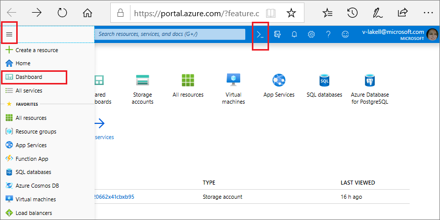
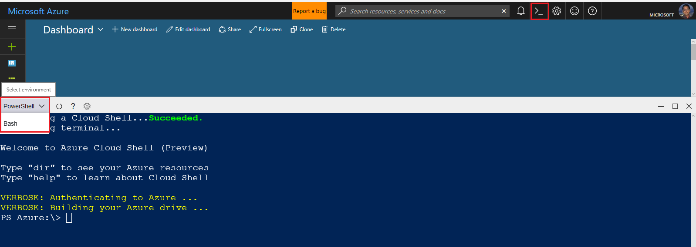

# Overview of Azure Cloud Shell
Azure Cloud Shell is an interactive, browser-accessible shell for managing Azure resources.
It provides the flexibility of choosing the shell experience that best suits the way you work.
Linux users can opt for a Bash experience, while Windows users can opt for PowerShell.

Try from shell.azure.com by clicking below.

Try from Azure portal using the Cloud Shell icon.

## Features

### Browser-based shell experience
Cloud Shell enables access to a browser-based command-line experience built with Azure management tasks in mind.
Leverage Cloud Shell to work untethered from a local machine in a way only the cloud can provide.

### Choice of preferred shell experience
Users can choose between Bash or PowerShell from the shell dropdown.

### Authenticated and configured Azure workstation
Cloud Shell is managed by Microsoft so it comes with popular command-line tools and language support. Cloud Shell also securely authenticates automatically for instant access to your resources through the Azure CLI or Azure PowerShell cmdlets.

View the full [list of tools installed in Cloud Shell.](features.md#tools)

### Integrated Cloud Shell editor
Cloud Shell offers an integrated graphical text editor based on the open-source Monaco Editor. Simply create and edit configuration files by running `code .` for seamless deployment through Azure CLI or Azure PowerShell.

[Learn more about the Cloud Shell editor](using-cloud-shell-editor.md).

### Integrated with docs.microsoft.com

You can use Cloud Shell directly from documentation hosted on [docs.microsoft.com](https://docs.microsoft.com). It is integrated in [Microsoft Learn](https://docs.microsoft.com/learn/), [Azure PowerShell](https://docs.microsoft.com/powershell/azure/overview) and [Azure CLI documentation](https://docs.microsoft.com/cli/azure) - click on the "Try It" button in a code snippet to open the immersive shell experience. 

### Multiple access points
Cloud Shell is a flexible tool that can be used from:
* [portal.azure.com](https://portal.azure.com)
* [shell.azure.com](https://shell.azure.com)
* [Azure CLI documentation](https://docs.microsoft.com/cli/azure)
* [Azure PowerShell documentation](https://docs.microsoft.com/powershell/azure/overview)
* [Azure mobile app](https://azure.microsoft.com/features/azure-portal/mobile-app/)
* [Visual Studio Code Azure Account extension](https://marketplace.visualstudio.com/items?itemName=ms-vscode.azure-account)

### Connect your Microsoft Azure Files storage
Cloud Shell machines are temporary and require a new or existing Azure Files share to be mounted as `clouddrive` to persist your files.

On first launch Cloud Shell prompts to create a resource group, storage account, and Azure Files share on your behalf. This is a one-time step and will be automatically attached for all sessions. A single file share can be mapped and will be used by both Bash and PowerShell in Cloud Shell.

Read more to learn how to mount a [new or existing storage account](persisting-shell-storage.md).

## Concepts
* Cloud Shell runs on a temporary host provided on a per-session, per-user basis
* Cloud Shell times out after 20 minutes without interactive activity
* Cloud Shell requires an Azure file share to be mounted
* Cloud Shell uses the same Azure file share for both Bash and PowerShell
* Cloud Shell is assigned one machine per user account
* Cloud Shell persists $HOME using a 5-GB image held in your file share
* Permissions are set as a regular Linux user in Bash

Learn more about features in [Bash in Cloud Shell](features.md) and [PowerShell in Cloud Shell](features-powershell.md).

## Pricing
The machine hosting Cloud Shell is free, with a pre-requisite of a mounted Azure Files share. Regular storage costs apply.

## Next steps
[Bash in Cloud Shell quickstart](quickstart.md)  
[PowerShell in Cloud Shell quickstart](quickstart-powershell.md)
