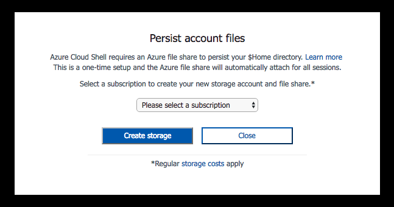

# Overview of Azure Cloud Shell (Preview)
Azure Cloud Shell is an interactive, browser-accessible shell for managing Azure resources.

## Features
### Browser-based shell experience
Cloud Shell enables access to a browser-based command-line experience built with Azure management tasks in mind. Leverage Cloud Shell to work untethered from a local machine in a way only the cloud can provide.

### Pre-configured Azure workstation
Cloud Shell comes pre-installed with popular command-line tools and language support so you can work faster.

[View the full tooling list for Azure Cloud Shell here.](features.md#tools)

### Automatic authentication
Cloud Shell securely authenticates automatically on each session for instant access to your resources through the Azure CLI 2.0.

### Connect your Azure File storage
Cloud Shell machines are temporary and as a result require an Azure file share to be mounted as `clouddrive` to persist your $Home directory.
On first launch Cloud Shell prompts to create a resource group, storage account, and file share on your behalf. This is a one-time step and will be automatically attached for all sessions. 

An LRS storage account is created on your behalf with an Azure file share containing a default 5-GB disk image. The file share mounts as `clouddrive` for file share interaction with the disk image being used to sync and persist your $Home directory. Regular storage costs apply.

Three resources will be created on your behalf:
1. Resource Group named: `cloud-shell-storage-<region>`
2. Storage Account named: `cs-uniqueGuid`
3. File Share named: `cs-<user>-<domain>-com-uniqueGuid`

> [!Note]
> All files in your $Home directory such as SSH keys are persisted in your user disk image stored in your mounted file share. Apply best practices when saving files in your $Home directory and mounted file share.

[Learn about Cloud Shell storage, updating file shares, and uploading/downloading files.] (persisting-shell-storage.md).

## Concepts
* Cloud Shell runs on a temporary machine provided on a per-session, per-user basis
* Cloud Shell times out after 10 minutes without interactive activity
* Cloud Shell can only be accessed with a file share attached
* Cloud Shell is assigned one machine per user account
* Permissions are set as a regular Linux user

[Learn more about all Cloud Shell features.](features.md)

## Examples
* Create or edit scripts to manage Azure resources from any browser
* Simultaneously manage resources via Azure portal and Azure CLI 2.0
* Test-drive Azure CLI 2.0

[Try out all these examples at the Cloud Shell quickstart.](quickstart.md)

## Pricing
The machine hosting Cloud Shell is free, with a pre-requisite of a mounted Azure file share to persist your $Home directory. 
Regular storage costs apply.

## Supported browsers
Cloud Shell is recommended for Chrome, Edge, and Safari. 
While Cloud Shell is supported for Chrome, Firefox, Safari, IE, and Edge, Cloud Shell is subject to specific browser settings.

## Troubleshooting
* When creating storage, I receive Error: 409 MissingSubscriptionRegistration.
  * This error signifies your subscription has not registered for the storage namespace. Follow [these step-by-step details](https://docs.microsoft.com/en-us/azure/azure-resource-manager/resource-manager-common-deployment-errors#noregisteredproviderfound) and try again when completed.
* When using an Azure Active Directory subscription, I cannot create storage due to Error: 400 DisallowedOperation.
  * AD subscriptions are not granted access to create Azure resources, please use an Azure subscription capable of creating storage resources.

For specific known limitations, visit [limitations of Cloud Shell](limitations.md).