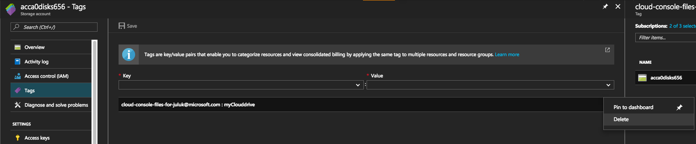
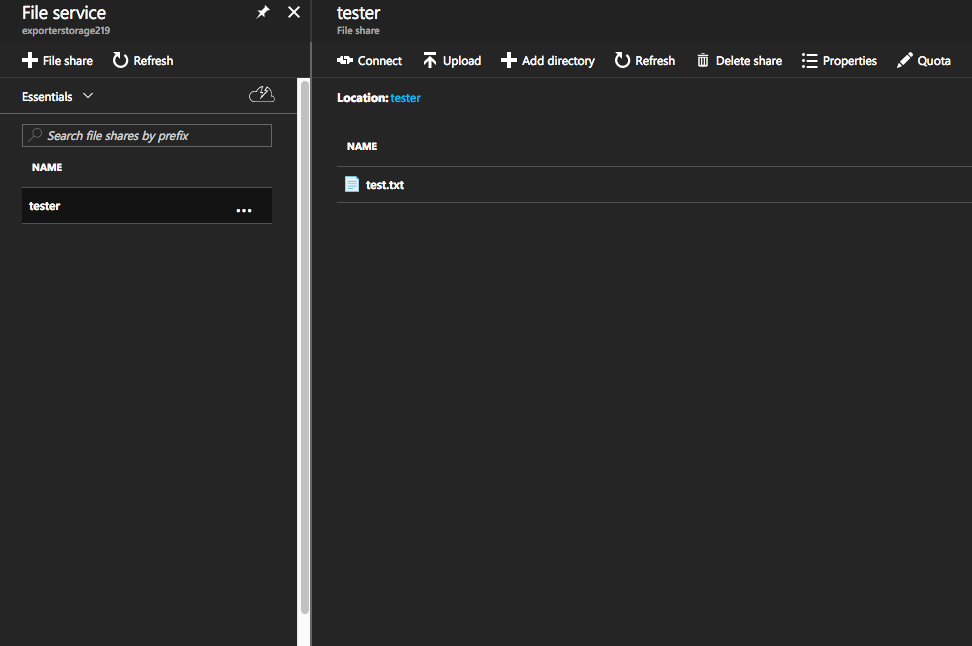
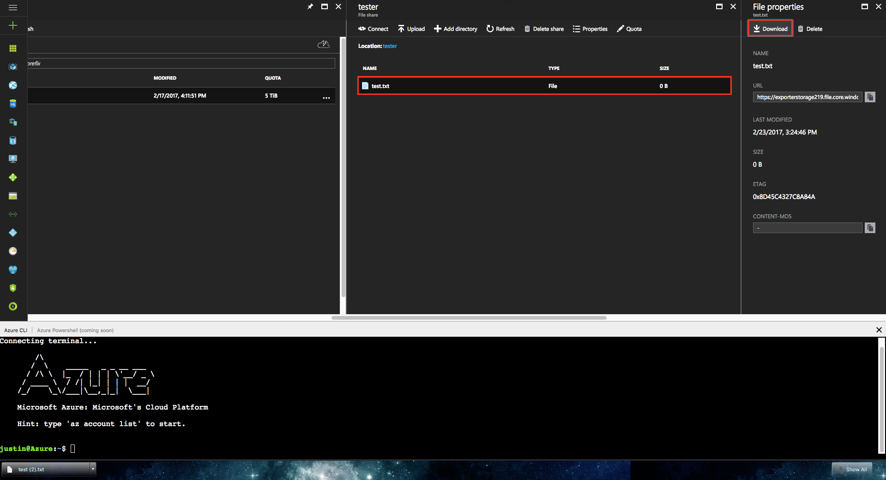

# Persisting Cloud Shell files
On first start, Cloud Shell asks for your subscription to create an LRS storage account and Azure file share for you. 
This is used to store a 5-GB image that automatically updates and persists your $Home directory. This file share will attach as `clouddrive` under your $Home directory.
This is a one-time action and this is automatically done for future sessions.

Cloud Shell will persist files with both methods below:
1. Persist all files in your `$Home` directory as a 5-GB (default size) image in the specified file share and sync automatically <br>

```
/Home/<User> ----->(mapped to) fileshare.storage.windows.net/fileshare/.cloudshell/user.img
 ```

2. Mount your `clouddrive` file share within your $Home for [individual file interaction via Azure portal](#upload-or-download-local-files) <br>

```
/Home/<User>/clouddrive ----->(mapped to) fileshare.storage.windows.net/fileshare
```

## Pre-Requisites
Cloud Shell will create a storage account and file share for you on first launch, however you may update the file share with the `createclouddrive` command.

If manually attaching a file share, storage accounts must be:
1. LRS or GRS to support file shares. Storage is subject to [regular Azure Files pricing.](https://azure.microsoft.com/en-us/pricing/details/storage/files/)
2. Must be located in one of the following regions:

### Supported storage regions
Your Cloud Shell will be provisioned in the same region as attached storage.
||Region|
|---|---|
|Americas|East US, South Central US, West US|
|Europe|North Europe, West Europe|
|Asia Pacific|India Central, Southeast Asia|

## Cloud Shell tagging
Cloud Shell adds a "tag" to attached storage accounts using the format: <br>

| Key | Value |
|:-------------:|:-------------:|
|cloud-shell-files-for-user@domain.com|fileshareName|

Use these tags to see which users are attaching file shares and where $Home images can be found.

## Attach file share
To mount an Azure Files storage account: <br>
1. Open a Cloud Shell session <br>
2. Run: <br>

```
createclouddrive -s mySubscription -g myRG -n storageAccountName -f fileShareName
```

To see more details run `createclouddrive -h`: <br>
```
Options: <br>
  -s | Subscription ID or name <br>
  -g | Resource group name <br>
  -n | Storage account name <br>
  -F | Create storage account if it doesn't exist <br>
  -f | Fileshare name <br>
  -? | -h | --help Shows this usage text <br>
```

## List file share
To find details about your mounted storage run `df`. The filepath to clouddrive will show your storage account name and fileshare in the url.

`//storageaccountname.file.core.windows.net/filesharename`

```
justin@Azure:~$ df
Filesystem                                         1K-blocks    Used  Available Use% Mounted on
overlay                                             29711408 5577940   24117084  19% /
tmpfs                                                 986716       0     986716   0% /dev
tmpfs                                                 986716       0     986716   0% /sys/fs/cgroup
/dev/sda1                                           29711408 5577940   24117084  19% /etc/hosts
shm                                                    65536       0      65536   0% /dev/shm
//storageName.file.core.windows.net/fileshareName 5368709120      64 5368709056   1% /home/justin/clouddrive
justin@Azure:~$
```

## Remove file share
To remove a file share from Cloud Shell:
1. Delete the storage tag on the storage account <br>

2. Recycle your Cloud Shell <br>


Your Cloud Shell should now be cleared of any mounted shares and open to mount another.

## Update file share
1. Follow process to [remove a file share](#remove-file-share)
2. Use `createclouddrive` to mount your new file share

## Upload or download local files
You can utilize the Portal GUI for Azure Files to upload or download files to/from storage.
Editing/removing/adding files from within Cloud Shell will also reflect in the File Storage GUI upon blade refresh.

1. Navigate to the mounted fileshare

2. Select target file in Portal
3. Hit "Download"


**Note** <br>
If you need to download a local file that exists in your $Home directory:
1. Copy it to `clouddrive` <br>
2. Follow [previous steps](#upload-or-download-local-files) <br>

## Next steps
[Cloud Shell Quickstart](quickstart.md) <br>
[About Azure File storage](https://docs.microsoft.com/azure/storage/storage-introduction#file-storage) <br>
[Learn more about Storage tags](https://docs.microsoft.com/azure/azure-resource-manager/resource-group-using-tags) <br>