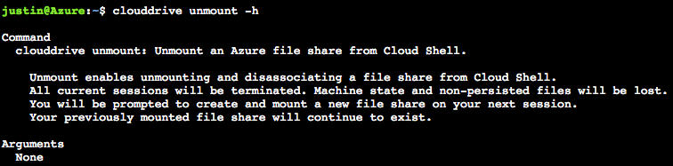
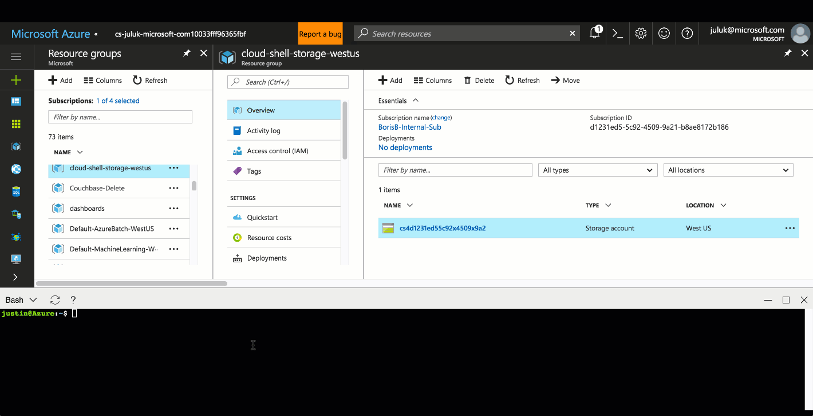

# Persisting Files in Azure Cloud Shell
On initial start, Azure Cloud Shell asks for your subscription to create an LRS storage account and Azure file share for you. Your subscription must have access to create a storage account in order to access Cloud Shell.


## How it works
### Three resources will be created on your behalf in a supported region nearest to you:
1. Resource Group named: `cloud-shell-storage-<region>`
2. Storage Account named: `cs-uniqueGuid`
3. File Share named: `cs-<user>-<domain>-com-uniqueGuid`

This file share will mount as `clouddrive` under your $Home directory. This file share is also used to store a 5-GB image created for you that automatically updates and persists your $Home directory. This is a one-time action and automatically mounts for subsequent sessions.

### Cloud Shell persists files with both methods below:
1. Create a disk image of your $Home directory to persist files within $Home. 
This disk image is saved in your specified file share as `acc_<User>.img` at `fileshare.storage.windows.net/fileshare/.cloudconsole/acc_<User>.img`

2. Mount specified file share as `clouddrive` in your $Home directory for direct file share interaction. 
`/Home/<User>/clouddrive` is mapped to `fileshare.storage.windows.net/fileshare`.
 
> [!Note]
> All files in your $Home directory such as SSH keys are persisted in your user disk image stored in your mounted file share. Apply best practices when persisting information in your $Home directory and mounted file share.

### Restrict resource creation with an Azure resource policy
The storage account is tagged with "ms-resource-usage:azure-cloud-shell". If your organization would like to deny users from creating storage accounts for Cloud Shell, create an [Azure resource policy for tags](https://docs.microsoft.com/azure/azure-resource-manager/resource-manager-policy-tags) triggered by this specific key and value.

## Using clouddrive
Cloud Shell allows users to run a command called `clouddrive` that enables manually updating the file share mounted to Cloud Shell.


## Mount a new clouddrive

### Pre-requisites for manual mounting
Cloud Shell will create a storage account and file share for you on first launch, however you may update the file share with the `clouddrive mount` command.

If mounting an existing file share, storage accounts must be:
1. LRS or GRS to support file shares.
2. Located in your assigned region. When onboarding, the region you are assigned to is listed in the resource group name `cloud-shell-storage-<region>`.

### Supported storage regions
Azure Files must reside in the same region as the machine being mounted to. Cloud Shell machines exist in the below regions:
|Area|Region|
|---|---|
|Americas|East US, South Central US, West US|
|Europe|North Europe, West Europe|
|Asia Pacific|India Central, Southeast Asia|

### Mount command

> [!NOTE]
> If mounting a new file share, a new user image will be created for your $Home directory as your previous $Home image is held in the previous file share.

1. Run `clouddrive mount` with the following parameters <br>

```
clouddrive mount -s mySubscription -g myRG -n storageAccountName -f fileShareName
```

To see more details run `clouddrive mount -h`: <br>


## Unmount clouddrive
You may unmount a file share mounted to Cloud Shell at any time. However, Cloud Shell requires a mounted file share so you will be prompted to create and mount a new file share on next session if removed.

To detach a file share from Cloud Shell:
1. Run `clouddrive unmount`
2. Acknowledge and confirm prompts

Your file share will continue to exist unless manually deleted. Cloud Shell will no longer search for this file share on subsequent sessions.

To see more details run `clouddrive mount -h`: <br>


> [!WARNING]
> This command will not delete any resources. However, manually deleting the resource group, storage account, or file share mapped to Cloud Shell will erase your $Home directory disk image and any files in your file share. This cannot be undone.

## List clouddrive
To discover which file share is mounted as `clouddrive`:
1. Run `df` 

The filepath to clouddrive will show your storage account name and file share in the url.

`//storageaccountname.file.core.windows.net/filesharename`

```
justin@Azure:~$ df
Filesystem                                          1K-blocks   Used  Available Use% Mounted on
overlay                                             29711408 5577940   24117084  19% /
tmpfs                                                 986716       0     986716   0% /dev
tmpfs                                                 986716       0     986716   0% /sys/fs/cgroup
/dev/sda1                                           29711408 5577940   24117084  19% /etc/hosts
shm                                                    65536       0      65536   0% /dev/shm
//mystoragename.file.core.windows.net/fileshareName 5368709120    64 5368709056   1% /home/justin/clouddrive
justin@Azure:~$
```

## Transfer local files to Cloud Shell
The `clouddrive` directory syncs to the Azure portal storage blade. Use this to transfer local files to or from your file share. Updating files from within Cloud Shell reflects in the File Storage GUI on blade refresh.

### Download files

1. Navigate to the mounted file share
2. Select target file in Portal
3. Hit "Download"

### Upload files

1. Navigate to mounted file share
2. Select "Upload"
3. Select file you wish to upload
4. Confirm upload

You should now see the file accessible in your clouddrive directory in Cloud Shell.

## Next steps
[Cloud Shell Quickstart](quickstart.md) <br>
[Learn about Azure File storage](https://docs.microsoft.com/azure/storage/storage-introduction#file-storage) <br>
[Learn about Storage tags](https://docs.microsoft.com/azure/azure-resource-manager/resource-group-using-tags) <br>