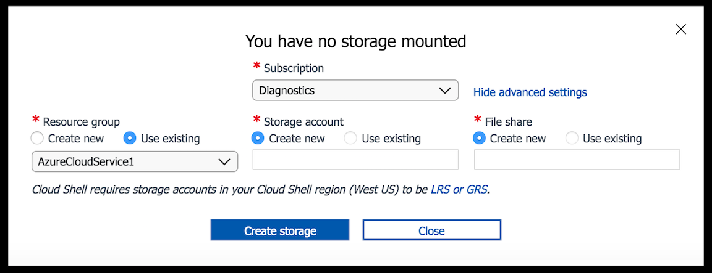
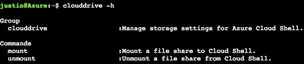

# Persist files in Azure Cloud Shell
Cloud Shell utilizes Azure File storage to persist files across sessions. On initial start, Cloud Shell prompts you to associate a new or existing file share to persist files across sessions.

> [!NOTE]
> Bash and PowerShell share the same file share. Only one file share can be associated with automatic mounting in Cloud Shell.

> [!NOTE]
> Azure storage firewall is not supported for cloud shell storage accounts.

## Create new storage

When you use basic settings and select only a subscription, Cloud Shell creates three resources on your behalf in the supported region that's nearest to you:
* Resource group: `cloud-shell-storage-<region>`
* Storage account: `cs<uniqueGuid>`
* File share: `cs-<user>-<domain>-com-<uniqueGuid>`


The file share mounts as `clouddrive` in your `$Home` directory. This is a one-time action, and the file share mounts automatically in subsequent sessions. 

The file share also contains a 5-GB image that is created for you which automatically persists data in your `$Home` directory. This applies for both Bash and PowerShell.

## Use existing resources

By using the advanced option, you can associate existing resources. When selecting a Cloud Shell region you must select a backing storage account co-located in the same region. For example, if your assigned region is West US then you must associate a file share that resides within West US as well.

When the storage setup prompt appears, select **Show advanced settings** to view additional options. The populated storage options filter for locally redundant storage (LRS),  geo-redundant storage (GRS), and zone-redundant storage (ZRS) accounts. 

> [!NOTE]
> Using GRS or ZRS storage accounts are recommended for additional resiliency for your backing file share. Which type of redundancy depends on your goals and price preference. [Learn more about replication options for Azure Storage accounts](../storage/common/storage-redundancy.md).



## Securing storage access
For security, each user should provision their own storage account.  For role-based access control (RBAC), users must have contributor access or above at the storage account level.

Cloud Shell uses an Azure File Share in a storage account, inside a specified subscription. Due to inherited permissions, users with sufficient access rights to the subscription will be able to access all the storage accounts, and file shares contained in the subscription.

Users should lock down access to their files by setting the permissions at the storage account or the subscription level.

## Supported storage regions
To find your current region you may run `env` in Bash and locate the variable `ACC_LOCATION`, or from PowerShell run `$env:ACC_LOCATION`. File shares receive a 5-GB image created for you to persist your `$Home` directory.

Cloud Shell machines exist in the following regions:

|Area|Region|
|---|---|
|Americas|East US, South Central US, West US|
|Europe|North Europe, West Europe|
|Asia Pacific|India Central, Southeast Asia|

Customers should choose a primary region, unless they have a requirement that their data at rest be stored in a particular region. If they have such a requirement, a secondary storage region should be used.

### Secondary storage regions
If a secondary storage region is used, the associated Azure storage account resides in a different region as the Cloud Shell machine that you're mounting them to. For example, Jane can set her storage account to be located in Canada East, a secondary region, but the machine she is mounted to is still located in a primary region. Her data at rest is located in Canada, but it is processed in the United States.

> [!NOTE]
> If a secondary region is used, file access and startup time for Cloud Shell may be slower.

A user can run `(Get-CloudDrive | Get-AzStorageAccount).Location` in PowerShell to see the location of their File Share.

## Restrict resource creation with an Azure resource policy
Storage accounts that you create in Cloud Shell are tagged with `ms-resource-usage:azure-cloud-shell`. If you want to disallow users from creating storage accounts in Cloud Shell, create an [Azure resource policy for tags](../azure-policy/json-samples.md) that are triggered by this specific tag.

## How Cloud Shell storage works 
Cloud Shell persists files through both of the following methods: 
* Creating a disk image of your `$Home` directory to persist all contents within the directory. The disk image is saved in your specified file share as `acc_<User>.img` at `fileshare.storage.windows.net/fileshare/.cloudconsole/acc_<User>.img`, and it automatically syncs changes. 
* Mounting your specified file share as `clouddrive` in your `$Home` directory for direct file-share interaction. `/Home/<User>/clouddrive` is mapped to `fileshare.storage.windows.net/fileshare`.
 
> [!NOTE]
> All files in your `$Home` directory, such as SSH keys, are persisted in your user disk image, which is stored in your mounted file share. Apply best practices when you persist information in your `$Home` directory and mounted file share.

## clouddrive commands

### Use the `clouddrive` command
In Cloud Shell, you can run a command called `clouddrive`, which enables you to manually update the file share that is mounted to Cloud Shell.



### List `clouddrive`
To discover which file share is mounted as `clouddrive`, run the `df` command. 

The file path to clouddrive shows your storage account name and file share in the URL. For example, `//storageaccountname.file.core.windows.net/filesharename`

```
justin@Azure:~$ df
Filesystem                                          1K-blocks   Used  Available Use% Mounted on
overlay                                             29711408 5577940   24117084  19% /
tmpfs                                                 986716       0     986716   0% /dev
tmpfs                                                 986716       0     986716   0% /sys/fs/cgroup
/dev/sda1                                           29711408 5577940   24117084  19% /etc/hosts
shm                                                    65536       0      65536   0% /dev/shm
//mystoragename.file.core.windows.net/fileshareName 5368709120    64 5368709056   1% /home/justin/clouddrive
justin@Azure:~$
```

### Mount a new clouddrive

#### Prerequisites for manual mounting
You can update the file share that's associated with Cloud Shell by using the `clouddrive mount` command.

If you mount an existing file share, the storage accounts must be located in your select Cloud Shell region. Retrieve the location by running `env` and checking the `ACC_LOCATION`.

#### The `clouddrive mount` command

> [!NOTE]
> If you're mounting a new file share, a new user image is created for your `$Home` directory. Your previous `$Home` image is kept in your previous file share.

Run the `clouddrive mount` command with the following parameters:

```
clouddrive mount -s mySubscription -g myRG -n storageAccountName -f fileShareName
```

To view more details, run `clouddrive mount -h`, as shown here:


### Unmount clouddrive
You can unmount a file share that's mounted to Cloud Shell at any time. Since Cloud Shell requires a mounted file share to be used, you will be prompted to create and mount another file share on the next session.

1. Run `clouddrive unmount`.
2. Acknowledge and confirm prompts.

Your file share will continue to exist unless you delete it manually. Cloud Shell will no longer search for this file share on subsequent sessions. To view more details, run `clouddrive unmount -h`, as shown here:


> [!WARNING]
> Although running this command will not delete any resources, manually deleting a resource group, storage account, or file share that's mapped to Cloud Shell erases your `$Home` directory disk image and any files in your file share. This action cannot be undone.
## PowerShell-specific commands

### List `clouddrive` Azure file shares
The `Get-CloudDrive` cmdlet retrieves the Azure file share information currently mounted by the `clouddrive` in the Cloud Shell. <br>


### Unmount `clouddrive`
You can unmount an Azure file share that's mounted to Cloud Shell at any time. If the Azure file share has been removed, you will be prompted to create and mount a new Azure file share at the next session.

The `Dismount-CloudDrive` cmdlet unmounts an Azure file share from the current storage account. Dismounting the `clouddrive` terminates the current session. The user will be prompted to create and mount a new Azure file share during the next session.


[!INCLUDE [PersistingStorage-endblock](../../includes/cloud-shell-persisting-shell-storage-endblock.md)]

Note: If you need to define a function in a file and call it from the PowerShell cmdlets, then the dot operator must be included. 
For example: . .\MyFunctions.ps1

## Next steps
[Cloud Shell Quickstart](quickstart.md) <br>
[Learn about Microsoft Azure Files storage](../storage/files/storage-files-introduction.md) <br>
[Learn about storage tags](https://docs.microsoft.com/azure/azure-resource-manager/resource-group-using-tags) <br>
