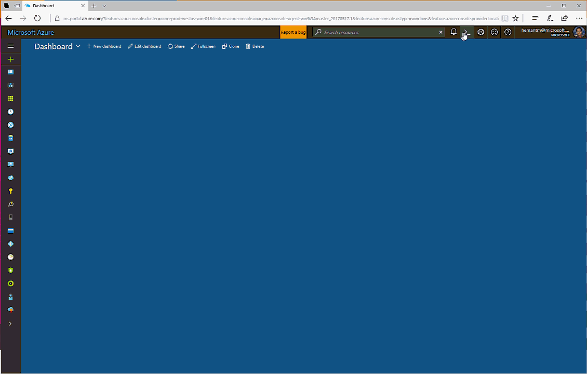
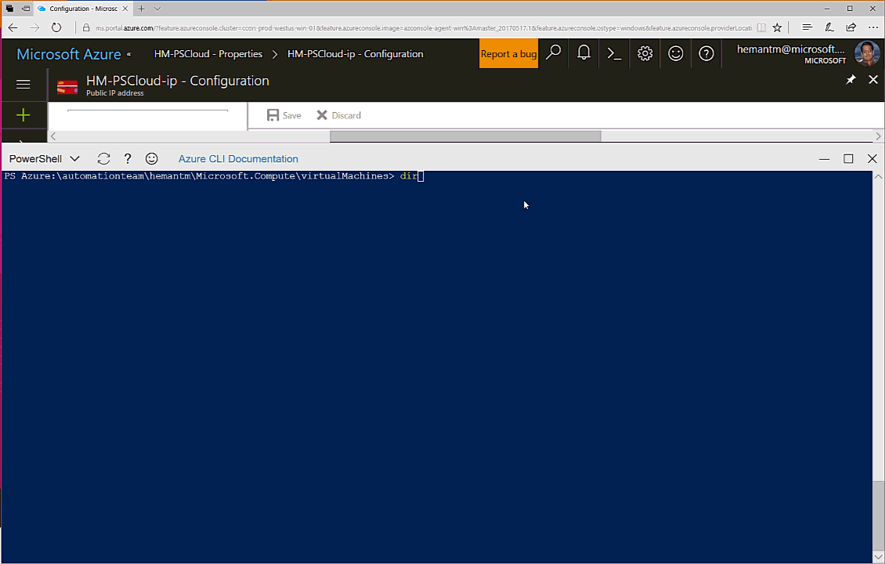
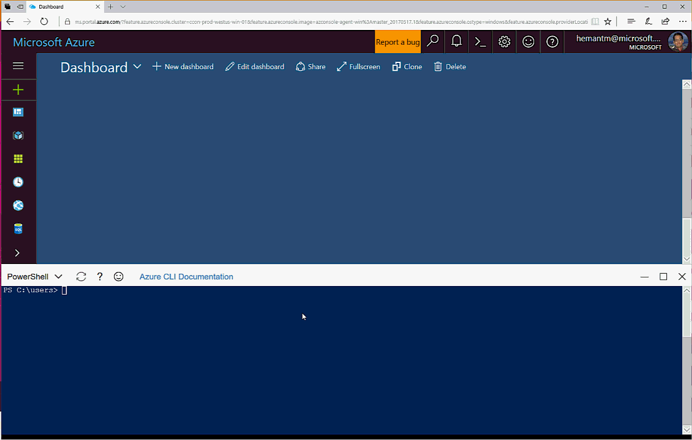

# Features and Tools for PowerShell in Azure Cloud Shell

[!include [features-introblock](<features-introblock.md)]

> [!TIP]
> [Bash in Azure Cloud Shell](features.md) is also available.

## PowerShell in Cloud Shell

The PowerShell experience in Azure Cloud Shell will provide the same benefits as the [Bash shell experience](features.md). Additionally, the PowerShell experience will provide:

- **Azure namespace** capability to let you easily discover and navigate all Azure resources.

    

- **Interaction with VMs** to enable seamless management into the guest VMs.

    

- **Extensible model** to import additional cmdlets and ability to run any executable.

    

## Tools

|**Category**    |**Name**                                 |
|----------------|-----------------------------------------|
|Azure tools     |AzureRM (3.8) modules  Azure CLI 2.0  |
|Text editors    |vim                                      |
|Package Manager |PowerShellGet  PackageManagement      |
|Source control  |git                                      |
|Test tools      |Pester                                   |

## Language Support

|**Language**|**Version**|
|------------|-----------|
|.NET        |4.6        |
|Node.js     |6.10       |
|Python      |2.7        |
|PowerShell  |5.1        |

## Secure automatic authentication
Cloud Shell securely and automatically authenticates account access for the Azure CLI 2.0.

## Azure Files persistence
Since Cloud Shell is allocated on a per-request basis using a temporary machine, files outside of your $Home and machine state are not persisted across sessions.
To persist files across sessions, Cloud Shell walks you through attaching an Azure file share on first launch.
Once completed Cloud Shell will automatically attach your storage for all future sessions.

[Learn more about attaching Azure file shares to Cloud Shell.](persisting-shell-storage.md)

## Next steps
[Quickstart with PowerShell in Cloud Shell](powershell-quickstart.md)  
[Learn about Azure PowerShell](https://docs.microsoft.com/powershell/azure/)  
