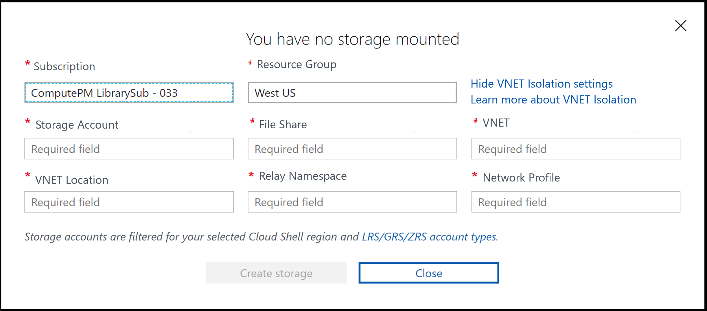

# Deploy Cloud Shell into an Azure virtual network
[Azure Virtual Network](../virtual-network/virtual-networks-overview.md) provides secure, private networking for your Azure and on-premises resources. By deploying Cloud Shell into an Azure virtual network, You can communicate securely with other resources in the virtual network.

This article shows how to set up the required resources to deploy Azure Cloud Shell to a virtual network.

## Required network resources

### Virtual network
A virtual network defines the address space in which one or more subnets are created. Cloud Shell can then be deployed into the subnets in your virtual network.

### Subnet
A subnet segments the virtual network into separate address spaces usable by the Azure resources placed in them.  There can be multiple subnets in a virtual network.

> [!NOTE] 
> The subnet that is used for Cloud Shell must be left empty of other resources.

### Network profile
A network profile is a network configuration template for Azure resources which specifes certain network properties for the resource.


## Virtual network deployment limitations
* To deploy Cloud Shell to a subnet, the subnet cannot contain any other resources. Remove all existing resources from an existing subnet prior to deploying Cloud Shell to it, or create a new subnet.
* Due to the additional networking resources involved, starting Cloud Shell in a virtual network is typically slower than a standard Cloud Shell session.


## Deploy network resources
 

### Create a resource group and virtual network
If you already have a desired VNET that you would like to connect to, skip this section.

In the Azure Portal, or using Azure CLI, Azure PowerShell, etc. create a Resource Group and a virtual network in the new resource group.  These must be located in either WestCentralUS or WestUS, and the resource group and virtual network need to be in the same region.
TODO: Remove the location requirement

### Create Subnets
TODO: Update repo location

Download the contents of [this repo](https://msazure.visualstudio.com/DefaultCollection/One/_git/compute-CloudShell?path=%2Fsrc%2Ftools%2FIsolatedContainers&version=GBbf-poc&_a=contents).

Open a PowerShell session in Cloud Shell, or a local experience of PowerShell 7 with the latest Azure PowerShell.  Navigate to the file location of the downloaded files.
Enter desired resource fields.
```azurepowershell-interactive
# Get Subscription ID using Get-AzSubscription
$SubscriptionID = 

# Resource Group where VNET is located
$ResourceGroupName = 

# Location of VNET and Resource Group
$Location = 

# Name of desired VNET
$ExistingVNETName = 

# Desired Relay Namespace name
$RelayNamespaceName = 

# Desired Storage Account name - must be all lowercase and globally unique
$StorageAccountName = 

# Desired File Share Name - must be all lowercase
$FileShareName =
```

Next run the `Setup-CloudShellVnet.ps1` script
```azurepowershell-interactive
.\Setup-CloudShellVnet.ps1 -SubscriptionId $SubscriptionID -ResourceGroupName $ResourceGroupName -Location $Location -ExistingVNetName $ExistingVNETName -BootstrapCloudShell -RelayNamespace $RelayNamespaceName 

.\Setup-CloudShellVnet.ps1 -SubscriptionId $SubscriptionID -ResourceGroupName $ResourceGroupName -Location $Location -ExistingVNetName $ExistingVNETName -CreateStorageAccount -StorageAccountName $StorageAccountName -FileShareName $FileShareName 

```
All of your isolated Cloud Shell resources have been created.


TODO: Replace with end UX design



TODO: Provide instructions on using UX to connect to isolated Cloud Shell.