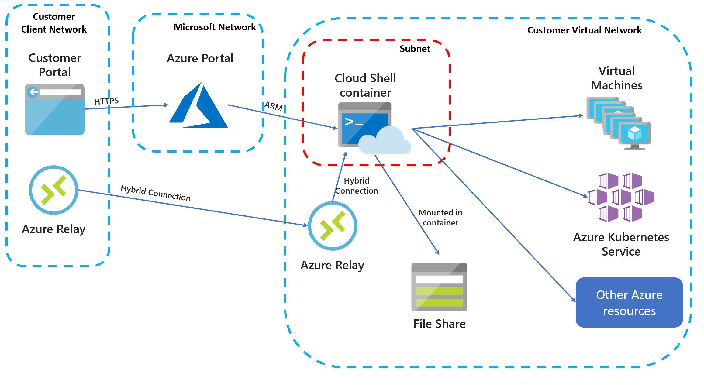
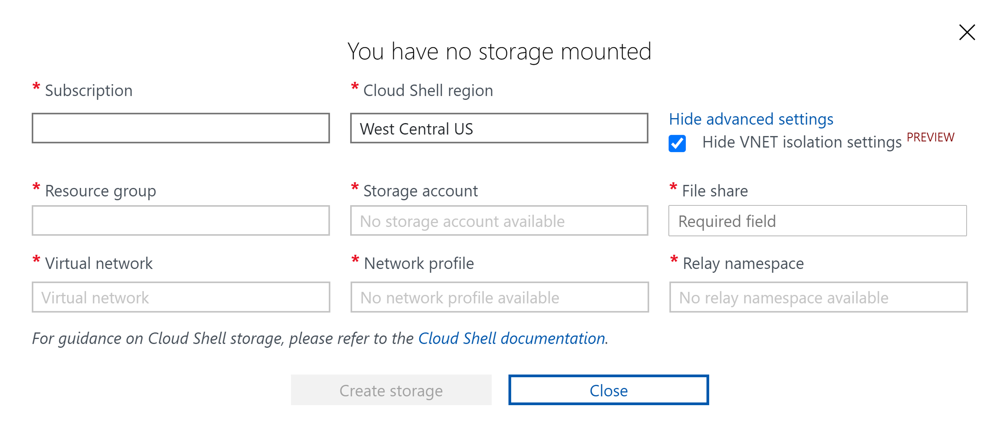

# Deploy Cloud Shell into an Azure virtual network

A regular Cloud Shell session runs in a container in a Microsoft network separate from your resources. This means that commands running inside the container cannot access resources that can only be accessed from a specific virtual network. For example, you cannot use SSH to connect from Cloud Shell to a virtual machine that only has a private IP address, or use kubectl to connect to a Kubernetes cluster which has locked down access. 

This optional feature addresses these limitations and allows you to deploy Cloud Shell into an Azure virtual network that you control. From there, the container is able to interact with resources within the virtual network you select.  

Below you can see the resource architecture that will be deployed and used in this scenario.



Before you can use Cloud Shell in your own Azure Virtual Network, you will need to create several resources to support this functionality. This article shows how to set up the required resources using an ARM template.

> [!NOTE]
> These resources only need to be set up once for the virtual network. They can then be shared by all administrators with access to the virtual network.

## Required network resources

### Virtual network
A virtual network defines the address space in which one or more subnets are created.

The desired virtual network to be used for Cloud Shell needs to be identified. This will usually be an existing virtual network that contains resources you would like to manage or a network that peers with networks that contain your resources.

### Subnet
Within the selected virtual network, a dedicated subnet must be used for Cloud Shell containers. This subnet is delegated to the Azure Container Instances (ACI) service.  When a user requests a Cloud Shell container in a virtual network, Cloud Shell uses ACI to create a container that is in this delegated subnet.  No other resources can be created in this subnet.

### Network profile
A network profile is a network configuration template for Azure resources that specifies certain network properties for the resource.

### Azure Relay
An [Azure Relay](../azure-relay/relay-what-is-it.md) allows two endpoints that are not directly reachable to communicate. In this case, it is used to allow the administrator's browser to communicate with the container in the private network.

The Azure Relay instance used for Cloud Shell can be configured to control which networks can access container resources: 
- Accessible from the public internet: In this configuration, Cloud Shell provides a way to reach otherwise internal resources from outside. 
- Accessible from specified networks: In this configuration, administrators will have to access the Azure portal from a computer running in the appropriate network to be able to use Cloud Shell.

## Storage requirements
As in standard Cloud Shell, a storage account is required while using Cloud Shell in a virtual network. Each administrator needs a file share to store their files.  The storage account needs to be accessible from the virtual network that is used by Cloud Shell. 

## Virtual network deployment limitations
* Due to the additional networking resources involved, starting Cloud Shell in a virtual network is typically slower than a standard Cloud Shell session.

* All Cloud Shell regions apart from Central India are currently supported. 

* [Azure Relay](../azure-relay/relay-what-is-it.md) is not a free service, please view their [pricing](https://azure.microsoft.com/pricing/details/service-bus/). In the Cloud Shell scenario, one hybrid connection is used for each administrator while they are using Cloud Shell. The connection will automatically be shut down after the Cloud Shell session is complete.

## Register the resource provider

The Microsoft.ContainerInstances resource provider needs to be registered in the subscription that holds the virtual network you want to use. Select the appropriate subscription with `Set-AzContext -Subscription {subscriptionName}`, and then run:

```powershell
PS> Get-AzResourceProvider -ProviderNamespace Microsoft.ContainerInstance | select ResourceTypes,RegistrationState

ResourceTypes                             RegistrationState
-------------                             -----------------
{containerGroups}                         Registered
...
```

If **RegistrationState** is `Registered`, no action is required. If it is `NotRegistered`, run `Register-AzResourceProvider -ProviderNamespace Microsoft.ContainerInstance`. 

## Deploy network resources
 
### Create a resource group and virtual network
If you already have a desired VNET that you would like to connect to, skip this section.

In the Azure portal, or using Azure CLI, Azure PowerShell, etc. create a resource group and a virtual network in the new resource group, **the resource group and virtual network need to be in the same region**.

### ARM templates
Utilize the [Azure Quickstart Template](https://aka.ms/cloudshell/docs/vnet/template) for creating Cloud Shell resources in a virtual network, and the [Azure Quickstart Template](https://aka.ms/cloudshell/docs/vnet/template/storage) for creating necessary storage. Take note of your resource names, primarily your file share name.

### Open relay firewall
Navigate to the relay created using the above template, select "Networking" in settings, allow access from your browser network to the relay. By default the relay is only accessible from the virtual network it has been created in. 

### Configuring Cloud Shell to use a virtual network.
> [!NOTE]
> This step must be completed for each administrator will use Cloud Shell.

After deploying completing the above steps, navigate to Cloud Shell in the Azure portal or on https://shell.azure.com. One of these experiences must be used each time you want to connect to an isolated Cloud Shell experience.

> [!NOTE]
> If Cloud Shell has been used in the past, the existing clouddrive must be unmounted. To do this run `clouddrive unmount` from an active Cloud Shell session, refresh your page.

Connect to Cloud Shell, you will be prompted with the first run experience. Select your preferred shell experience, select "Show advanced settings" and select the "Show VNET isolation settings" box. Fill in the fields in the pop-up.  Most fields will autofill to the available resources that can be associated with Cloud Shell in a virtual network.  The File Share name will have to be filled in by the user.




## Next steps
[Learn about Azure Virtual Networks](../virtual-network/virtual-networks-overview.md)
