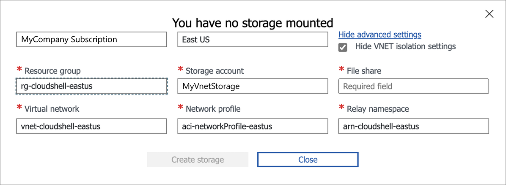

# Deploy Azure Cloud Shell in a virtual network with quickstart templates

Before you can deploy Azure Cloud Shell in a virtual network (VNet) configuration using the
quickstart templates, there are several prerequisites to complete before running the templates.

This document guides you through the process to complete the configuration.

## Steps to deploy Azure Cloud Shell in a virtual network

This article walks you through the following steps to deploy Azure Cloud Shell in a virtual network:

1. Collect the required information
1. Create the virtual networks using the **Azure Cloud Shell - VNet** ARM template
1. Create the virtual network storage account using the **Azure Cloud Shell - VNet storage** ARM template
1. Configure and use Azure Cloud Shell in a virtual network

## 1. Collect the required information

There are several pieces of information that you need to collect before you can deploy Azure Cloud.
You can use the default Azure Cloud Shell instance to gather the required information and create the
necessary resources. You should create dedicated resources for the Azure Cloud Shell VNet
deployment. All resources must be in the same Azure region and contained in the same resource group.

- **Subscription** - The name of your subscription containing the resource group used for the Azure
  Cloud Shell VNet deployment
- **Resource Group** - The name of the resource group used for the Azure Cloud Shell VNet deployment
- **Region** - The location of the resource group
- **Virtual Network** - The name of the virtual network created for Azure Cloud Shell VNet
- **Azure Container Instance OID** - The ID of the Azure Container Instance for your resource group
- **Azure Relay Namespace** - The name that you want to assign to the Relay resource created by the
  template

### Create a resource group

You can create the resource group using the Azure portal, Azure CLI, or Azure PowerShell. For more
information, see the following articles:

- [Manage Azure resource groups by using the Azure portal][02]
- [Manage Azure resource groups by using Azure CLI][01]
- [Manage Azure resource groups by using Azure PowerShell][03]

### Create a virtual network

You can create the virtual network using the Azure portal, Azure CLI, or Azure PowerShell. For more
information, see the following articles:

- [Use the Azure portal to create a virtual network][05]
- [Use Azure PowerShell to create a virtual network][06]
- [Use Azure CLI to create a virtual network][04]

> [!NOTE]
> When setting the Container subnet address prefix for the Cloud Shell subnet it's important to
> consider the number of Cloud Shell sessions you need to run concurrently. If the number of Cloud
> Shell sessions exceeds the available IP addresses in the container subnet, users of those sessions
> can't connect to Cloud Shell. Increase the container subnet range to accommodate your specific
> needs. For more information, see the _Change Network Settings_ section of
> [Add, change, or delete a virtual network subnet][07]

### Register the resource provider

Azure Cloud Shell runs in a container. The **Microsoft.ContainerInstances** resource provider needs
to be registered in the subscription that holds the virtual network for your deployment. Depending
when your tenant was created, the provider may already be registered.

Use the following commands to check the registration status.

```powershell
Set-AzContext -Subscription MySubscriptionName
Get-AzResourceProvider -ProviderNamespace Microsoft.ContainerInstance |
    Select-Object ResourceTypes, RegistrationState
```

```Output
ResourceTypes                                     RegistrationState
-------------                                     -----------------
{containerGroups}                                 Registered
{serviceAssociationLinks}                         Registered
{locations}                                       Registered
{locations/capabilities}                          Registered
{locations/usages}                                Registered
{locations/operations}                            Registered
{locations/operationresults}                      Registered
{operations}                                      Registered
{locations/cachedImages}                          Registered
{locations/validateDeleteVirtualNetworkOrSubnets} Registered
{locations/deleteVirtualNetworkOrSubnets}         Registered
```

If **RegistrationState** for `{containerGroups}` is `NotRegistered`, run the following command to
register the provider:

```powershell
Register-AzResourceProvider -ProviderNamespace Microsoft.ContainerInstance
```

### Azure Container Instance ID

To configure the virtual network for Cloud Shell using the quickstarts, retrieve the `Azure Container Instance`
ID for your organization.

```powershell
Get-AzADServicePrincipal -DisplayNameBeginsWith 'Azure Container Instance'
```

```Output
DisplayName                      Id                                   AppId
-----------                      --                                   -----
Azure Container Instance Service 8fe7fd25-33fe-4f89-ade3-0e705fcf4370 34fbe509-d6cb-4813-99df-52d944bfd95a
```

Take note of the **Id** value for the `Azure Container Instance` service principal. It's needed for
the **Azure Cloud Shell - VNet storage** template.

## 2. Create the virtual network using the ARM template

Use the [Azure Cloud Shell - VNet][08] template to create Cloud Shell resources in a virtual
network. The template creates three subnets under the virtual network created earlier. You may
choose to change the supplied names of the subnets or use the defaults. The virtual network, along
with the subnets, require valid IP address assignments. You need at least one IP address for the
Relay subnet and enough IP addresses in the container subnet to support the number of concurrent
sessions you expect to use.

The ARM template requires specific information about the resources you created earlier, along with
naming information for new resources. This information is filled out along with the prefilled
information in the form.

Information needed for the template:

- **Subscription** - The name of your subscription containing the resource group for Azure Cloud
  Shell VNet
- **Resource Group** - The resource group name of either an existing or newly created resource group
- **Region** - Location of the resource group
- **Virtual Network** - The name of the virtual network created for Azure Cloud Shell virtual network
- **Azure Container Instance OID** - The ID of the Azure Container Instance for your resource group

Fill out the form with the following information:

| Project details |                                                              Value                                                               |
| --------------- | -------------------------------------------------------------------------------------------------------------------------------- |
| Subscription    | Defaults to the current subscription context.<br>For this example, we're using `MyCompany Subscription`                          |
| Resource group  | Enter the name of the resource group from the prerequisite information.<br>For this example, we're using `rg-cloudshell-eastus`. |

|        Instance details         |                                                                     Value                                                                      |
| ------------------------------- | ---------------------------------------------------------------------------------------------------------------------------------------------- |
| Region                          | Prefilled with your default region.<br>For this example, we're using `East US`.                                                                |
| Existing virtual network Name              | Fill in the value from the prerequisite information you gathered.<br>For this example, we're using `vnet-cloudshell-eastus`.                   |
| Relay Namespace Name            | Create a name that you want to assign to the Relay resource created by the template.<br>For this example, we're using `arn-cloudshell-eastus`. |
| Azure Container Instance OID    | Fill in the value from the prerequisite information you gathered.<br>For this example, we're using `8fe7fd25-33fe-4f89-ade3-0e705fcf4370`.     |
| Container Subnet Name           | Defaults to `cloudshellsubnet`. Enter the name of the subnet for your container.                                                               |
| Container Subnet Address Prefix | For this example, we use `10.1.0.0/16`, which provides 65,543 IP addresses for Cloud Shell instances.                                          |
| Relay Subnet Name               | Defaults to `relaysubnet`. Enter the name of the subnet containing your relay.                                                                 |
| Relay Subnet Address Prefix     | For this example, we use `10.0.2.0/24`.                                                                                                        |
| Storage Subnet Name             | Defaults to `storagesubnet`. Enter the name of the subnet containing your storage.                                                             |
| Storage Subnet Address Prefix   | For this example, we use `10.0.3.0/24`.                                                                                                        |
| Private Endpoint Name           | Defaults to `cloudshellRelayEndpoint`. Enter the name of the subnet containing your container.                                                 |
| Tag Name                        | Defaults to `{"Environment":"cloudshell"}`. Leave unchanged or add more tags.                                                                  |
| Location                        | Defaults to `[resourceGroup().location]`. Leave unchanged.                                                                                     |

Once the form is complete, select **Review + Create** and deploy the network ARM template to your
subscription.

## 3. Create the virtual network storage using the ARM template

Use the [Azure Cloud Shell - VNet storage][09] template to create Cloud Shell resources in a virtual
network. The template creates the storage account and assigns it to the private virtual network.

The ARM template requires specific information about the resources you created earlier, along
with naming information for new resources.

Information needed for the template:

- **Subscription** - The name of the subscription containing the resource group for Azure Cloud
  Shell virtual network.
- **Resource Group** - The resource group name of either an existing or newly created resource group
- **Region** - Location of the resource group
- **Existing virtual network name** - The name of the virtual network created earlier
- **Existing Storage Subnet Name** - The name of the storage subnet created with the Network
  quickstart template
- **Existing Container Subnet Name** - The name of the container subnet created with the Network
  quickstart template

Fill out the form with the following information:

| Project details |                                                              Value                                                               |
| --------------- | -------------------------------------------------------------------------------------------------------------------------------- |
| Subscription    | Defaults to the current subscription context.<br>For this example, we're using `MyCompany Subscription`                          |
| Resource group  | Enter the name of the resource group from the prerequisite information.<br>For this example, we're using `rg-cloudshell-eastus`. |

|        Instance details        |                                              Value                                               |
| ------------------------------ | ------------------------------------------------------------------------------------------------ |
| Region                         | Prefilled with your default region.<br>For this example, we're using `East US`.                  |
| Existing virtual network Name             | For this example, we're using `vnet-cloudshell-eastus`.                                          |
| Existing Storage Subnet Name   | Fill in the name of the resource created by the network template.                                |
| Existing Container Subnet Name | Fill in the name of the resource created by the network template.                                |
| Storage Account Name           | Create a name for the new storage account.<br>For this example, we're using `myvnetstorage1138`. |
| File Share Name                | Defaults to `acsshare`. Enter the name of the file share want to create.                         |
| Resource Tags                  | Defaults to `{"Environment":"cloudshell"}`. Leave unchanged or add more tags.                    |
| Location                       | Defaults to `[resourceGroup().location]`. Leave unchanged.                                       |

Once the form is complete, select **Review + Create** and deploy the network ARM template to your
subscription.

## 4. Configuring Cloud Shell to use a virtual network

After you have deployed your private Cloud Shell instance, each Cloud Shell user must change their
configuration to use the new private instance.

If you have used the default Cloud Shell before deploying the private instance, you must reset your
user settings.

1. Open Cloud Shell
1. Select **Cloud Shell settings** from the menu bar (gear icon).
1. Select **Reset user settings** then select **Reset**

Resetting the user settings triggers the first-time user experience the next time you start Cloud
Shell.

[  ](media/quickstart-deploy-vnet/setup-cloud-shell-storage.png#lightbox)

1. Choose your preferred shell experience (Bash or PowerShell)
1. Select **Show advanced settings**
1. Select the **Show VNET isolation settings** checkbox.
1. Choose the **Subscription** containing your private Cloud Shell instance.
1. Choose the **Region** containing your private Cloud Shell instance.
1. Select the **Resource group** name containing your private Cloud Shell instance. If you have
   selected the correct resource group, the **Virtual network**, **Network profile**, and **Relay
   namespace** should be automatically populated with the correct values.
1. Enter the name for the **File share** you created with the storage template.
1. Select **Create storage**.

## Next steps

You must complete the Cloud Shell configuration steps for each user that needs to use the new
private Cloud Shell instance.

<!-- link references -->
[01]: /azure/azure-resource-manager/management/manage-resource-groups-cli
[02]: /azure/azure-resource-manager/management/manage-resource-groups-portal
[03]: /azure/azure-resource-manager/management/manage-resource-groups-powershell
[04]: /azure/virtual-network/quick-create-cli
[05]: /azure/virtual-network/quick-create-portal
[06]: /azure/virtual-network/quick-create-powershell
[07]: /azure/virtual-network/virtual-network-manage-subnet?tabs=azure-portal#change-subnet-settings
[08]: https://aka.ms/cloudshell/docs/vnet/template
[09]: https://azure.microsoft.com/resources/templates/cloud-shell-vnet-storage/
