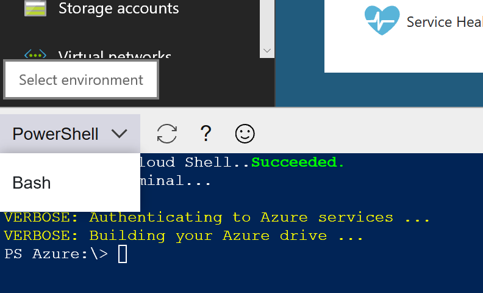

# Quickstart for PowerShell in Azure Cloud Shell

This document details how to use the PowerShell in Cloud Shell in the [Azure portal](https://portal.azure.com/).

> [!NOTE]
> A [Bash in Azure Cloud Shell](quickstart.md) Quickstart is also available.

## Start Cloud Shell

1. Click on **Cloud Shell** button from the top navigation bar of the Azure portal

  

2. Select the PowerShell environment from the drop-down and you will be in Azure drive `(Azure:)`

  

## Run PowerShell commands

Run regular PowerShell commands in the Cloud Shell, such as:

```azurepowershell-interactive
PS Azure:\> Get-Date

# Expected Output
Friday, July 27, 2018 7:08:48 AM

PS Azure:\> Get-AzureRmVM -Status

# Expected Output
ResourceGroupName       Name       Location                VmSize   OsType     ProvisioningState  PowerState
-----------------       ----       --------                ------   ------     -----------------  ----------
MyResourceGroup2        Demo        westus         Standard_DS1_v2  Windows    Succeeded           running
MyResourceGroup         MyVM1       eastus            Standard_DS1  Windows    Succeeded           running
MyResourceGroup         MyVM2       eastus   Standard_DS2_v2_Promo  Windows    Succeeded           deallocated
```

## Navigate Azure resources

 1. List all your subscriptions from `Azure` drive

    ```azurepowershell-interactive
    PS Azure:\> dir
    ```

 2. `cd` to your preferred subscription

    ```azurepowershell-interactive
    PS Azure:\> cd MySubscriptionName
    PS Azure:\MySubscriptionName>
    ```

 3. View all your Azure resources under the current subscription

    Type `dir` to list multiple views of your Azure resources.

    ```azurepowershell-interactive
    PS Azure:\MySubscriptionName> dir

        Directory: azure:\MySubscriptionName

    Mode Name
    ---- ----
    +    AllResources
    +    ResourceGroups
    +    StorageAccounts
    +    VirtualMachines
    +    WebApps
    ```

### AllResources view

Type `dir` under `AllResources` directory to view your Azure resources.

```azurepowershell-interactive
PS Azure:\MySubscriptionName> dir AllResources
```

### Explore resource groups

 You can go to the `ResourceGroups` directory and inside a specific resource group you can find virtual machines.

```azureowershell-interactive
PS Azure:\MySubscriptionName> cd ResourceGroups\MyResourceGroup1\Microsoft.Compute\virtualMachines

PS Azure:\MySubscriptionName\ResourceGroups\MyResourceGroup1\Microsoft.Compute\virtualMachines> dir


    Directory: Azure:\MySubscriptionName\ResourceGroups\MyResourceGroup1\Microsoft.Compute\virtualMachines


VMName    Location   ProvisioningState VMSize          OS            SKU             OSVersion AdminUserName  NetworkInterfaceName
------    --------   ----------------- ------          --            ---             --------- -------------  --------------------
TestVm1   westus     Succeeded         Standard_DS2_v2 WindowsServer 2016-Datacenter Latest    AdminUser      demo371
TestVm2   westus     Succeeded         Standard_DS1_v2 WindowsServer 2016-Datacenter Latest    AdminUser      demo271
```

> [!NOTE]
> You may notice that the second time when you type `dir`, the Cloud Shell is able to display the items much faster.
> This is because the child items are cached in memory for a better user experience.
However, you can always use `dir -Force` to get fresh data.

### Navigate storage resources

By entering into the `StorageAccounts` directory, you can easily navigate all your storage resources

```azureowershell-interactive
PS Azure:\MySubscriptionName\StorageAccounts\MyStorageAccountName\Files> dir

    Directory: Azure:\MySubscriptionNameStorageAccounts\MyStorageAccountName\Files

Name          ConnectionString
----          ----------------
MyFileShare1  \\MyStorageAccountName.file.core.windows.net\MyFileShare1;AccountName=MyStorageAccountName AccountKey=<key>
MyFileShare2  \\MyStorageAccountName.file.core.windows.net\MyFileShare2;AccountName=MyStorageAccountName AccountKey=<key>
MyFileShare3  \\MyStorageAccountName.file.core.windows.net\MyFileShare3;AccountName=MyStorageAccountName AccountKey=<key>
```

With the connection string, you can use the following command to mount the Azure Files share.

```azurepowershell-interactive
net use <DesiredDriveLetter>: \\<MyStorageAccountName>.file.core.windows.net\<MyFileShareName> <AccountKey> /user:Azure\<MyStorageAccountName>
```

For details, see [Mount an Azure Files share and access the share in Windows][azmount].

You can also navigate the directories under the Azure Files share as follows:

```azurepowershell-interactive
PS Azure:\MySubscriptionName\StorageAccounts\MyStorageAccountName\Files> cd .\MyFileShare1\
PS Azure:\MySubscriptionName\StorageAccounts\MyStorageAccountName\Files\MyFileShare1> dir

Mode  Name
----  ----
+     TestFolder
.     hello.ps1
```

### Interact with virtual machines

You can find all your virtual machines under the current subscription via `VirtualMachines` directory.

```azurepowershell-interactive
PS Azure:\MySubscriptionName\VirtualMachines> dir

    Directory: Azure:\MySubscriptionName\VirtualMachines


Name       ResourceGroupName  Location  VmSize          OsType              NIC ProvisioningState  PowerState
----       -----------------  --------  ------          ------              --- -----------------  ----------
TestVm1    MyResourceGroup1   westus    Standard_DS2_v2 Windows       my2008r213         Succeeded     stopped
TestVm2    MyResourceGroup1   westus    Standard_DS1_v2 Windows          jpstest         Succeeded deallocated
TestVm10   MyResourceGroup2   eastus    Standard_DS1_v2 Windows           mytest         Succeeded     running
```

#### Invoke PowerShell script across remote VMs

 > [!WARNING]
 > Please refer to [Troubleshooting remote management of Azure VMs](troubleshooting.md#troubleshooting-remote-management-of-azure-vms).

  Assuming you have a VM, MyVM1, let's use `Invoke-AzureRmVMCommand` to invoke a PowerShell script block on the remote machine.

  ```azurepowershell-interactive
  Invoke-AzureRmVMCommand -Name MyVM1 -ResourceGroupName MyResourceGroup -Scriptblock {Get-ComputerInfo} -EnableRemoting
  ```

  You can also navigate to the VirtualMachines directory first and run `Invoke-AzureRmVMCommand` as follows.

  ```azurepowershell-interactive
  PS Azure:\> cd MySubscriptionName\MyResourceGroup\Microsoft.Compute\virtualMachines
  PS Azure:\MySubscriptionName\MyResourceGroup\Microsoft.Compute\virtualMachines> Get-Item MyVM1 | Invoke-AzureRmVMCommand -Scriptblock {Get-ComputerInfo}

  # You will see output similar to the following:

  PSComputerName                                          : 65.52.28.207
  RunspaceId                                              : 2c2b60da-f9b9-4f42-a282-93316cb06fe1
  WindowsBuildLabEx                                       : 14393.1066.amd64fre.rs1_release_sec.170327-1835
  WindowsCurrentVersion                                   : 6.3
  WindowsEditionId                                        : ServerDatacenter
  WindowsInstallationType                                 : Server
  WindowsInstallDateFromRegistry                          : 5/18/2017 11:26:08 PM
  WindowsProductId                                        : 00376-40000-00000-AA947
  WindowsProductName                                      : Windows Server 2016 Datacenter
  WindowsRegisteredOrganization                           :
   ...
  ```

#### Interactively log on to a remote VM

You can use `Enter-AzureRmVM` to interactively log into a VM running in Azure.

  ```azurepowershell-interactive
  PS Azure:\> Enter-AzureRmVM -Name MyVM1 -ResourceGroupName MyResourceGroup -EnableRemoting
  ```

You can also navigate to the `VirtualMachines` directory first and run `Enter-AzureRmVM` as follows

  ```azurepowershell-interactive
 PS Azure:\MySubscriptionName\ResourceGroups\MyResourceGroup\Microsoft.Compute\virtualMachines> Get-Item MyVM1 | Enter-AzureRmVM
 ```

### Discover WebApps

By entering into the `WebApps` directory, you can easily navigate your web apps resources

```azurepowershell-interactive
PS Azure:\MySubscriptionName> dir .\WebApps\

    Directory: Azure:\MySubscriptionName\WebApps

Name            State    ResourceGroup      EnabledHostNames                  Location
----            -----    -------------      ----------------                  --------
mywebapp1       Stopped  MyResourceGroup1   {mywebapp1.azurewebsites.net...   West US
mywebapp2       Running  MyResourceGroup2   {mywebapp2.azurewebsites.net...   West Europe
mywebapp3       Running  MyResourceGroup3   {mywebapp3.azurewebsites.net...   South Central US

# You can use Azure cmdlets to Start/Stop your web apps
PS Azure:\MySubscriptionName\WebApps> Start-AzureRmWebApp -Name mywebapp1 -ResourceGroupName MyResourceGroup1

Name           State    ResourceGroup        EnabledHostNames                   Location
----           -----    -------------        ----------------                   --------
mywebapp1      Running  MyResourceGroup1     {mywebapp1.azurewebsites.net ...   West US

# Refresh the current state with -Force
PS Azure:\MySubscriptionName\WebApps> dir -Force

    Directory: Azure:\MySubscriptionName\WebApps

Name            State    ResourceGroup      EnabledHostNames                  Location
----            -----    -------------      ----------------                  --------
mywebapp1       Running  MyResourceGroup1   {mywebapp1.azurewebsites.net...   West US
mywebapp2       Running  MyResourceGroup2   {mywebapp2.azurewebsites.net...   West Europe
mywebapp3       Running  MyResourceGroup3   {mywebapp3.azurewebsites.net...   South Central US
```

## SSH

To authenticate to servers or VMs using SSH, generate the public-private key pair in Cloud Shell and
publish the public key to `authorized_keys` on the remote machine, such as `/home/user/.ssh/authorized_keys`.

> [!NOTE]
> You can create SSH private-public keys using `ssh-keygen` and publish them to `$env:USERPROFILE\.ssh` in Cloud Shell.

### Using SSH

Follow instructions [here](https://docs.microsoft.com/azure/virtual-machines/linux/quick-create-powershell) to create a new VM configuration using AzureRM cmdlets.
Before calling into `New-AzureRmVM` to kick off the deployment, add SSH public key to the VM configuration.
The newly created VM will contain the public key in the `~\.ssh\authorized_keys` location, thereby enabling credential-free SSH session to the VM.

```azurepowershell-interactive
# Create VM config object - $vmConfig using instructions on linked page above

# Generate SSH keys in Cloud Shell
ssh-keygen -t rsa -b 2048 -f $HOME\.ssh\id_rsa 

# Ensure VM config is updated with SSH keys
$sshPublicKey = Get-Content "$HOME\.ssh\id_rsa.pub"
Add-AzureRmVMSshPublicKey -VM $vmConfig -KeyData $sshPublicKey -Path "/home/azureuser/.ssh/authorized_keys"

# Create a virtual machine
New-AzureRmVM -ResourceGroupName <yourResourceGroup> -Location <vmLocation> -VM $vmConfig

# SSH to the VM
ssh azureuser@MyVM.Domain.Com
```

## List available commands

Under `Azure` drive, type `Get-AzureRmCommand` to get context-specific Azure commands.

Alternatively, you can always use `Get-Command *azurerm* -Module AzureRM.*` to find out the available Azure commands.

## Install custom modules

You can run `Install-Module` to install modules from the [PowerShell Gallery][gallery].

## Get-Help

Type `Get-Help` to get information about PowerShell in Azure Cloud Shell.

```azurepowershell-interactive
Get-Help
```

For a specific command, you can still do `Get-Help` followed by a cmdlet.

```azurepowershell-interactive
Get-Help Get-AzureRmVM
```

## Use Azure Files to store your data

You can create a script, say `helloworld.ps1`, and save it to your `clouddrive` to use it across shell sessions.

```azurepowershell-interactive
cd $HOME\clouddrive
code .\helloworld.ps1
# Add the content, such as 'Hello World!'
.\helloworld.ps1
Hello World!
```

Next time when you use PowerShell in Cloud Shell, the `helloworld.ps1` file will exist under the `$HOME\clouddrive` directory that mounts your Azure Files share.

## Use custom profile

You can customize your PowerShell environment, by creating PowerShell profile(s) - `profile.ps1` (or `Microsoft.PowerShell_profile.ps1`).
Save it under `$profile.CurrentUserAllHosts` (or `$profile.CurrentUserAllHosts`), so that it can be loaded in every PowerShell in Cloud Shell session.

For how to create a profile, refer to [About Profiles][profile].

## Use Git

To clone a Git repo in the Cloud Shell, you need to create a [personal access token][githubtoken] and use it as the username. Once you have your token, clone the repository as follows:

```azurepowershell-interactive
  git clone https://<your-access-token>@github.com/username/repo.git
```

## Exit the shell

Type `exit` to terminate the session.

[bashqs]:quickstart.md
[gallery]:https://www.powershellgallery.com/
[customex]:https://docs.microsoft.com/azure/virtual-machines/windows/extensions-customscript
[profile]: https://msdn.microsoft.com/powershell/reference/5.1/microsoft.powershell.core/about/about_profiles
[azmount]: https://docs.microsoft.com/azure/storage/files/storage-how-to-use-files-windows
[githubtoken]: https://help.github.com/articles/creating-a-personal-access-token-for-the-command-line/
