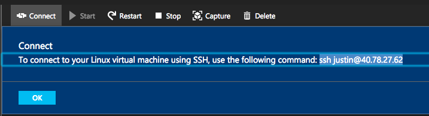
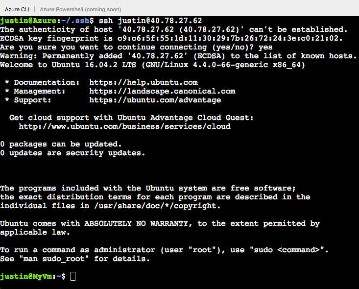

# Quickstart
This document details how to use the Azure Cloud Shell in the [Azure portal](https://ms.portal.azure.com/).

## Start Cloud Shell
1. Launch **Cloud Shell** from the top navigation of the Azure portal  

2. Select a subscription to create a storage account and Azure file share with  

3. Select "Create storage"

> [!TIP]
> You are automatically authenticated for Azure CLI 2.0 in every sesssion.

### Set your subscription
1. List subscriptions you have access to:  
`az account list`
2. Set your preferred subscription:  
`az account set --subscription my-subscription-name`

> [!TIP]
> Your subscription will be remembered for future sessions using `azureProfile.json` held in your $Home directory.

### Create a resource group
Create a new resouce group in WestUS named "MyRG":  
`az group create -l westus -n MyRG`  

### Create a Linux VM
Create an Ubuntu VM in your new resource group. The Azure CLI 2.0 will create ssh keys and setup the VM with them.  
`az vm create -n my_vm_name -g MyRG --image UbuntuLTS --generate-ssh-keys`

> [!NOTE]
> The public and private keys used to authenticate your VM are placed in `/User/.ssh/id_rsa` and `/User/.ssh/id_rsa.pub` by Azure CLI 2.0 by default. Your .ssh folder is persisted in your attached Azure file share's 5-GB image.

Your username on this VM will be your username used in Cloud Shell ($User@Azure:).

### SSH into your Linux VM
1. Search for your VM name in the Azure portal search bar
2. Click "Connect" and run: `ssh username@ipaddress`

Upon establishing the SSH connection, you should see the Ubuntu welcome prompt.

## Cleaning up 
Delete your resource group and any resources within it:  
Run `az group delete -n MyRG`

## Next Steps
[Learn about persisting storage on Cloud Shell](persisting-shell-storage.md) 
[Learn about Azure CLI 2.0] (https://docs.microsoft.com/cli/azure/) 
[Learn about Azure File Storage] (https://docs.microsoft.com/azure/storage/storage-introduction#file-storage) 
