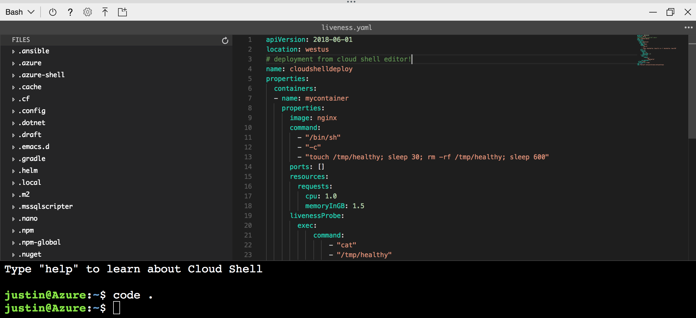
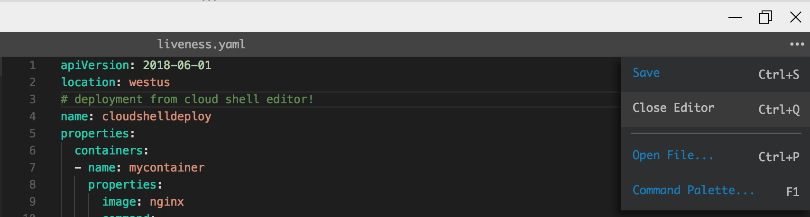
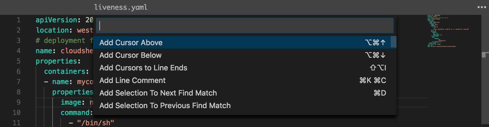

# Using the Azure Cloud Shell editor

Azure Cloud Shell includes an integrated file editor built from the open-source [Monaco Editor](https://github.com/Microsoft/monaco-editor). The Cloud Shell editor supports features such as language highlighting, the command palette, and a file explorer.

## Opening the editor

For simple file creation and editing, launch the editor by running `code .` in the Cloud Shell terminal. This action opens the editor with your active working directory set in the terminal.

To directly open a file for quick editing, run `code <filename>` to open the editor without the file explorer.

To open the editor via UI button, click the `{}` editor icon from the toolbar. This will open the editor and default the file explorer to the `/home/<user>` directory.

## Closing the editor

To close the editor, open the `...` action panel in the top right of the editor and select `Close editor`.

## Command palette

To launch the command palette, use the `F1` key when focus is set on the editor. Opening the command palette can also be done through the action panel.

## Contributing to the Monaco Editor

Language highlight support in the Cloud Shell editor is supported through upstream functionality in the [Monaco Editor](https://github.com/Microsoft/monaco-editor)'s use of Monarch syntax definitions. To learn how to make contributions, read the [Monaco contributor guide](https://github.com/Microsoft/monaco-editor/blob/master/CONTRIBUTING.md).

## Next steps
[Try the quickstart for Bash in Cloud Shell](quickstart.md)
[View the full list of integrated Cloud Shell tools](features.md)