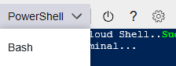
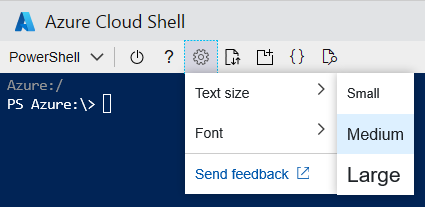

# Using the Azure Cloud Shell window

This document explains how to use the Cloud Shell window.

## Swap between Bash and PowerShell environments

Use the environment selector in the Cloud Shell toolbar to swap between Bash and PowerShell environments.

## Restart Cloud Shell

> [!WARNING]
> Restarting Cloud Shell will reset machine state and any files not persisted by your Azure file share will be lost.

* Click the restart icon in the Cloud Shell toolbar to reset machine state.

## Minimize & maximize Cloud Shell window

* Click the minimize icon on the top right of the window to hide it. Click the Cloud Shell icon again to unhide.
* Click the maximize icon to set window to max height. To restore window to previous size, click restore.

## Concurrent sessions
Cloud Shell enables multiple concurrent sessions across browser tabs by allowing each session to exist as a separate Bash process.
If exiting a session, be sure to exit from each session window as each process runs independently although they run on the same machine.

## Copy and paste
[!INCLUDE [copy-paste](../../includes/cloud-shell-copy-paste.md)]

## Resize Cloud Shell window
* Click and drag the top edge of the toolbar up or down to resize the Cloud Shell window.

## Scrolling text display
* Scroll with your mouse or touchpad to move terminal text.

## Changing the text size

* Click the settings icon on the top left of the window, then hover over the "Text size" option and select your desired text size. Your selection will be persisted across sessions.

## Exit command
Running `exit` terminates the active session. This behavior occurs by default after 20 minutes without interaction.

## Next steps

[Bash in Cloud Shell Quickstart](quickstart.md)
[PowerShell in Cloud Shell Quickstart](quickstart-powershell.md)