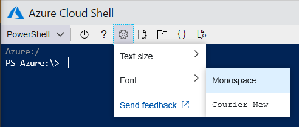
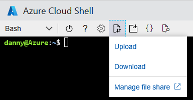
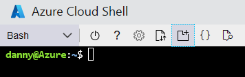
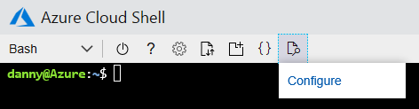
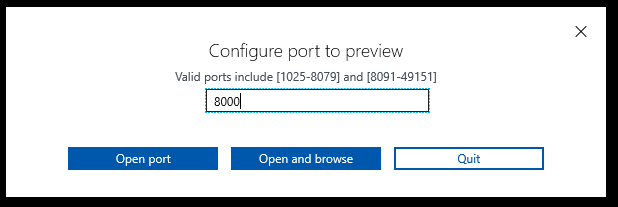
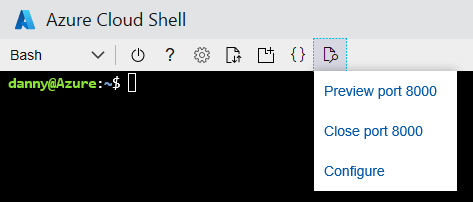

# Using the Azure Cloud Shell window

This document explains how to use the Cloud Shell window.

## Swap between Bash and PowerShell environments

Use the environment selector in the Cloud Shell toolbar to swap between Bash and PowerShell environments.

## Restart Cloud Shell

> [!WARNING]
> Restarting Cloud Shell will reset machine state and any files not persisted by your Azure file share will be lost.

* Click the restart icon in the Cloud Shell toolbar to reset machine state.

## Change the text size

* Click the settings icon on the top left of the window, then hover over the "Text size" option and select your desired text size. Your selection will be persisted across sessions.

## Change the font

* Click the settings icon on the top left of the window, then hover over the "Font" option and select your desired font.  Your selection will be persisted across sessions.

## Upload and download files

* Click the upload/download files icon on the top left of the window, then select upload or download.
    * For uploading files, use the pop-up to browse to the file on your local computer, select the desired file, and click the "Open" button.  The file will be uploaded into
    the `/home/user` directory.
    * For downloading files, enter the fully qualified file path into the pop-up window, and select the "Download" button.  
    > [!NOTE] 
    > Files and file paths are case sensitive in Cloud Shell. Double check your casing in your file path.

## Open another Cloud Shell window
Cloud Shell enables multiple concurrent sessions across browser tabs by allowing each session to exist as a separate process.
If exiting a session, be sure to exit from each session window as each process runs independently although they run on the same machine.  

* Click the open new session icon on the top left of the window. A new tab will open with another session connected to the existing container.

## Cloud Shell editor
* Refer to the [Using the Azure Cloud Shell editor](using-cloud-shell-editor.md) page.

## Web preview
  
 

* Click the web preview icon on the top left of the window, select "Configure", specify the desired port to open.  Select either "Open port" to only open the port, or "Open and browse" to open the port and preview the port in a new tab.  
    
 
* Click the web preview icon on the top left of the window, select "Preview port ..." to preview an open port in a new tab.
* Click the web preview icon on the top left of the window, select "Close port ..." to close the open port.

## Minimize & maximize Cloud Shell window

* Click the minimize icon on the top right of the window to hide it. Click the Cloud Shell icon again to unhide.
* Click the maximize icon to set window to max height. To restore window to previous size, click restore.

## Copy and paste
[!INCLUDE [copy-paste](../../includes/cloud-shell-copy-paste.md)]

## Resize Cloud Shell window
* Click and drag the top edge of the toolbar up or down to resize the Cloud Shell window.

## Scrolling text display
* Scroll with your mouse or touchpad to move terminal text.

## Exit command
Running `exit` terminates the active session. This behavior occurs by default after 20 minutes without interaction.

## Next steps

[Bash in Cloud Shell Quickstart](quickstart.md)  
[PowerShell in Cloud Shell Quickstart](quickstart-powershell.md)