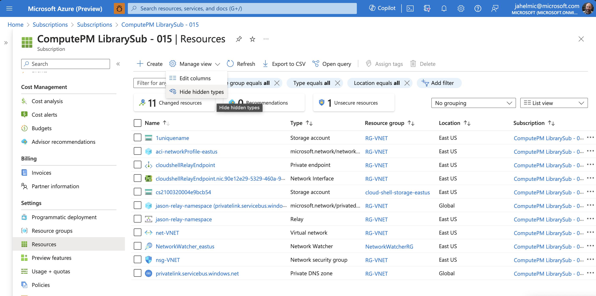

# Troubleshooting Azure Cloud Shell in a private virtual network

This article provides instructions for troubleshooting a private virtual network deployment of Azure
Cloud Shell. For best results, and to be supportable, following the deployment instructions in the
[Deploy Azure Cloud Shell in a virtual network using quickstart templates][07] article.

## Verify you have set the correct permissions

To configure Azure Cloud Shell in a virtual network, you must have the **Owner** role assignment on
the subscription. To view and assign roles, see [List Owners of a Subscription][08]

Unless otherwise noted, all the troubleshooting steps start in **Subscriptions** section of the
Azure portal.

1. Sign in to the [Azure portal][09].
1. On the Azure portal menu, search for **Subscriptions**. Select it from the available options.
1. Select the subscription you want to view.

## Verify resource provider registrations

To use Cloud Shell, you must register the **Microsoft.CloudShell** and **Microsoft.Relay** resource
providers for your subscription. You only need to register the namespace once per subscription. To
see all resource providers, and the registration status for your subscription:

1. On the left menu, under **Settings**, select **Resource providers**.
1. In the search box, enter `cloudshell` to search for the resource provider.
1. Select the **Microsoft.CloudShell** resource provider register from the provider list.
1. Select **Register** to change the status from **unregistered** to **Registered**.

   ![Screenshot of selecting resource providers in the Azure portal.][06]

1. In the search box, enter `relay` to search for the resource provider.
1. Select the **Microsoft.Relay** resource provider register from the provider list.
1. Select **Register** to change the status from **unregistered** to **Registered**.

   ![Screenshot of selecting resource providers in the Azure portal.][05]

## Verify Azure Container Instance Service role assignments

Verify Microsoft.Relay and Network profile have Azure Container Instance Service role. Use the
following steps to see the resources and the role permissions for your subscription:

1. On the left menu, under **Settings**, select **Resources**.
1. In the **Manage View** icon on the top toolbar, select **Show hidden types**.

   

1. Select the network profile resource **aci-networkprofile-<location>**.
1. On the left menu, select **Access control (IAM)**, then select **Role assignments** from the top
   menu bar.
1. In the search box, enter `container` to search for the network contributor.
1. Ensure that **Azure Container Instance Service** appears in the list.

   ![Screenshot of selecting resource providers in the Azure portal.][01]

1. Select the rely namespace resource matching the pattern: **<unique-name>-relay-namespace**.
1. On the left menu, select **Access control (IAM)**, then select **Role assignments** from the top
   menu bar.
1. In the search box, enter `container` to search for the network contributor.
1. Ensure that **Azure Container Instance Service** appears in the list.

   ![Screenshot of selecting resource providers in the Azure portal.][04]

## Redeploy the Cloud Shell for a private virtual network

When you receive the following error message, you must redeploy the Cloud Shell for a private
virtual or you can open a support ticket.

<!-- link references -->
[01]: ./media/vnet-tsg/aci-network.png
[02]: ./media/vnet-tsg/azure-container-instance-service.png
[03]: ./media/vnet-tsg/entra-id.png
[04]: ./media/vnet-tsg/relay-namespace.png
[05]: ./media/vnet-tsg/resource-provider-relay.png
[06]: ./media/vnet-tsg/resource-provider.png
[07]: quickstart-deploy-vnet.md
[08]: /azure/role-based-access-control/role-assignments-list-portal#list-owners-of-a-subscription
[09]: https://portal.azure.com/
