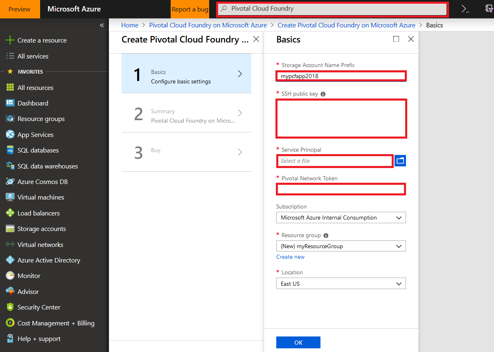
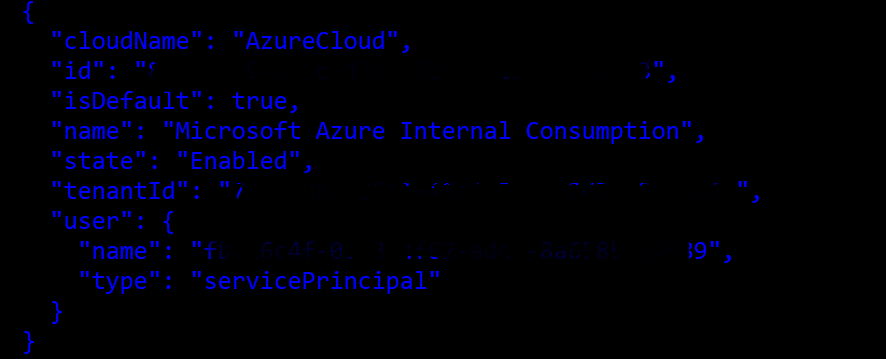
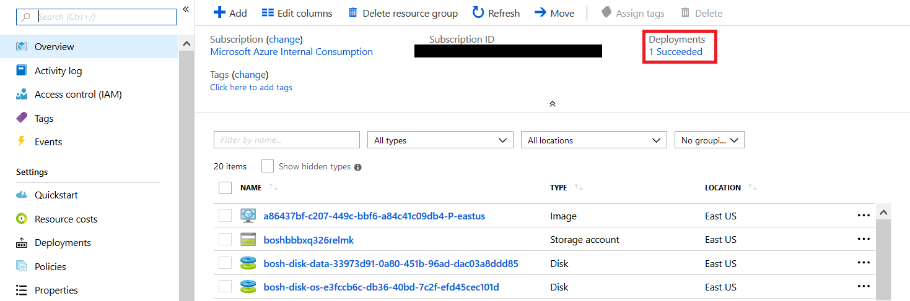
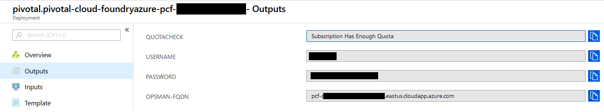
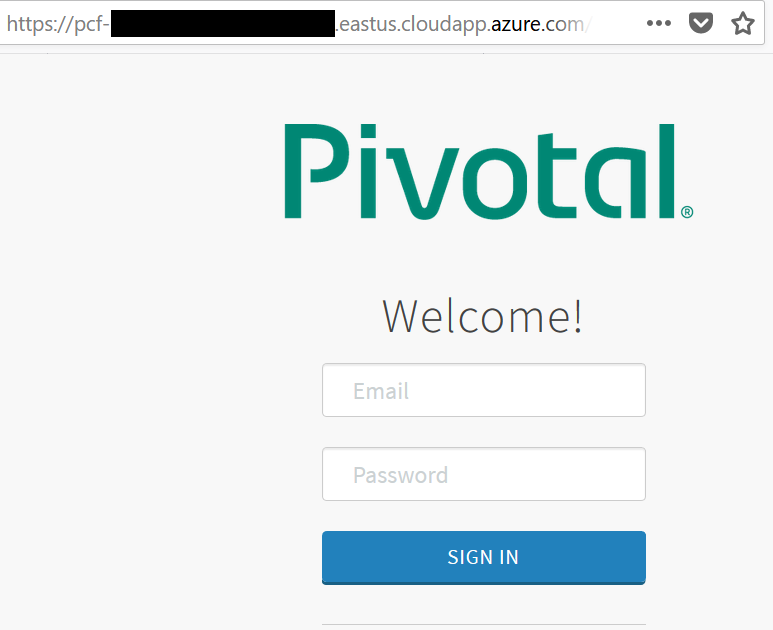
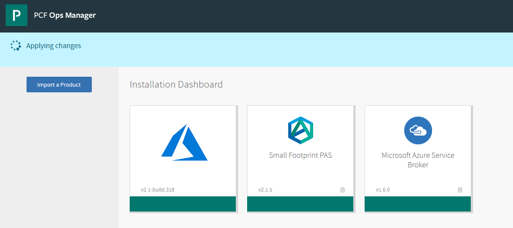

# Create a Pivotal Cloud Foundry cluster on Azure

This tutorial provides quick steps to create and generate the parameters you need to provision a Pivotal Cloud Foundry (PCF) cluster on Azure. To find the Pivotal Cloud Foundry solution, perform a search in the Azure [Marketplace](https://azuremarketplace.microsoft.com/marketplace/apps/pivotal.pivotal-cloud-foundry).




## Generate an SSH public key

There are several ways to generate a public secure shell (SSH) key by using Windows, Mac, or Linux.

```Bash
ssh-keygen -t rsa -b 2048
```

For more information, see [Use SSH keys with Windows on Azure](https://docs.microsoft.com/azure/virtual-machines/linux/ssh-from-windows).

## Create a service principal

> [!NOTE]
>
> To create a service principal, you need owner account permission. You also can write a script to automate creating the service principal. For example, you can use the Azure CLI [az ad sp create-for-rbac](https://docs.microsoft.com/cli/azure/ad/sp?view=azure-cli-latest).

1. Sign in to your Azure account.

    `az login`

    
 
    Copy the "id" value as your **subscription ID**, and copy the "tenantId" value to use later.

2. Set your default subscription for this configuration.

    `az account set -s {id}`

3. Create an Azure Active Directory application for your PCF. Specify a unique alphanumeric password. Store the password as your **clientSecret** to use later.

    `az ad app create --display-name "Svc Principal for OpsManager" --password {enter-your-password} --homepage "{enter-your-homepage}" --identifier-uris {enter-your-homepage}`

    Copy the "appId" value in the output as your **clientID** to use later.

    > [!NOTE]
    >
    > Choose your own application home page and identifier URI, for example, [http://www.contoso.com](http://www.contoso.com).

4. Create a service principal with your new app ID.

    `az ad sp create --id {appId}`

5. Set the permission role of your service principal as a Contributor.

    `az role assignment create --assignee “{enter-your-homepage}” --role “Contributor”`

    Or you also can use

    `az role assignment create --assignee {service-principal-name} --role “Contributor”`

    

6. Verify that you can successfully sign in to your service principal by using the app ID, password, and tenant ID.

    `az login --service-principal -u {appId} -p {your-password}  --tenant {tenantId}`

7. Create a .json file in the following format. Use the **subscription ID**, **tenantID**, **clientID**, and **clientSecret** values you copied previously. Save the file.

    ```json
    {
        "subscriptionID": "{enter-your-subscription-Id-here}",
        "tenantID": "{enter-your-tenant-Id-here}",
        "clientID": "{enter-your-app-Id-here}",
        "clientSecret": "{enter-your-key-here}"
    }
    ```

## Get the Pivotal Network token

1. Register or sign in to your [Pivotal Network](https://network.pivotal.io) account.
2. Select your profile name in the upper-right corner of the page. Select **Edit Profile**.
3. Scroll to the bottom of the page, and copy the **LEGACY API TOKEN** value. This value is your **Pivotal Network Token** value that you use later.

## Provision your Cloud Foundry cluster on Azure

Now you have all the parameters you need to provision your [Pivotal Cloud Foundry cluster on Azure](https://azuremarketplace.microsoft.com/marketplace/apps/pivotal.pivotal-cloud-foundry).
Enter the parameters, and create your PCF cluster.

## Verify the deployment, and sign in to the Pivotal Ops Manager

1. Your PCF cluster shows a deployment status.

    

2. Select the **Deployments** link in the navigation on the left to get credentials for your PCF Ops Manager. Select the **Deployment Name** on the next page.
3. In the navigation on the left, select the **Outputs** link to display the URL, username, and password for the PCF Ops Manager. The "OPSMAN-FQDN" value is the URL.
 
    
 
4. Start the URL in a web browser. Enter the credentials from the previous step to sign in.

    
         
    > [!NOTE]
    >
    > If the Internet Explorer browser fails due to a "Site not secure" warning message, select **More information** and go to the webpage. For Firefox, select **Advance** and add the certification to proceed.

5. Your PCF Ops Manager displays the deployed Azure instances. Now you can deploy and manage your applications here.
               
    
 
