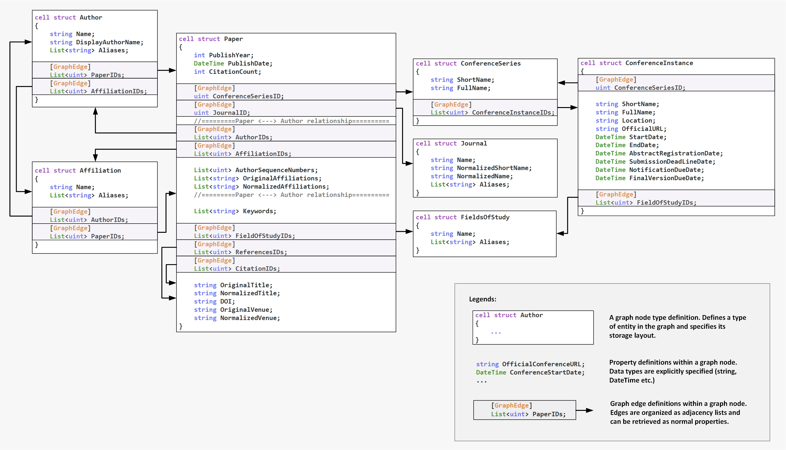

# Graph Search Method

The **graph search** REST API is used to return a set of academic entities based on the given graph patterns.  The response is a set of graph paths satisfying the user-specified constraints. A graph path is an interleaved sequence of graph nodes and edges in the form of _v0, e0, v1, e1, ..., vn_, where _v0_ is the starting node of the path.
<br>

**REST endpoint:**  
```
https://westus.api.cognitive.microsoft.com/academic/v1.0/graph/search?
```   
<br>

## Request Parameters  

Name     | Value | Required?  | Description
-----------|-----------|---------|--------
**mode**       | Text string | Yes | Name of the mode that you wish to use. The value is either *json* or *lambda*.

The graph search method must be called via an HTTP POST request. The post request should include the content type header: **application/json**.

##### JSON Search 

For the *json* search, the POST body is a JSON object. The JSON object describes a path pattern with user-specified constraints (see the [specification of JSON object](JSONSearchSyntax.md) for *json* search).


##### Lambda Search

For the *lambda* search, the POST body is a plain-text string. The POST body is a LIKQ lambda query string, which  is a single C# statement (see the [specification of query string](LambdaSearchSyntax.md) for *lambda* search). 

<br>

## Response (JSON)

Name | Description
-------|-----   
**results** | An array of 0 or more entities that match the query expression. Each entity contains the values of requested attributes. This field is present if the request has been successfully processed.
**error** |	HTTP status codes. This field is present if the request fails.
**message** | Error message. This field is present if the request fails.

If a query cannot be processed within _800 ms_, a _timeout_ error will be returned. 

<br>

#### Example:

##### JSON Search
```
https://westus.api.cognitive.microsoft.com/academic/v1.0/graph/search?mode=json
```
<br>
For the *json* search, if we want to get the papers whose titles contain "graph engine" and written by "bin shao", we can specify the query as follows.

```JSON
{
  "path": "/paper/AuthorIDs/author",
  "paper": {
    "type": "Paper",
    "NormalizedTitle": "graph engine",
    "select": [
      "OriginalTitle"
    ]
  },
  "author": {
    "return": {
      "type": "Author",
      "Name": "bin shao"
    }
  }
}
```

The output of a query is an array of graph paths. A graph path is an array of node objects corresponding to the nodes specified in the query path. These node objects have at least one property *CellID*, which represents the entity ID. Other properties can be retrieved by specifying the property names via the select operator of a [*Traversal Action Object*](JSONSearchSyntax.md).

```JSON
{
  "Results": [
    [
      {
        "CellID": 2160459668,
        "OriginalTitle": "Trinity: a distributed graph engine on a memory cloud"
      },
      {
        "CellID": 2093502026
      }
    ],
    [
      {
        "CellID": 2171539317,
        "OriginalTitle": "A distributed graph engine for web scale RDF data"
      },
      {
        "CellID": 2093502026
      }
    ],
    [
      {
        "CellID": 2411554868,
        "OriginalTitle": "A distributed graph engine for web scale RDF data"
      },
      {
        "CellID": 2093502026
      }
    ],
    [
      {
        "CellID": 73304046,
        "OriginalTitle": "The Trinity graph engine"
      },
      {
        "CellID": 2093502026
      }
    ]
  ]
}
 ```

##### Lambda Search 

```
https://westus.api.cognitive.microsoft.com/academic/v1.0/graph/search?mode=lambda
```
<br>
For the *lambda* search, if we want to get the author IDs of a given paper, we can write a query like the following one.

```
MAG.StartFrom(@"{
    type  : ""Paper"",
    match : {
        NormalizedTitle : ""trinity: a distributed graph engine on a memory cloud""
    }
}").FollowEdge("AuthorIDs").VisitNode(Action.Return)
```

The output of a *lambda* search query is also an array of graph paths:

```JSON
{
  "Results": [
    [
      {
        "CellID": 2160459668
      },
      {
        "CellID": 2142490828
      }
    ],
    [
      {
        "CellID": 2160459668
      },
      {
        "CellID": 2116756368
      }
    ],
    [
      {
        "CellID": 2160459668
      },
      {
        "CellID": 2093502026
      }
    ]
  ]
}
```
 
## Graph Schema

Graph schema is useful for writing graph search queries. It is shown in the following figure.


