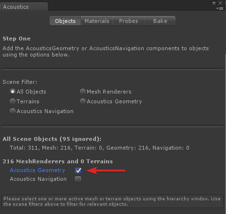

# Getting Started With Acoustics in Unity
For more information about what Microsoft Acoustics is, check out the [Introduction to Microsoft Acoustics](index.md).

## Supported platforms
* Unity 2018+ for bakes, using .NET 4.x scripting runtime version
* Unity 5.2+ for runtime, using 48-kHz sample rate, "Best Performance" DSP buffer size
* Windows 64-bit Unity Editor
* Windows desktop, UWP, and Android targets
* Azure Batch subscription required for bakes

## Importing the plugin
Import the UnityPackage to your project. 
* In Unity, go to Assets > Import Package > Custom Package... 
  
* Choose MicrosoftAcoustics.unitypackage

Note that when importing this package it makes a settings change to Project Settings/Player: setting it to .NET 4.x. Unity requires a restart to pick up this settings change and will not tell you so please restart Unity after importing the package.

## Calculating the acoustics for your scene
The first step in creating the runtime acoustics for your project is to [calculate the acoustic properties of each scene](BakeUIWalkthrough.md).

### Enable the plugin
The bake portion of the acoustics toolkit requires the .NET 4.x scripting runtime version. Package import will update your Unity player settings, then Unity will need to restart.
 

### Create a Navigation Mesh
Use the standard [Unity workflow](https://docs.unity3d.com/Manual/nav-BuildingNavMesh.html) to create a navigation mesh for your project.

### Mark your scene objects for acoustics
Bring up the acoustics window using Window > Acoustics in Unity.

De-select any selected items in the Unity hierarchy window, then in the acoustics Object tab click "Acoustics Geometry" to mark all meshes and terrains in your scene as acoustics geometry.

To unmark meshes or terrain for acoustics, select it and uncheck the "Acoustics Geometry" checkbox.

On the Materials tab, assign the acoustic materials to materials used in your scene. The 'Default' material has absorption equivalent to concrete.

### Preview the probes
On the Probes tab, click Calculate. When calculation is complete, you'll see floating spheres in the scene view, which denote the locations for acoustics simulation. If you get close enough to an object in the scene window, you can also see the voxelization of the scene that will be used during the bake. The green voxels should line up with the objects you marked as geometry. The probe points and voxel displays can be toggled in the Gizmos menu.

### Bake in the cloud
In the Bake tab, enter your Azure credentials and click Bake. If you don't have an Azure Batch account, see [this walkthrough for our recommended account setup](CreateAzureAccount.md).
When the bake is finished, the data file will automatically be downloaded to your AcousticsData directory.

## Using the Acoustics Runtime
* In Unity, go to Edit > Project Settings > Audio, and select "Microsoft Acoustics" as the Spatializer Plugin for your project. Also make sure the DSP Buffer Size is set to Best Performance, as this changes the buffer size used in Unity's audio engine. Only the largest buffer size is currently supported.  
  
  
* Drag and drop the Microsoft Acoustics prefab from the project panel into your scene  
  
* Click on the MicrosoftAcoustics Game Object and go to its inspector panel 
* Specify the location of your ACE file by drag-and-dropping it into the Acoustics Manager script, or by clicking on the circle button next to the text box. The ACE file should follow the form "<scenename>.ace.bytes".
  

* Create an audio source. Click the checkbox at the bottom of the AudioSource's inspector panel that says "Spatialize." Make sure the Spatial Blend is set to full 3D  
  
* Open the Audio Mixer (Window > Audio Mixer). Make sure you have at least one Mixer, with one group. If you don't, Click the '+' button to the right of "Mixers" 
* Right-click the bottom of the channel strip in the effects section, and add the "Microsoft Acoustics Mixer" effect. Note that only one Microsoft Acoustics Mixer is supported at a time.  
  
* Assign all spatialized audio sources' outputs to the group. Without this, all spatialized audio sources may be muted.

## Tuning parameters without rebaking
Sometimes, the results of the bake sound great for one category of sounds, but another category of sounds requires less realism and needs adjustment. This can be accomplished by adding the AcousticsSourceCustomization script to the Audio Sources that need tuning. The script has three parameters  
  
* **Reverb Power Adjust** - This value adjusts the reverb power, in dB. Positive values make a sound more reverberant, negative values make a sound more dry.
* **Decay Time Scale** - This value adjusts the decay time in a multiplicative fashion. For example, if the acoustics table query results in a decay time of 750 milliseconds, but this value is set to 1.5, the resulting decay time is 1.125 seconds.
* **Enable Acoustics** - This checkbox controls whether this sound source uses the results of the acoustics table query or not. When this checkbox is checked, all acoustic parameters from the lookup table will be applied. When this checkbox is unchecked, the source will still be spatialized, but no acoustics lookup query is performed. The result is through-the-wall directionality, with no obstruction/occlusion effects, and no dynamic change in reverb.  

To adjust parameters for all sources, click on the channel strip in the Audio Mixer, and adjust the parameters on the Microsoft Acoustics Mixer effect.

  

## Viewing bake information at runtime
Viewing voxels and probe points at runtime can help debug issues with sound sources being stuck inside the voxelized geometry. To toggle the voxel grid and probe points display, click the corresponding checkbox in the Gizmos menu.  
  
The voxel display can help determine if visual components in the game have a transform applied to them. If so, apply the same transform to the GameObject hosting the Acoustics Manager.

## Deploying to Android
To use Microsoft Acoustics on Android, change your build target to Android. Some versions of Unity have a bug with deploying audio plugins -- make sure you are not using a version affected by [this bug](https://issuetracker.unity3d.com/issues/android-ios-audiosource-playing-through-google-resonance-audio-sdk-with-spatializer-enabled-does-not-play-on-built-player).
