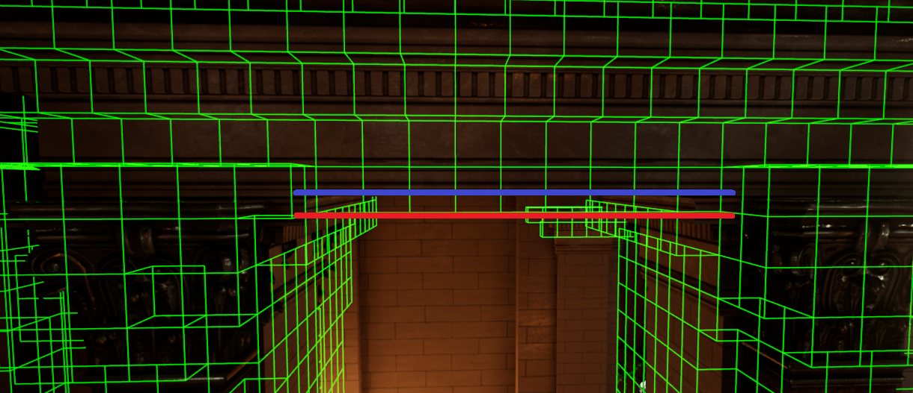

# Project Acoustics Bake Resolution
This conceptual overview describes the difference between coarse and fine resolutions while baking acoustics. You choose this setting during the Probes step of the baking workflow.

## Coarse vs fine resolution

The only difference between the coarse and fine resolution settings is the frequency at which the simulation is performed. Fine uses a frequency twice as high as coarse. This has a number of implications on the acoustic simulation:

* The wavelength for coarse is twice as long as fine, and therefore the voxels are twice as large.
* The simulation time is directly related to the voxel size, making a coarse bake about 16 times faster than a fine bake.
* Portals (for example, doors or windows) smaller than the voxel size can't be simulated. The coarse setting may cause some of these smaller portals to not be simulated; therefore, they won't pass sound through at runtime. You can see if this is happening by viewing the voxels.
* The lower simulation frequency results in less diffraction around corners and edges.
* Sound sources can't be located inside "filled" voxels (i.e. voxels that contain geometry). This results in no sound. It's more difficult to place sound sources so they are not inside the larger voxels of coarse than it is when using the fine setting.
* The larger voxels will intrude more into portals, as shown below. The first image was created using coarse, while the second is the same doorway using fine resolution. As indicated by the red markings, there is much less intrusion into the doorway using the fine setting. The blue line is the doorway as defined by the geometry, while the red line is the effective acoustic portal defined by the voxel size. How this intrusion plays out in a given situation depends completely on how the voxels line up with the geometry of the portal, which is determined by the size and locations of your objects in the scene.

## Next steps

Try out the coarse and fine resolution settings yourself using our [Unreal](unreal-baking.md) or [Unity](unity-baking.md) plugins.