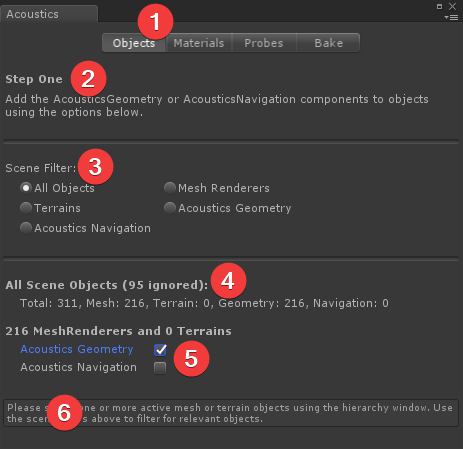
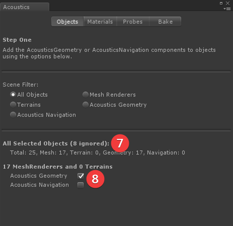
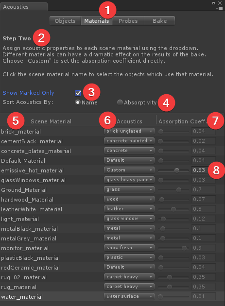
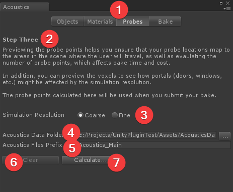
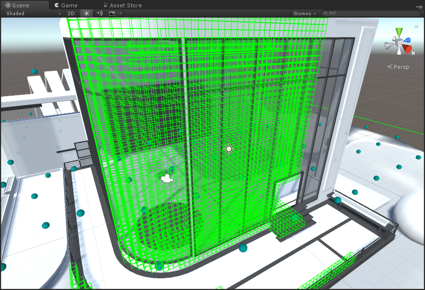
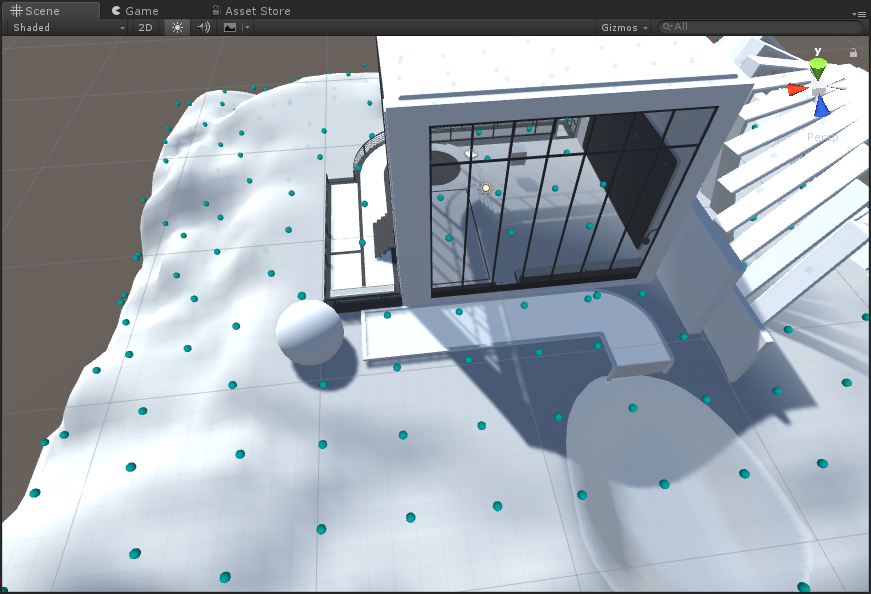
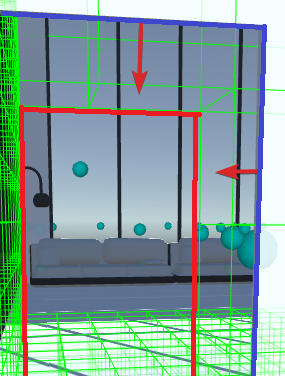
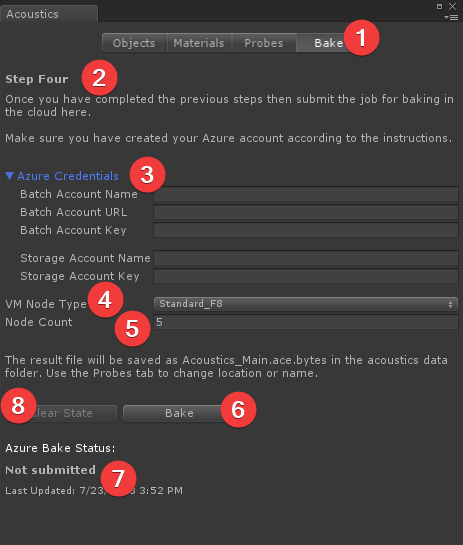
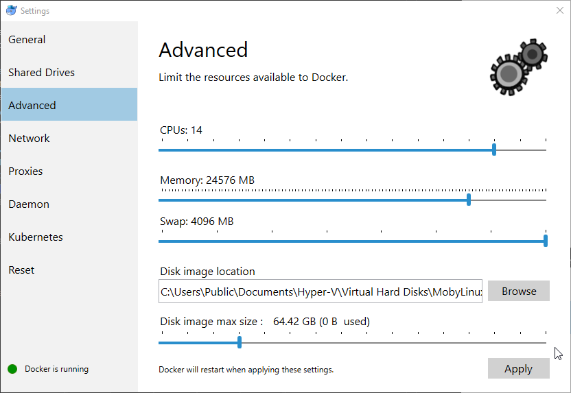
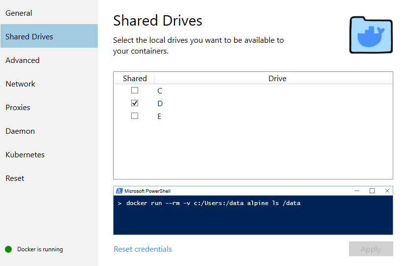

# Bake acoustics

This document describes the process of submitting an acoustics bake using the Unity editor extension. For more background on acoustics, see [What is Acoustics](what-is-acoustics.md). For a quickstart guide, see [Getting Started](getting-started.md).

## Import the plugin

Import the Acoustics plugin package to your project. Then open the Acoustics UI by choosing **Window > Acoustics** from the Unity menu:

## Principles

The Acoustics tool window gathers the information the acoustics engine needs to calculate the acoustics for your scene. There are five steps to doing a bake:

1. Create or mark your player navigation mesh
2. Mark acoustics geometry
3. Assign acoustic materials properties to geometry
4. Preview probe placement
5. Bake

After the bake is complete, see [Design Process Overview for Acoustics](design-process.md) for optional post-bake design steps.

## Create or mark a navigation mesh

A navigation mesh is used to place probe points for simulation. You can use Unity's  [navigation mesh workflow](https://docs.unity3d.com/Manual/nav-BuildingNavMesh.html), or you can specify your own navigation mesh. Navigation meshes created with Unity's workflow will be picked up by the acoustics system. To use your own meshes, mark them from the **Objects** tab as described in the next step.

## Objects tab

Open the **Objects** tab of the **Acoustics** window. Use this tab to mark objects in your scene, which simply adds the **AcousticsGeometry** or **AcousticsNavigation** components to the object. You can also use the [standard Unity component workflow](https://docs.unity3d.com/Manual/UsingComponents.html) to mark or unmark objects.

Select one or more objects in the scene window or hierarchy and then mark or unmark them for **AcousticsGeometry** or **AcousticsNavigation** as described below. If nothing is selected, then you can mark or unmark everything in the scene at once.

Only Mesh Renderers and Terrains can be marked. All other object types will be ignored. The checkboxes will mark or unmark all of the affected objects.

If you have nothing selected in your scene, it will look like the following picture:

If you have something selected in your scene or hierarchy window, it will look like the following picture:

### Objects tab parts

The parts of the tab page are:

1. The tab selection buttons (**Objects** tab selected). Use these buttons to walk through the various steps of doing an acoustics bake, from left to right.
2. A brief description of what you need to do using this page.
3. Available filters for the hierarchy window. Use this to filter the hierarchy window to objects of the specified type so you can more easily mark them. If you have not yet marked anything for acoustics, selecting the last two options will show you nothing. However, they can be useful to find marked objects once you have done so.
4. When no objects are selected, this section shows the status of all objects in the scene:
    * Total - The total number of active, non-hidden objects in the scene.
    * Ignored - The number of objects that are not Mesh Renderers or Terrains.
    * Mesh - The number of Mesh Renderer objects in the scene
    * Terrain - The number of Terrain objects in the scene
    * Geometry - The number of Mesh or Terrain objects in the scene marked as "Acoustics Geometry"
    * Navigation - The number of Mesh or Terrain objects in the scene marked as "Acoustics Navigation". This number doesn't include Unity's NavMesh.
5. Shows the total number of 'mark-able' objects in the scene, which is only Mesh Renderers and Terrains. Shows checkboxes you can use to mark (add the appropriate component to) those objects as geometry or navigation for acoustics
6. When nothing is selected, this note reminds you to select objects for marking if needed. You can also check one or both checkboxes to mark all the objects in the scene without selecting anything.
7. When objects are selected, this section shows the status of only the selected objects.
8. Shows the total number of 'mark-able' selected objects. Checking or unchecking the checkboxes will mark or unmark only the selected objects.

If some objects are marked and some aren't, the appropriate checkbox will show a "mixed" value:

Clicking the checkbox will force all objects to be marked, and clicking again will unmark all the objects.

Objects can be marked for both geometry and navigation.

### Guidelines for marking objects

Be sure to mark any objects as **Acoustics Geometry** if they should occlude, reflect, or absorb sound. Acoustics geometry can include things like ground, walls, roofs,  windows & window glass, rugs, and large furniture. It's okay to include smaller objects such as lamps, decorative items, light fixtures, as they don't appreciably increase the bake cost. It's important to not miss major elements such as the ground or a ceiling. Also, don't include things that shouldn't affect the acoustics, such as collision meshes.

An object's transform at the time of the probe calculation (via the **Probes** tab, below) is fixed in the bake results. Moving any of the marked objects in the scene will require redoing the probe calculation and rebaking the scene.

## Materials tab

Once your objects are marked, click the **Materials** button to go to the Materials Tab.

### Parts of the Materials tab

1. The **Materials** tab button, used to bring up this page.
2. A brief description of what you need to do using this page.
3. When checked, only materials used by objects marked as **Acoustics Geometry** will be listed. Otherwise, all materials used in the scene will be listed.
4. Use these options to change the order of the dropdown menu that is shown when you click a dropdown in the Acoustics column below (#6). **Name** sorts the acoustic materials by name. "Absorptivity" sorts them in order of absorptivity from low to high.
5. The list of materials used in the scene, sorted alphabetically. If the **Show Marked Only** checkbox is checked (#3), only materials used by objects marked as **Acoustics Geometry** are shown. Clicking on a material here will select all objects in the scene that use that material.
6. Shows the acoustic material that the scene material has been assigned to. Click a dropdown to reassign a scene material to a different acoustic material. You can change the sorting order of the menu shown when you click an item here using the **Sort Acoustics By:** options above (#4).
7. Shows the acoustic absorption coefficient of the material selected in the previous column. A value of zero means perfectly reflective (no absorption), while a value of 1 means perfectly absorptive (no reflection). The absorption coefficient can't be changed unless the selected material is "Custom".
8. For a material assigned to "Custom", the slider is no longer disabled and you can choose the absorption coefficient using the slider or by typing in a value. For more information on material properties, see [Design Process Overview for Acoustics](design-process.md).

### Guidelines for assigning materials (or absorption values)

This tab tries to guess what the absorption of your materials is based on the name. For example, if your scene material name is LivingRoom_WoodTable, the initial acoustic material assigned to it will be "wood". Materials where a known material can't be determined are assigned the "Default" material, which has absorption similar to concrete.

You can reassign acoustic materials to each scene material. For example, if a room sounds too reverberant, change the acoustic material of the walls, floor, or ceiling to something of higher absorptivity. The acoustic material assignment applies to all objects that use that scene material.

## Probes tab

After assigning the materials, switch to the **Probes** tab.

### Parts of the Probes tab

1. The **Probes** tab button used to bring up this page
2. A brief description of what you need to do using this page
3. Use these to choose a coarse or fine simulation resolution. Coarse is faster, but has certain tradeoffs. See ["Coarse vs Fine Resolution"](#Coarse-vs-Fine-Resolution) below for details.
4. Choose the location where the acoustics data files should be placed using this field. Click the button with "..." to use a folder picker. The default is **Assets/AcousticsData**. An **Editor** subfolder will also be created under this location. For more information about data files, see ["Data Files"](#Data-Files) below.
5. The data files for this scene will be named using the prefix provided here. The default is "Acoustics_[Scene Name]".
6. After the probes have been calculated, the controls above will be disabled. Click the **Clear** button to erase the calculations and enable the controls so that you can recalculate using new settings.
7. Click the **Calculate...** button to voxelize the scene and calculate the probe point locations. This is done locally on your machine, and must be done prior to doing a bake.

In this version of Project Acoustics, probes can't be placed manually and must be placed through the automated process provided in the **Probes** tab.

### What the "Calculate..." button calculates

The **Calculate...** button takes all the data you have provided so far (geometry, navigation, materials, and the Coarse/Fine setting) and goes through several steps:

1. It takes the geometry from the scene meshes and calculates a voxel volume. The voxel volume is a 3-dimensional volume that encloses your entire scene, and is made up of small cubic "voxels". The size of the voxels is determined by the simulation frequency, which is set by the **Simulation Resolution** setting. Each voxel is marked as being either "open air" or containing scene geometry. If a voxel contains geometry then the voxel is tagged with the absorption coefficient of the material assigned to that geometry.
2. It then uses the navigation data to calculate acoustically interesting locations where the player might go. It tries to find a reasonably small set of these locations that includes smaller areas such as doorways and hallways, and then to rooms, to open spaces. For small scenes this typically is fewer than 100 locations, while large scenes may have up to a thousand.
3. For each of the final listener locations it computes, it determines a number of parameters such as how "open" is the space, the size of the room it is in, etc.
4. The results of these calculations are stored in files at the location you specify (See ["Data Files"](#Data-Files) below)

Depending on the size of your scene and the speed of your machine, these calculations can take several minutes.

Once these calculations are complete, you can preview both the voxel data and the probe point locations to help ensure that the bake will give you good results. Things like a bad navigation mesh or missing/extra geometry will typically be quickly visible in the preview so you can correct it.

### Scene rename

The scene name is used to connect the scene to files storing the probe point placement and voxelization. If the scene is renamed after probe points are calculated, the material assignment and placement data is lost and should be rerun.

## Debug display through Gizmos

By default, both the **Probes** and **Voxels** gizmos are turned on. These will show you the voxels and probe point locations that were calculated. They can be enabled or disabled using the Gizmos menu:

### Voxels

Voxels are shown in the scene window as green cubes around participating geometry. Voxels that contain only air are not shown. There is a large green box around your entire scene that denotes the complete voxel volume that will be used in the simulation.
Move around your scene and verify that everything that should be geometry has voxels. The scene camera has to be within about 5 meters of the object for the voxels to show.

If you compare the voxels created with Coarse resolution vs Fine resolution, you will see that the coarse voxels are twice as large.

### Probe points

Probe points are synonymous with possible player (listener) locations. When doing a bake, the acoustics for a sound source anywhere in the scene is calculated for each of these probe points. If the player is not directly at a probe point location, the data from the probe points nearest to the player are used to interpolate the parameters at that location.

Therefore it is important to ensure that probe points exist anywhere the player is expected to travel in the scene, and that small areas and doorways are adequately represented. Probe points are placed by the Project Acoustics engine based on interpretation of your scene's geometry and cannot be moved or edited in this Designer Preview. Use them instead to verify the correctness of your geometry marking and of the navigation hint data.

### Coarse vs Fine resolution

The only difference between the Coarse and Fine resolution settings is the frequency at which the simulation is performed. Fine uses a frequency twice as high as Coarse.
While this may seem simple, it has a number of implications on the acoustic simulation:

* The wavelength for Coarse is twice as long as Fine, and therefore the voxels are twice as large.
* The simulation time is directly related to the voxel size, making a Coarse bake about 16 times faster than a Fine bake.
* Portals (for example, doors or windows) smaller than the voxel size cannot be simulated. The Coarse setting may cause some of these smaller portals to not be simulated; therefore, they will not pass sound through at runtime. You can see if this is happening by viewing the voxels.
* The lower simulation frequency results in less diffraction around corners and edges.
* Sound sources cannot be located inside "filled" voxels, that is voxels that contain geometry - this results in no sound. It is more difficult to locate sound sources so they are not inside the larger voxels of Coarse than it is using the Fine setting.
* The larger voxels will intrude more into portals, as shown below. The first image was created using Coarse, while the second is the same doorway using Fine resolution. As indicated by the red markings, there is much less intrusion into the doorway using the Fine setting. The blue line is the doorway as defined by the geometry, while the red line is the effective acoustic portal defined by the voxel size. How this intrusion plays out in a given situation depends completely on how the voxels line up with the geometry of the portal, which is determined by the size and locations of your objects in the scene.

## Bake tab

Once you're happy with the preview data, use the **Bake** tab to submit your bake to the cloud.

### Parts of the bake tab

1. The Bake Tab button used to bring up this page.
2. A brief description of what to do on this page.
3. Fields to enter your Azure Credentials once your Azure account has been created. For more information, see [Create an Azure Batch Account](create-azure-account.md).
4. Docker image tag for the acoustics toolset.
5. Launch Azure portal to manage your subscriptions, monitor usage and view billing information etc. 
6. Azure batch compute node type to use for the calculation. The node type must be supported by your Azure data center location. If not sure, leave at **Standard_F8s_v2**.
7. Number of nodes to use for this calculation. The number you enter here affects the time to complete the bake and is limited by your Azure Batch core allocation. The default allocation only allows for two 8 core nodes or one 16 core node, but can be expanded. For more information on core allocation constraints, see [Create an Azure Batch Account](create-azure-account.md).
8. Select this checkbox to configure your compute pool to use [low-priority nodes](https://docs.microsoft.com/azure/batch/batch-low-pri-vms). Low-priority compute nodes have much lower cost but they may not always be available or may be preempted at any time.
9. The probe count for your scene as calculated on the **Probes** tab. The number of probes determines the number of simulations that need to be run in the cloud. You cannot specify more nodes than there are probes.
10. The amount of elapsed time it is expected to take for your job to run in the cloud. This does not include node startup time. Once the job starts running, this is about how long it should be before you get back the results. Note that this is only an estimate.
11. The total amount of computing time needed to run the simulations. This is the total amount of node compute time that will be used in Azure. See [Estimating bake cost](#Estimating-bake-cost) below for more information on using this value.
12. This message tells you where the results of the bake will be saved once the job completes.
13. (Advanced Use Only) If for some reason you need to force Unity to forget about a bake you submitted (e.g. you downloaded the results using another machine), click the **Clear State** button to forget about the job that was submitted. Note that this means the result file, when ready, will **not** be downloaded, and **this is not the same as canceling the job**. The job, if running, will continue to run in the cloud.
14. Click the Bake button to submit the bake to the cloud. While a job is running, this shows **Cancel Job** instead.
15. Prepares for processing acoustics simulation on a local machines. See [Local bake](#Local-bake) for more information.  
16. This area shows the status of the bake. When completed, it should show **Downloaded**.

You can always get complete information about active jobs, compute pools, and storage at the [Azure Portal](https://portal.azure.com).

While a job is running the **Bake** button changes to **Cancel Job**. Use this button to cancel the job in progress. You will be asked to confirm before the job is canceled. Canceling a job cannot be undone, no results will be available, and you will still be charged for any Azure compute time used.

Once you've started a bake, you can close Unity. Depending on the project, node type, and number of nodes, a cloud bake can take several hours. The bake job status will be updated when you reload the project and open the Acoustics window. If the job has completed, the output file will be downloaded.

The Azure credentials are stored securely on your local machine and associated with your Unity editor. They are used solely to establish a secure connection to Azure.

###  Estimating Azure bake cost

To estimate what a given bake will cost, take the value shown for **Estimated Compute Cost**, which is a duration, and multiply that by the hourly cost in your local currency of the **VM Node Type** you selected. The result will not include the node time needed to get the nodes up and running. For example, if you select **Standard_F8s_v2** for your node type, which has a cost of $0.40/hr, and the Estimated Compute Cost is 3 hours and 57 minutes, the estimated cost to run the job will be $0.40 * ~4 hours = ~$1.60. The actual cost will likely be a bit higher due to the extra time to get the nodes started. You can find the hourly node cost on the [Azure Batch Pricing](https://azure.microsoft.com/pricing/details/virtual-machines/linux) page (select "Compute optimized" or "High performance compute" for the category).

### Reviewing the bake results

After the bake completes, check that the voxels and probe points are in their expected locations by running the runtime plugin. More information is in [Design Process Overview for Acoustics](design-process.md).

## Local bake
Local bake runs acoustics simulation on your own PC instead of offloading it to the Azure Batch compute cluster. This can be a good option for experimenting with acoustics without requiring an Azure subscription. Note that the Acoustics simulation is computationally demanding and can take a long time depending on the size of the scene, simulation configuration, and raw computing power of the processing machine.

### Minimum hardware requirements
64-bit Intel processor with at least 8 cores and 32 GB of RAM or higher.

As an example, on an 8 core machine with Intel Xeon E5-1660 @ 3 GHz and 32 GB RAM -
* Small scene with 100 probes takes ~2 hours for a coarse bake and ~32 hours for a fine resolution bake.
* Larger scene with 1000 probes can take up to ~20 hours for a coarse resolution and ~21 days for a fine resolution bake.

### Setup Docker
Install and configure Docker on the PC that will process the simulation -
1. Install the [Docker toolset](https://www.docker.com/products/docker-desktop).
2. Launch Docker settings, navigate to the "Advanced" options and configure resources to have at leat 8GB RAM. The more CPUs you can allocate to Docker, the faster the bake will complete. 
3. Navigate to "Shared Drives" and turn on sharing for the drive used for processing.

### Run local bake
1. Click on "Prepare Local Bake" button on the Bake tab and select a folder where the input files and execution scripts will be saved. You can then run the bake on any machine as long as it meets the minimum hardware requirements and has Docker installed by copying the folder to that machine.
2. Launch the simulation using the "runlocalbake.bat" script. This script will fetch the Project Acoustics Docker image with the toolset necessary for simulation processing and start the simulation. 
3. Once the simulation has finished, copy the resulting .ace file back to your Unity project. To make sure Unity recognizes this as a binary file, append ".bytes" to the file extension (for example, "Scene1.ace.bytes"). The detailed logs for the simulation are stored in "AcousticsLog.txt." If you run into any issues, share this file to assist with diagnosis.

## Data files

There are four data files created by this plugin at various points. Only one of them is needed at runtime, therefore the other three are inside folders named "Editor" so they won't be compiled into your project.

* **Assets/Editor/[SceneName]\_AcousticsParameters.asset**: This file stores the data you enter in fields in the Acoustics UI. The location and name of this file can't be changed. There are other values stored in this file that affect the bake, but they are for advanced users and should not be changed.
* **Assets/AcousticsData/Acoustics\_[SceneName].ace.bytes**: This file is what is created during the bake simulation, and contains the lookup data used by the runtime to render the acoustics of your scene. The location and name of this file can be changed using the fields on the **Probes** Tab.
* **Assets/AcousticsData/Editor/Acoustics_[SceneName].vox**: This file stores the voxelized acoustics geometry and the material properties. Computed using the **Calculate...** button on the Probes Tab. The location and name of this file can be changed using the fields on the **Probes** Tab.
* **Assets/AcousticsData/Editor/Acoustics\_[SceneName]\_config.xml**: This file stores parameters computed using the **Calculate...** button on the **Probes** Tab. The location and name of this file can be changed using the fields on the **Probes** Tab.

Take care not to delete the *.ace.bytes file downloaded from the bake. This file isn't recoverable except by rebaking the scene.

## Next steps
* Apply bake results to sound sources in [Design Process Overview for Acoustics](design-process.md).

