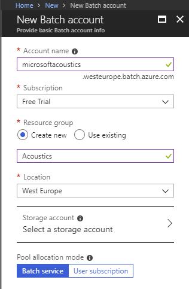
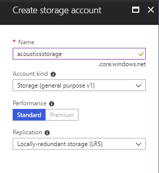
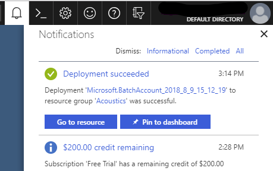
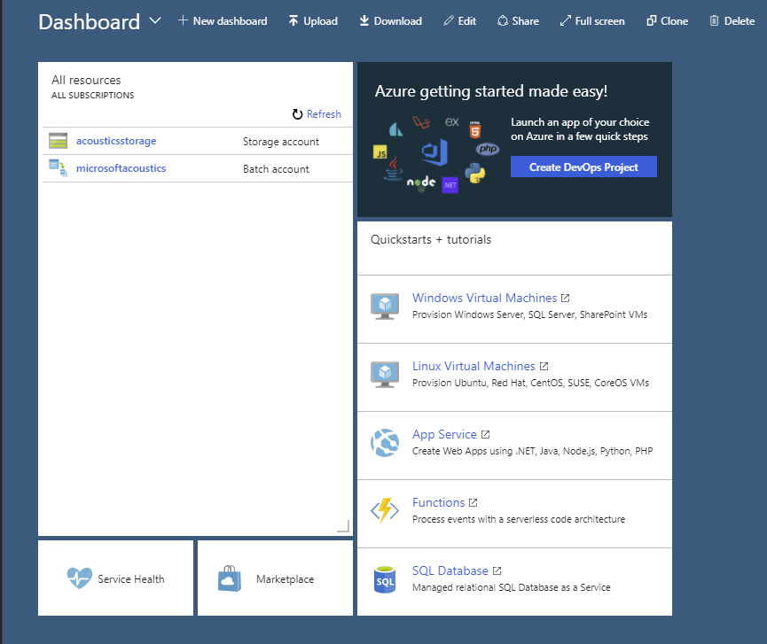
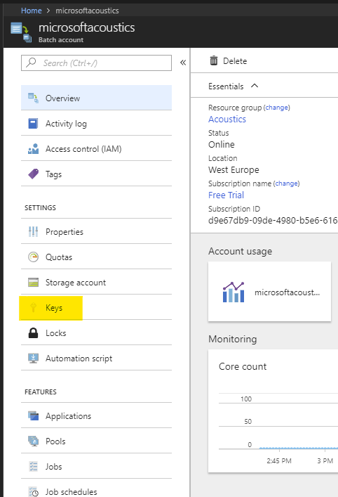
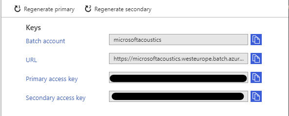
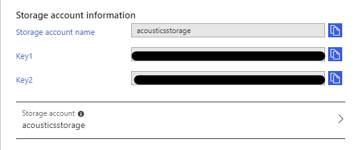

# Create an Azure Batch account
Follow this guide for setting up Azure Batch and Storage accounts necessary for working with acoustics. For information about the Unity plugin developed as part of Project Acoustics, see [What is acoustics](what-is-acoustics.md). For information about how to incorporate acoustics into your Unity project, see [Getting Started](getting-started.md).  

## Get an Azure subscription
An [Azure Subscription](https://azure.microsoft.com/free/) is required before setting up Batch and Storage accounts. If you're signing up for the first time, Azure provides a few time-limited free resources and $200 credit.

## Create Azure Batch and storage accounts
Next, follow [these instructions](https://docs.microsoft.com/azure/batch/batch-account-create-portal) to set up your Azure Batch and associated Azure Storage accounts.

Pick default options for both Batch and Storage accounts:
  
  

  

It takes a few minutes for Azure to deploy the accounts. Look for a completion notification in the upper right corner on the portal.
  
  

Your accounts should now be visible on your dashboard.
  
  

## Set up acoustics bake UI with Azure credentials
Click on the Batch account link on the dashboard, then click on the **Keys** link on the Batch account page to access your credentials.
  
  

  

Click on the **Storage Account** link on the page to access your Azure Storage account credentials.
  
  

Enter these credentials in the Bake tab as described in the [bake UI walkthrough](bake-ui-walkthrough.md).

## Node types and region support
Project Acoustics requires F- and H-series compute optimized Azure VM nodes which may not be supported in all Azure regions. Please check [this table](https://azure.microsoft.com/global-infrastructure/services)
to ensure you're picking the right location for your Batch account. At this moment H series virtual machines are supported in East US, North Central US, South Central US, West US, West US 2, North Europe, West Europe and Japan West.

## Upgrading your quota
Azure Batch accounts are provisioned on account creation with a limit of 20 compute cores. You may want to increase this limit for faster bake times, because you can parallelize your acoustics workload across many nodes, up to the number of probe points in your scene. You can request a quota increase by clicking on the **Quota** link on your Azure Batch portal page and then clicking on **Request Quota Increase**:

## Next steps
* Get started [integrating acoustics into your Unity project](getting-started.md)
* Explore the [sample scene](sample-walkthrough.md)

