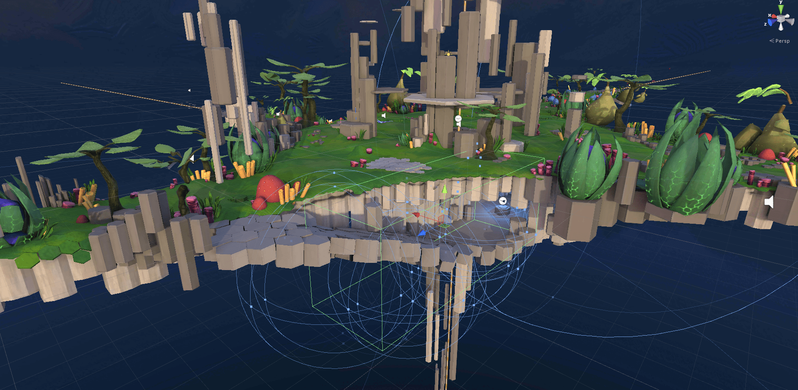
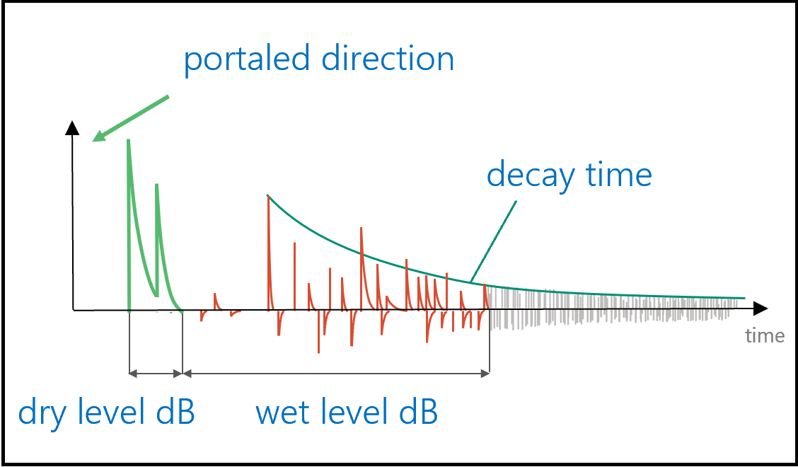

# Project Acoustics Design Process Concepts

This conceptual overview explains how Project Acoustics incorporates physical acoustic simulation into the sound design process.

## Sound design with audio DSP parameters

3D interactive titles achieve their particular sound using audio digital signal processing (DSP) blocks hosted in an audio engine. These blocks range in complexity from simple mixing, to reverberation, echo, delay, equalization, compression and limiting, and other effects. Selecting, arranging, and setting parameters on these effects is the responsibility of the sound designer, who builds an audio graph that achieves the aesthetic and gameplay goals of the experience.

In an interactive title, as the sounds and listener move throughout the 3D space, how do these parameters adapt to changing conditions? The sound designer will often arrange volumes throughout the space that are programmed to trigger parameter changes to achieve changes in reverberation effects, for example, or to duck sounds in the mix as the listener moves from one part of the scene to another. Acoustics systems are also available that can automate some of these effects.

3D titles use lighting and kinematic physics systems that are physics-motivated but designer-adjusted to achieve a mix of immersion and gameplay goals. A visual designer doesn't set individual pixel values, but rather adjusts 3D models, materials, and light transport systems that are all physically-based to trade off visual aesthetics and CPU costs. What would be the equivalent process for audio? Project Acoustics is a first step in the exploration of this question. First we'll touch on what it means to transport acoustical energy through a space.

## Impulse responses: Acoustically connecting two points in space

If you're familiar with audio design, you may be familiar with acoustic impulse responses. An acoustic impulse response models the transport of a sound from a source to a listener. Therefore an impulse response can capture every interesting effect of room acoustics such as occlusion and reverberation. Impulse responses also have certain powerful properties that allow audio DSP effects to scale. Adding two audio signals together and processing with an impulse response gives the same result as applying the impulse response separately to each signal and adding the results. Acoustic propagation and impulse responses also don't depend on the audio being processed, only on the scene being modeled, and the source and listener locations. In short, an impulse response distills the scene's effect on sound propagation.

An impulse response captures every interesting room acoustic effect, and we can apply it to audio efficiently with a filter, and we can get impulse responses from measurement or simulation. But what if we don't quite want the acoustics to match the physics exactly, but rather mold it to match the emotional demands of a scene? But much like pixel values, an impulse response is just a list of thousands of numbers, how can we possibly adjust it to meet aesthetic needs? And what if we want to have occlusion/obstruction that varies smoothly while passing through doorways or behind obstacles, how many impulse responses do we need to get a smooth effect? What if the source moves fast? How do we interpolate?

It sounds difficult to use simulation and impulse responses for some aspects of acoustics in interactive titles. But we can still build an audio transport system that supports designer adjustments if we can connect our impulse responses from simulation with our familiar audio DSP effect parameters.

## Connecting simulation to audio DSP with parameters

An impulse response contains every interesting (and every uninteresting)  acoustical effect. Audio DSP blocks, when their parameters are set properly, can render interesting acoustical effect. Using acoustical simulation to drive an audio DSP block to automate audio transport in a 3D scene is only a matter of measuring the audio DSP parameters from an impulse response. This measurement is well understood for certain common and important acoustical effects including occlusion, obstruction, portalling, and reverberation.

But if the simulation is connected directly to the audio DSP parameters, where is the designer adjustment? What did we gain? Well, we gain a significant amount of memory back by discarding impulse responses and retaining a few DSP parameters. And to give the designer some power over the final result, we need only find a way to insert the designer between the simulation and the audio DSP.

## Sound design by transforming audio DSP parameters from simulation

Consider the effect your sunglasses have on your view of the world. On a bright day, the glasses can reduce the shine to something more comfortable. In a dark room, you might not be able to see anything at all. The glasses don't set a certain level of brightness in all situations; they just make everything darker.

If we use simulation to drive our audio DSP using occlusion and reverberation parameters, we can add a filter after the simulator to adjust the parameters that the DSP 'sees'. The filter wouldn't enforce a certain level of occlusion or reverb tail length, much like sunglasses don't make every room the same brightness. The filter might just make every occluder occlude less. Or occlude more. By adding and adjusting one 'darkening' occlusion parameter filter, large, open rooms would still have little to no occlusion effect, while doorways would increase from a medium to a strong occlusion effect, while retaining the smoothness in effect transitions that the simulation provides.

In this paradigm, the designer's task changes from choosing acoustic parameters for each and every situation, to selecting and adjusting filters to apply to the most important DSP parameters coming from simulation. It elevates the designer's activities from the narrow concerns of setting up smooth transitions to the higher concerns of the intensity of occlusion and reverberation effects and the presence of sources in the mix. Of course, when the situation demands, one filter always available is to simply go back to choosing the DSP parameters for a specific source in a specific situation.

## Sound design in Project Acoustics

The Project Acoustics package integrates each of the components described above: a simulator, an encoder that extracts parameters and builds the acoustics asset, audio DSP, and a selection of filters. Sound design with Project Acoustics entails choosing parameters for the filters that adjust the occlusion and reverberation parameters derived from simulation and applied to the audio DSP, with dynamic controls exposed inside the game editor and the audio engine.

## Next steps
* Try out the design paradigm using the [Project Acoustics quickstart for Unity](unity-quickstart.md) or the [Project Acoustics quickstart for Unreal](unreal-quickstart.md)
* Explore the [Project Acoustics design controls for Unity](unity-workflow.md) or the [Project Acoustics design controls for Unreal](unreal-workflow.md)

