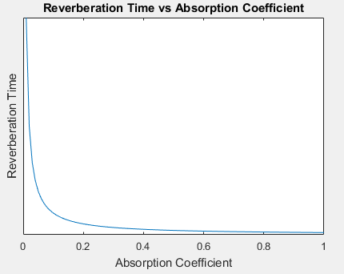
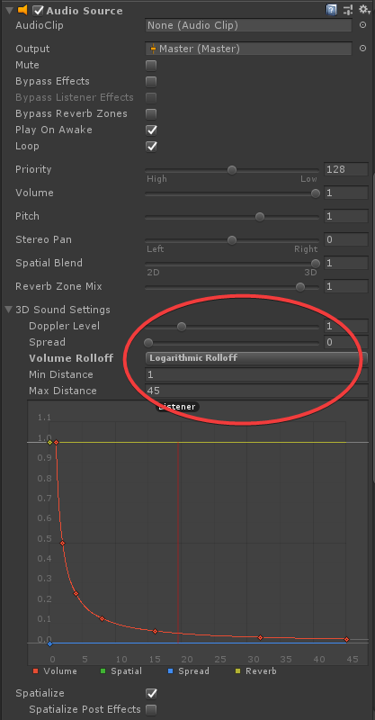
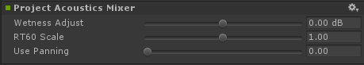

# Design process overview
You can express your design intent in all three phases of the Project Acoustics workflow: pre-bake scene setup, sound source placement, and post-bake design. The process requires less markup associated with placing reverb volumes while retaining designer control over how a scene sounds.

## Pre-bake design
The pre-bake scene setup process produces the scene and metadata that are used for the sound wave simulation, which includes selecting which scene elements will participate in the simulation to provide occlusions, reflections, and reverberation. The metadata for the scene is the selection of acoustic materials for each scene element. The acoustic materials control the amount of sound energy reflected back from each surface.

The default absorption coefficient for all surfaces is 0.04, which is highly reflective. You can achieve aesthetic and gameplay effects by tuning the absorption coefficients of different materials throughout the scene, which are especially prominent to listeners when they hear the transitions from one area of the scene to another. For example, transitioning from a dark reverberant room to a bright, non-reverberant outdoor scene enhances the impact of the transition. To achieve this effect, tune the absorption coefficients on the outdoor scene materials higher.

The reverberation time of a given material in a room is inversely related to its absorption coefficient, with most materials having absorption values in the 0.01 to 0.20 range. Materials with absorption coefficients outside this range are very absorbent.

The [bake UI walk through](bake-ui-walkthrough.md) describes the pre-bake controls in detail.

## Sound source placement
Viewing voxels and probe points at runtime can help debug issues with sound sources being stuck inside the voxelized geometry. To toggle the voxel grid and probe points display, click the corresponding checkbox in the Gizmos menu, in the upper right of the scene view. If the sound source is inside a wall voxel, move it into an air voxel.

  

The voxel display can help determine if visual components in the game have a transform applied to them. If so, apply the same transform to the GameObject hosting the **Acoustics Manager**.

### Voxel size discrepancies
You may notice that the size of the voxels used to illustrate which of the scene meshes participate in the acoustics bake is different in the design time and runtime views. This difference does not affect the quality/granularity of your selected simulation frequency but is rather a biproduct of the runtime use of the voxelized scene. At runtime the simulation voxels are “refined” to support the interpolation between source locations. This also enables design time positioning of sound sources closer to the scene meshes than the simulation voxel size allows – since sources inside a voxel that contain an acoustically treated mesh do not make any sound.

Here are two images showing the difference between design (pre-bake) voxels and runtime (post-bake) voxels as visualized by the Unity plugin:

Design time voxels:

Runtime voxels:

The decision on whether or not the voxel mesh accurately represents the architecture/structural scene meshes should be made using the design mode voxels, not the runtime visualization of the refined voxels.

## Post-bake design
Bake results are stored in the ACE file as occlusion and reverberation parameters for all source-listener location pairs throughout the scene. This physically accurate result can be used for your project as-is, and is a great starting point for design. The post-bake design process specifies rules for transforming the bake result parameters at runtime.

### Distance-based attenuation
The audio DSP provided by the **Microsoft Acoustics** Unity spatializer plugin respects the per-source distance-based attenuation built into the Unity Editor. Controls for distance-based attenuation are in the **Audio Source** component found in the **Inspector** panel of sound sources, under **3D Sound Settings**:

Acoustics performs computation in a "simulation region" box centered around the player location. If a sound source is distant from the player, located outside this simulation region, only geometry within the box will affect the sound propagation (such as causing occlusion) which works reasonably well when occluders are in the vicinity of the player. However, in cases when the player is in open space but the occluders are near the distant sound source, the sound can become unrealistically disoccluded. Our suggested workaround is to ensure in such cases that the sound attenuation falls off to 0 at about 45m, the default horizontal distance of the player to the edge of the box.

### Tuning scene parameters
To adjust parameters for all sources, click on the channel strip in Unity's **Audio Mixer**, and adjust the parameters on the **Acoustics Mixer** effect.

### Tuning source parameters
Attaching the **AcousticsAdjust** script to a source enables tuning parameters for that source. To attach the script, click **Add Component** on the bottom of the **Inspector** panel and navigate to **Scripts > Acoustics Adjust**. The script has six controls:

* **Enable Acoustics** - Controls whether acoustics is applied to this source. When unchecked, the source will be spatialized with HRTFs, but without acoustics, meaning without obstruction, occlusion, and dynamic reverberation parameters such as level and decay time. Reverberation is still applied with a fixed level and decay time.
* **Occlusion** - Apply a multiplier to the occlusion dB level computed by the acoustics system. If this multiplier is greater than 1, occlusion will be exaggerated, while values less than 1 make the occlusion effect more subtle, and a value of 0 disables occlusion.
* **Transmission (dB)** - Set the attenuation (in dB) caused by transmission through geometry. Set this slider to its lowest level to disable transmission. Acoustics spatializes the initial dry audio as arriving around scene geometry (portaling). Transmission provides an additional dry arrival that is spatialized in the line-of-sight direction. Note that the distance attenuation curve for the source is also applied.
* **Wetness (dB)** - Adjusts the reverb power, in dB, according to distance from source. Positive values make a sound more reverberant, while negative values make a sound more dry. Click on the curve control (green line) to bring up the curve editor. Modify the curve by left-clicking to add points and dragging those points to form the function you want. The x-axis is distance from source and the y-axis is reverb adjustment in dB. See this [Unity Manual](https://docs.unity3d.com/Manual/EditingCurves.html) for more details on editing curves. To reset the curve back to default, right click on **Wetness** and select **Reset**.
* **Decay Time Scale** - Adjusts a multiplier for the decay time. For example, if the bake result specifies a decay time of 750 milliseconds, but this value is set to 1.5, the decay time applied to the source is 1,125 milliseconds.
* **Outdoorness** - An additive adjustment on the acoustics system’s estimate of how "outdoors" the reverberation on a source should sound. Setting this to 1 will make a source always sound completely outdoors, while setting it to -1 will make a source sound indoors.

Different sources may require different settings to achieve certain aesthetic or gameplay effects. Dialog is one possible example. The human ear is more attuned to reverberation in speech, while dialog often needs to be intelligible for gameplay. You can account for this without making the dialog non-diegetic by moving the **Wetness** downwards, adjusting the **Perceptual Distance Warp** parameter described below, adding some **Transmission** for some dry audio boost propagating through walls, and/or reducing the **Occlusion** from 1 to have more sound arrive through portals.

Attaching the **AcousticsAdjustExperimental** script to a source enables additional experimental tuning parameters for that source. To attach the script, click **Add Component** on the bottom of the **Inspector** panel and navigate to **Scripts > Acoustics Adjust Experimental**. There is currently one experimental control:

* **Perceptual Distance Warp** - Apply an exponential warping to the distance used to compute the dry-wet ratio. The acoustics system computes wet levels throughout the space, which vary smoothly with distance and provide perceptual distance cues. Warping values greater than 1 exaggerate this effect by increasing distance-related reverberation levels, making the sound "distant", while warping values less than 1 make the distance-based reverberation change more subtle, making the sound more "present".

