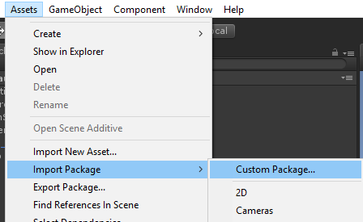
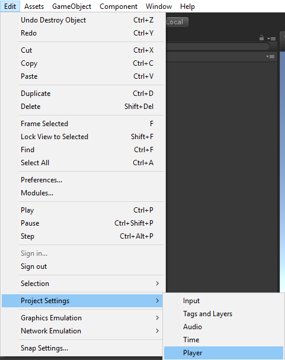
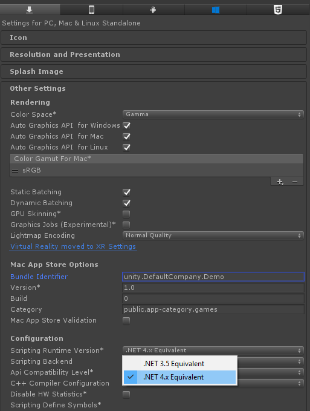
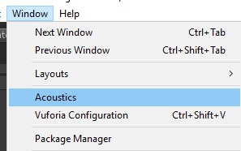
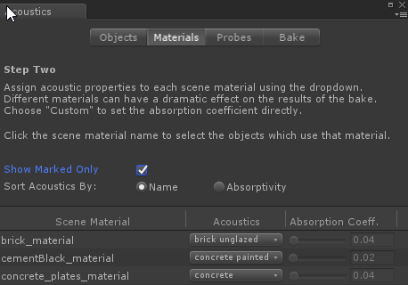
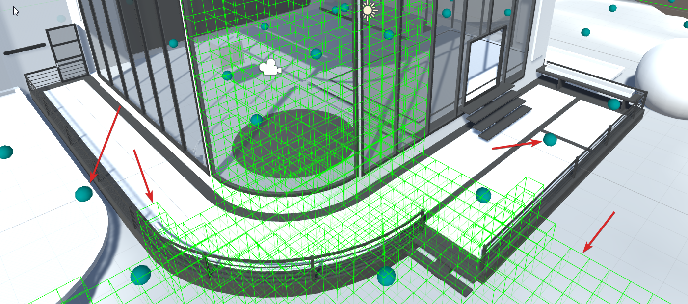
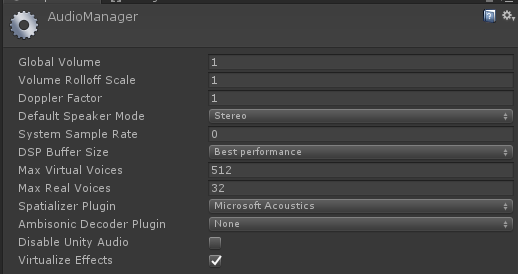
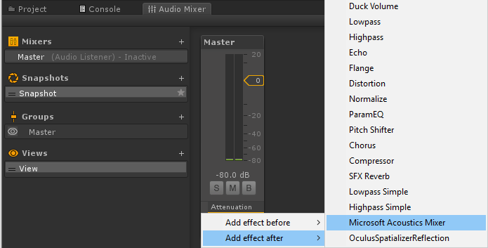

# Getting started with Project Acoustics
This quickstart guide will show you how to integrate the plugin in your Unity project, bake your scene, and apply the acoustics to sound sources. For this quickstart, you'll need to first create an [Azure batch account](create-azure-account.md). This guide assumes some familiarity with Unity.

## Download the plugin
Register [here](https://forms.office.com/Pages/ResponsePage.aspx?id=v4j5cvGGr0GRqy180BHbRwMoAEhDCLJNqtVIPwQN6rpUOFRZREJRR0NIQllDOTQ1U0JMNVc4OFNFSy4u) to join the Designer Preview.

## Supported platforms for quickstart
* [Unity 2018.2+](http://www.unity3d.com)
  * Requires setting your project to the **.NET 4.x Equivalent** scripting runtime version 
  * Requires the Windows-based Unity editor

## Import the plugin
Import the acoustics UnityPackage to your project. 
* In Unity, go to **Assets > Import Package > Custom Package...**

  

* Choose **MicrosoftAcoustics.unitypackage**

If you're importing the plugin into an existing project, your project may already have an **mcs.rsp** file in the project root, which specifies options to the C# compiler. You'll need to merge the contents of that file with the mcs.rsp file that comes with the Project Acoustics plugin.

## Enable the plugin
The bake portion of the acoustics toolkit requires the .NET 4.x scripting runtime version. Package import will update your Unity player settings. Restart Unity for this setting to take effect.

## Create a navigation mesh
Use the standard [Unity workflow](https://docs.unity3d.com/Manual/nav-BuildingNavMesh.html) to create a navigation mesh for your project. For information on how to use your own navigation meshes, see the [bake UI walk through](bake-ui-walkthrough.md).

## Mark static meshes for acoustics
Bring up the acoustics window using **Window > Acoustics** in Unity. This window can be docked next to the Inspector.

In Unity's hierarchy window, de-select any selected items. In the acoustics **Object** tab click the "Acoustics Geometry" checkbox to mark all meshes and terrains in your scene as acoustics geometry.

On the **Materials** tab, assign the acoustic materials to materials used in your scene. The **Default** material has absorption equivalent to concrete. For more information on specifying your own materials properties, see the [design process page](design-process.md).

## Preview the probes
On the **Probes** tab, click **Calculate**. This calculation may take a few minutes, depending on scene size. When calculation is complete, you'll see floating spheres in the scene view, which mark the locations for acoustics simulation, called "probe points". If you get close enough to an object in the scene window, you can also see the scene voxelization. The green voxels should line up with the objects you marked as geometry. The probe points and voxel displays can be toggled in the Gizmos menu in the top right of the scene view.

## Bake the scene
In the **Bake** tab, enter your Azure credentials and click **Bake**. If you don't have an Azure Batch account, see [this walkthrough for our recommended account setup](create-azure-account.md).
When the bake is finished, the data file will automatically be downloaded to the **Assets/AcousticsData** directory in your project.

## Set up audio runtime DSP
We embed the audio runtime DSP for acoustics in Unity's spatializer framework and integrate it with HRTF-based spatialization. To enable acoustics processing, switch to the **Microsoft Acoustics** spatializer by going to **Edit > Project Settings > Audio**, and select **Microsoft Acoustics** as the **Spatializer Plugin** for your project. Also, make sure the **DSP Buffer Size** is set to Best Performance.

  

Open the Audio Mixer (**Window > Audio Mixer**). Make sure you have at least one Mixer, with one group. If you don't, Click the '+' button to the right of **Mixers**. Right-click the bottom of the channel strip in the effects section, and add the **Microsoft Acoustics Mixer** effect. Note that only one Project Acoustics Mixer is supported at a time.

## Set up the acoustics lookup table
Drag and drop the **Microsoft Acoustics** prefab from the project panel into your scene:

Click on the **ProjectAcoustics** Game Object and go to its inspector panel. Specify the location of your bake result (the .ACE file, in **Assets/AcousticsData**) by drag-and-dropping it into the Acoustics Manager script, or by clicking on the circle button next to the text box.

  

## Apply acoustics to sound sources
Create an audio source. Click the checkbox at the bottom of the AudioSource's inspector panel that says **Spatialize**. Make sure **Spatial Blend** is set to full 3D.  

## Apply post-bake design
You can attach the script **AcousticsAdjust** to a sound source in your scene to enable additional source design parameters, by clicking **Add Component** and choosing **Scripts > Acoustics Adjust**:

There are also parameters on the **Microsoft Acoustics Mixer**. For more information about post-bake design, see [design parameters](design-process.md).

## Next steps
* Try the [sample scene](sample-walkthrough.md)
* Learn about the full set of [bake features](bake-ui-walkthrough.md)
* Explore more detailed [design parameters](design-process.md)

