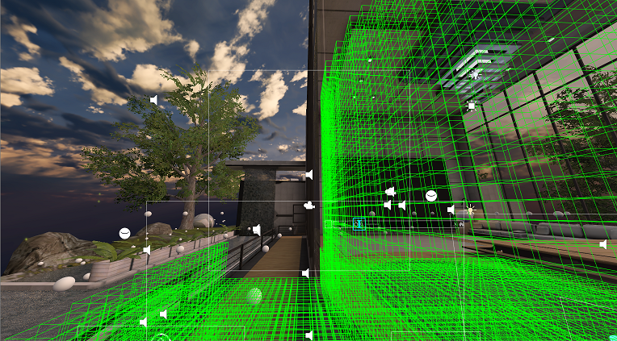

# Introduction to acoustics
If you don't need the "why" below, you can get started trying things out [here](GettingStarted.md).

## Thanks for checking out a new approach to acoustics!
**First, let’s cover WHY you may want to try this out.** Below we outline a workflow that may be familiar to you if you work on sound design for virtual environments. Perhaps you even dread this portion of level design or maybe feel you spend way too much of your time on this instead of on more creative sound design tasks. Let's revisit to get a feel for how it is done today:

With the existing approach to environment acoustics design, you place, align, and realign (and then maybe repeat that a few times) a ton of reverb zones. Sigh.

Then you painstakingly tweak two dozen cryptic parameters to get each zone to sound “just right”. Rinse and repeat for each zone in your scene, and then redo that as many times as the level designers iterate. Drat.

Then you may have to create and align some box colliders to turn reverb zones off and on, usually to prevent bleed from one reverb zone to another. Ouch.

And if that wasn't enough, now it would be time to engage the developer team to code up some raytracing logic to get the right occlusion/obstruction filtering across the various wall/ceiling/floor materials in the scene. Tricky.

## Is there a better way?
What if you could simply mark up a scene’s architecture and its materials, then let powerful CPUs in the cloud use physics to calculate how sound waves will propagate from all possible sound and player locations in your scene? What if that resulted in relevant acoustic parameters that take care of all the acoustic design tasks listed above, applied automatically to your reverb DSP without any coding? Even if that took a few hours, that is time you could spend on more creative sound design work, right?

At least that is what this Designer Preview proposes. We hope to learn from early adopters if the approach makes sense in terms of workflow, cost (ROI), relevance for various types of Unity projects and of course the acoustic fidelity of the system.

**We hope you will try it out and let us know what you think**

# Here are some more details

## Why acoustics?
In the real world, humans use audio-visual cues to understand the world around them. Acoustics provide critical perceptual cues about the surrounding environment. In virtual worlds, combining spatial audio with acoustics increases user immersion, similar to how detailed wall textures with realistic object lighting do on the visual side. The approach to acoustics described here is a tool that analyzes virtual worlds to create a realistic simulation of what the virtual world will sound like. The analysis includes both the geometry and the materials for each surface in the world. This produces a simulation which includes parameters such as primary arrival direction of a sound source, reverb power and decay times, and any occlusion/obstruction effects that might occur because of room geometry.

## How does this approach to acoustics work?
The system relies on an offline compute of the virtual world. This allows it to perform a much more thorough simulation of a virtual space than if the analysis was done in realtime as part of a game engine. The offline compute produces an asset file containing a lookup table for acoustical properties that can be used to drive the properties of all the sound sources located inside the virtual world. Queries into the lookup table are fast, only microseconds per source on an XBox One. By using the components included in the acoustics toolkit, you can make your audio sound truly realistic **without writing a single line of code.** If you're not 100% happy with the way the simulation sounds out of the box, you can tweak the parameters using the built-in customization scripts.

## What is the workflow like?
The system relies on a large offline compute. This compute is hosted in Azure, and requires an Azure Batch subscription. The workflow is broken up into three parts: [Design](#design), [Bake](#bake), and [Runtime](#runtime).
### Design
In order to analyze a scene, we must first mark up the scene with metadata to help the compute process know what to do. This happens in the Unity editor, and produces a file that gets uploaded to Azure. This file contains information suchas a voxel map of your scene, quantized locations inside the scene to perform sound wave physics simulation from (known as probe points), materials of each surface in the scene, and so on. The Unity plugin has tools that help in this metadata generation process, as well as connecting to your Azure account.  
  
### Bake
Once the metadata file has been generated, it is uploaded to Azure to perform the offline analysis. We refer to this process as the Bake process. Depending on scene complexity and simulation parameter configuration, these bakes can take anywhere from a few minutes to many hours on even the fastest machines. This is why Azure Batch is leveraged to perform this compute. By using Azure Batch, anyone with an internet connection can take advantage of this system without needing to purchase and maintain ultra high-end machines on premises.
### Runtime
Once the bake has completed, a file is downloaded to your project, known as an ACE file. This is the lookup table that is used at runtime to drive the acoustic parameters for each sound source. If something doesn't sound quite right, you can either go back and redesign the origin of the acoustics simulation by changing scene materials and other simulation parameters, or you can tweak individual acoustic parameters without needing to do another bake.