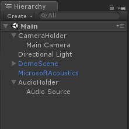
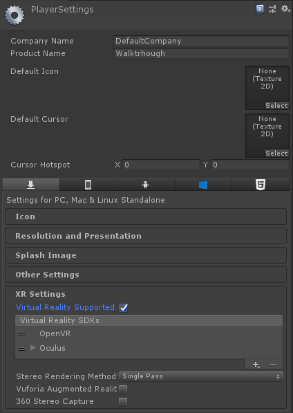

# Unity sample walkthrough
This is a walkthrough of the Project Acoustics sample. For more information about what Project Acoustics is, check out the [Introduction to Project Acoustics](what-is-acoustics.md). For help in adding the Project Acoustics package to a pre-existing Unity project, use the [Getting Started guide](getting-started.md).

## Requirements for running the sample project
* Unity 2018.2+, using .NET 4.x scripting runtime version
* Windows 64-bit Unity Editor
* The sample supports Windows desktop, UWP, and Android targets, including head-mounted displays (HMDs)
* Azure Batch subscription required for bake process

## Sample project setup
Download and import the **MicrosoftAcoustics.Sample.unitypackage**. On import, project settings including **Spatializer** and **Scripting Runtime Version** are updated to meet the plugin's requirements. When this is complete, you'll see an error in the Unity console from **AcousticsGeometry.cs** about changing the Scripting Runtime Version to **.NET 4.x Equivalent**. This settings change is done as part of the package import, but requires a Unity restart to take effect. Restart Unity now.

## Running the sample
The sample includes a demo scene, **Assets/AcousticsDemo/ProjectAcousticsDemo.unity**. This scene has three sound sources. By default, only one sound source is playing, and the other two are paused. These are located under **Sound Sources** in the **Hierarchy**. To help make a generic navigation script, the Main Camera is a child of the CameraHolder object. 

The scene has already been baked, and has an ACE file associated with the **MicrosoftAcoustics** prefab in the **Hierarchy**. 

Listen to how the scene sounds by clicking the play button in the Unity editor. On desktop, use W, A, S, D and the mouse to move around. To compare how the scene sounds with and without acoustics, press the **R** button until the overlay text turns red and says "Acoustics: Disabled." To see keyboard shortcuts for more controls, press **F1**. All controls are also useable by right clicking to select the action to perform, then left clicking to perform the action.

## Targeting other platforms
The sample contains settings to run on Windows Desktop, UWP, Windows Mixed Reality, Android, and Oculus Go. By default, the project is configured for Windows Desktop. To target a VR platform, go to the player settings (**Edit > Project Settings > Player**), find the **XR Settings**, and check the **Virtual Reality Supported** checkbox.

  

Connect a VR headset to your PC. Go to **File > Build Settings**, and click **Build and Run** to deploy the sample to your VR headset. Navigate through the scene using the motion controllers for your headset, or try using W, A, S, D on the keyboard.    
To target Android and Oculus Go, choose Android from the **Build Settings** menu. Click **Switch Target**, then **Build and Run**. This will deploy the sample scene to your connected Android device. For information about Unity development for Android, see [Unity documentation](https://docs.unity3d.com/Manual/android-GettingStarted.html).

  

## Next steps
* [Create an Azure account](create-azure-account.md) for your own bakes
* Explore the [design process](design-process.md)

