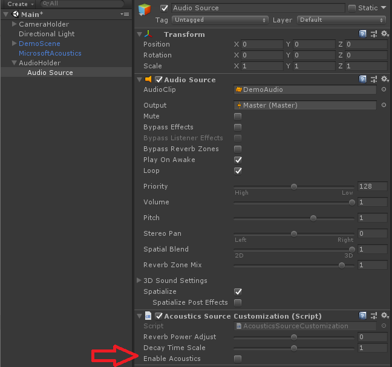

# Acoustics Unity Sample Walkthrough
This is a walkthrough of the sample Unity project for Microsoft Acoustics. For more information about what Microsoft Acoustics is, check out the [Introduction to Microsoft Acoustics](what-is-acoustics.md). For help in adding the Microsoft Acoustics package to a pre-existing Unity project, use the [Getting Started guide](gettingstarted.md).

## Requirements for running the sample project
* Unity 2018+, using .NET 4.x scripting runtime version
* Windows 64-bit Unity Editor
* Sample supports Windows desktop, UWP, and Android targets, with options for Mixed Reality and Virtual Reality
* Azure Batch subscription required for bake process

## Sample project setup
It is recommended to start with a blank Unity project, since the sample project will override certain project settings. Download and import the MicrosoftAcoustics.Sample.unitypackage. When this is complete, you'll see an error from AcousticsGeometry.cs about changing the Scripting Runtime Version to .NET 4.x Equivalent. This is done as part of the package import, but requires a Unity restart to take effect. Restart Unity now.  

## Running the sample
The sample has the MicrosoftAcoustics.unitypackage already deployed. It also has a demo scene in it, which is fully configured to use Microsoft Acoustics. Open the demo scene, under Assets/AcousticsDemo/Main.unity. This scene has a house in it (named DemoScene, in the Hierarchy), with a single spatialized audio source playing from a floating cube (named AudioHolder in the Hierarchy). To help make a generic navigation script, the Main Camera is a child of the CameraHolder object.  
  
The scene has already been baked, and has an ACE file associated with the Acoustics Manager script. To see the navigation mesh used to bake this scene, go to Window > Navigation, and the nav mesh will appear in blue.  

Take a listen to how the scene sounds by playing through the game in the Unity editor. Use W, A, S, D and the mouse to move around. Try moving both the player camera as well as the sound source to hear how the scene's geometry affects the audio. To compare how the scene sounds with and without Acoustics, add the Acoustics Source Customization script to the audio source attached to the Audio Holder component. Once added, uncheck the Enable Acoustics checkbox.  
  
Toggle this checkbox a few times while positioned in different parts of the scene to get a feel for the difference that Microsoft Acoustics makes.  

## Targeting other platforms
The sample contains settings to run on Windows Desktop, UWP, Windows Mixed Reality, Android, and Oculus Go. By default, the project is configured for Windows Desktop. To target a VR platform, go to the player settings (Edit > Project Settings > Player), find the XR settings, and check the Virtual Reality Supported checkbox.  
  
Connect a VR headset to your PC. Go to File > Build Settings, and click Build and Run to deploy the sample to your VR headset. Navigate through the scene using the motion controllers for your headset, or try using W, A, S, D on the keyboard.    
To target Android, simply choose Android from the Build Settings menu. Click Switch Target, then Build and Run. This will deploy the sample scene to your connected Android device. For help with Unity development for Android, the [Unity documentation](https://docs.unity3d.com/Manual/android-GettingStarted.html) is a good place to start.
  
