# Project Acoustics Unity Bake Tutorial
This tutorial describes acoustics baking with Project Acoustics in Unity.

Software requirements:
* [Unity 2018.2+](https://unity3d.com) for Windows
* [Project Acoustics plugin integrated in your Unity project](unity-integration.md) or the [Project Acoustics Unity sample content](unity-quickstart.md)
* Optional: An [Azure Batch account](create-azure-account.md) to accelerate bakes using cloud computing

## Open the Project Acoustics bake window
Choose **Window > Acoustics** from the Unity menu:

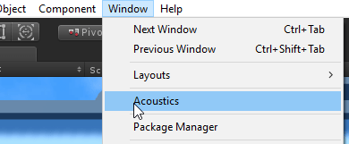

## Create a navigation mesh
Project Acoustics uses a navigation mesh to place listener probe points for simulation. You can use Unity's [navigation mesh workflow](https://docs.unity3d.com/Manual/nav-BuildingNavMesh.html), or use another 3D modeling package to design your own mesh. 

## Mark acoustic scene objects
Project Acoustics relies on two types of scene objects for simulation: the objects that will reflect and occlude sound in the simulation, and the player navigation mesh that constrains listener probe points in simulation. Both object types are marked using the **Objects** tab. 

Because marking objects simply adds the **AcousticsGeometry** or **AcousticsNavigation** components to the object, you can also use the [standard Unity component workflow](https://docs.unity3d.com/Manual/UsingComponents.html) to mark or unmark objects. Only Mesh Renderers and Terrains can be marked. All other object types will be ignored. The checkboxes will mark or unmark all of the affected objects.

### Mark acoustic occlusion and reflection geometry
Open the **Objects** tab of the **Acoustics** window. Mark any objects as **Acoustics Geometry** if they should occlude, reflect, or absorb sound. Acoustics geometry can include things like ground, walls, roofs, windows & window glass, rugs, and large furniture. You can use any arbitrary level of complexity for these objects. Because the scene is voxelized before simulation, highly detailed meshes, such as trees with many small leaves, aren't more costly to bake than simplified objects.

Don't include things that shouldn't affect the acoustics, such as invisible collision meshes.

An object's transform at the time of the probe calculation (via the **Probes** tab, below) is fixed in the bake results. Moving any of the marked objects in the scene will require redoing the probe calculation and rebaking the scene.

### Mark the navigation mesh
Navigation meshes created with Unity's workflow will be picked up by the acoustics system. To use your own meshes, mark them from the **Objects** tab.

### For reference: The Objects tab parts
The parts of the tab page are:

1. The tab selection buttons (**Objects** tab selected). Use these buttons to walk through the various steps of doing an acoustics bake, from left to right.
2. A brief description of what you need to do using this page.
3. Available filters for the hierarchy window. Use this to filter the hierarchy window to objects of the specified type so you can more easily mark them. If you have not yet marked anything for acoustics, selecting the last two options will show you nothing. However, they can be useful to find marked objects once you have done so.
4. When no objects are selected, this section shows the status of all objects in the scene:
    * Total - The total number of active, non-hidden objects in the scene.
    * Ignored - The number of objects that are not Mesh Renderers or Terrains.
    * Mesh - The number of Mesh Renderer objects in the scene
    * Terrain - The number of Terrain objects in the scene
    * Geometry - The number of Mesh or Terrain objects in the scene marked as "Acoustics Geometry"
    * Navigation - The number of Mesh or Terrain objects in the scene marked as "Acoustics Navigation". This number doesn't include Unity's NavMesh.
5. Shows the total number of 'mark-able' objects in the scene, which is only Mesh Renderers and Terrains. Shows checkboxes you can use to mark (add the appropriate component to) those objects as geometry or navigation for acoustics
6. When nothing is selected, this note reminds you to select objects for marking if needed. You can also check one or both checkboxes to mark all the objects in the scene without selecting anything.
7. When objects are selected, this section shows the status of only the selected objects.
8. Shows the total number of 'mark-able' selected objects. Checking or unchecking the checkboxes will mark or unmark only the selected objects.

If you have nothing selected in your scene, the Objects tab will look like the following picture:

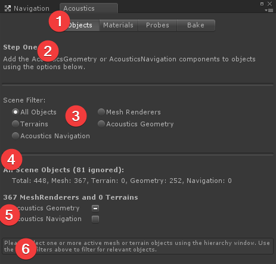

If you have something selected in your scene or hierarchy window, it will look like the following picture:

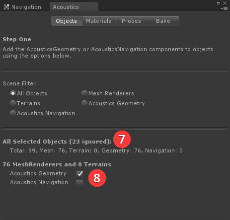

If some objects are marked and some aren't, the appropriate checkbox will show a "mixed" value:

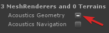

Clicking the checkbox will force all objects to be marked, and clicking again will unmark all the objects.

Objects can be marked for both geometry and navigation.

## Select acoustic materials
Once your objects are marked, click the **Materials** button and assign acoustic materials. The Project Acoustics materials system is tied to the Unity visual materials system: for two objects to have separate acoustic materials, they must have separate visual materials.

The acoustic materials control the amount of sound energy reflected back from each surface. The default acoustic material has absorption similar to concrete. Project Acoustics suggests materials based on the visual material name. You can assign the acoustic material 'Custom' to a material to enable an absorption coefficient slider.

The reverberation time of a given material in a room is inversely related to its absorption coefficient, with most materials having absorption values in the 0.01 to 0.20 range. Materials with absorption coefficients outside this range are very absorbent.

### For reference: Parts of the Materials tab
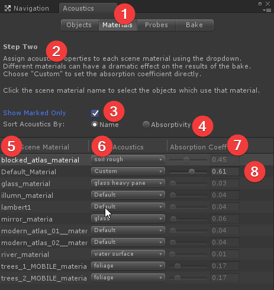

1. The **Materials** tab button, used to bring up this page.
2. A brief description of what you need to do using this page.
3. When checked, only materials used by objects marked as **Acoustics Geometry** will be listed. Otherwise, all materials used in the scene will be listed.
4. Use these options to change the order of the dropdown menu that is shown when you click a dropdown in the Acoustics column below (#6). **Name** sorts the acoustic materials by name. "Absorptivity" sorts them in order of absorptivity from low to high.
5. The list of materials used in the scene, sorted alphabetically. If the **Show Marked Only** checkbox is checked (#3), only materials used by objects marked as **Acoustics Geometry** are shown. Clicking on a material here will select all objects in the scene that use that material.
6. Shows the acoustic material that the scene material has been assigned to. Click a dropdown to reassign a scene material to a different acoustic material. You can change the sorting order of the menu shown when you click an item here using the **Sort Acoustics By:** options above (#4).
7. Shows the acoustic absorption coefficient of the material selected in the previous column. A value of zero means perfectly reflective (no absorption), while a value of 1 means perfectly absorptive (no reflection). The absorption coefficient can't be changed unless the selected material is "Custom".
8. For a material assigned to "Custom", the slider is no longer disabled and you can choose the absorption coefficient using the slider or by typing in a value.

## Calculate and review listener probe locations
After assigning the materials, switch to the **Probes** tab and click **Calculate** to place listener probe points for simulation.

### What the "Calculate..." button calculates
The **Calculate...** button uses your selected acoustic scene geometry to prepare your scene for simulation:

1. It takes the geometry from the scene meshes and calculates a voxel volume. The voxel volume is a 3-dimensional volume that encloses your entire scene, and is made up of small cubic "voxels". The size of the voxels is determined by the simulation frequency, which is set by the **Simulation Resolution** setting. Each voxel is marked as being either "open air" or containing scene geometry. If a voxel contains geometry then the voxel is tagged with the absorption coefficient of the material assigned to that geometry.
2. It uses the navigation mesh(es) to place listener probe points. The algorithm balances the competing concerns of spatial coverage and simulation time and file size, while ensuring that narrow corridors and small spaces always have some amount of coverage. Typical probe point counts range from 100 for small scenes to a few thousand for large scenes.

Depending on the size of your scene and the speed of your machine, these calculations can take several minutes.

### Review voxel and probe placement
Preview both the voxel data and the probe point locations to ensure you're ready to bake your scene. An incomplete navigation mesh or missing or extra acoustic geometry will usually be quickly visible in the preview. Voxel and probe placement can be enabled or disabled using the Gizmos menu:

Voxels containing acoustic geometry are shown as green cubes. Explore your scene and verify that everything that should be geometry has voxels. The scene camera has to be within about 5 meters of the object for the voxels to show.

If you compare the voxels created with coarse resolution vs fine resolution, you will see that the coarse voxels are twice as large.

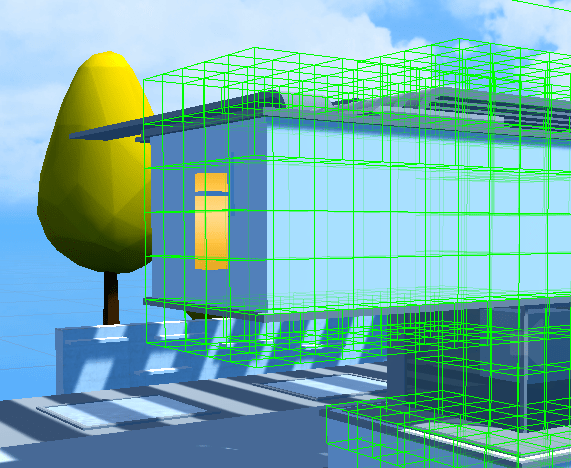

Simulation results are interpolated between listener probe point locations at runtime. Check there are probe points near any place the player is expected to travel in the scene.

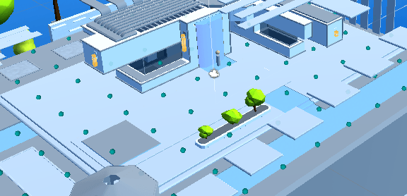

### Take care with scene renames
The scene name is used to connect the scene to files storing the probe point placement and voxelization. If the scene is renamed after probe points are calculated, the material assignment and placement data is lost and should be rerun.

### For reference: Parts of the Probes tab
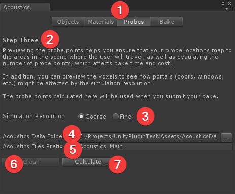

1. The **Probes** tab button used to bring up this page
2. A brief description of what you need to do using this page
3. Use these to choose a coarse or fine simulation resolution. Coarse is faster, but has certain tradeoffs. See [Bake Resolution](bake-resolution.md) below for details.
4. Choose the location where the acoustics data files should be placed using this field. Click the button with "..." to use a folder picker. The default is **Assets/AcousticsData**. An **Editor** subfolder will also be created under this location. For more information about data files, see [Data Files](#Data-Files) below.
5. The data files for this scene will be named using the prefix provided here. The default is "Acoustics_[Scene Name]".
6. After the probes have been calculated, the controls above will be disabled. Click the **Clear** button to erase the calculations and enable the controls so that you can recalculate using new settings.
7. Click the **Calculate...** button to voxelize the scene and calculate the probe point locations. This is done locally on your machine, and must be done prior to doing a bake.

In this version of Project Acoustics, probes can't be placed manually and must be placed through the automated process provided in the **Probes** tab.

See [Bake Resolution](bake-resolution.md) for more details on coarse vs fine resolution.

## Bake your scene using Azure Batch
You can bake your scene with a compute cluster in the cloud using the Azure Batch service. The Project Acoustics Unity plugin connects directly to Azure Batch to instantiate, manage, and tear down an Azure Batch cluster for each bake. On the **Bake** tab, enter your Azure credentials, select a cluster machine type and size, and click **Bake**.

### For reference: Parts of the Bake tab
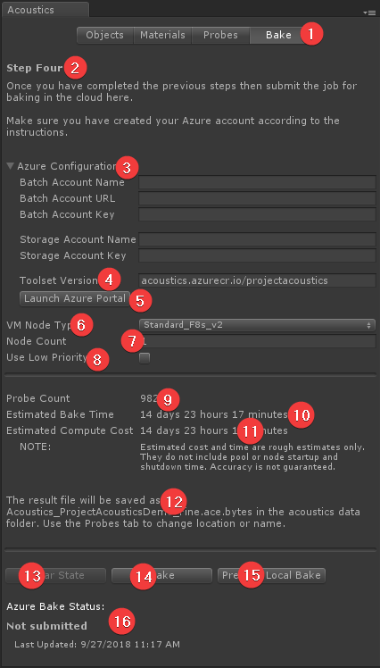

1. The Bake Tab button used to bring up this page.
2. A brief description of what to do on this page.
3. Fields to enter your Azure Credentials once your Azure account has been created. For more information, see [Create an Azure Batch Account](create-azure-account.md).
4. Docker image tag for the acoustics toolset.
5. Launch Azure portal to manage your subscriptions, monitor usage and view billing information etc. 
6. Azure batch compute node type to use for the calculation. The node type must be supported by your Azure data center location. If not sure, leave at **Standard_F8s_v2**.
7. Number of nodes to use for this calculation. The number you enter here affects the time to complete the bake and is limited by your Azure Batch core allocation. The default allocation only allows for two 8 core nodes or one 16 core node, but can be expanded. For more information on core allocation constraints, see [Create an Azure Batch Account](create-azure-account.md).
8. Select this checkbox to configure your compute pool to use [low-priority nodes](https://docs.microsoft.com/azure/batch/batch-low-pri-vms). Low-priority compute nodes have much lower cost but they may not always be available or may be preempted at any time.
9. The probe count for your scene as calculated on the **Probes** tab. The number of probes determines the number of simulations that need to be run in the cloud. You cannot specify more nodes than there are probes.
10. The amount of elapsed time it's expected to take for your job to run in the cloud. This does not include node startup time. Once the job starts running, this is about how long it should be before you get back the results. Note that this is only an estimate.
11. The total amount of computing time needed to run the simulations. This is the total amount of node compute time that will be used in Azure. See [Estimating bake cost](#Estimating-bake-cost) below for more information on using this value.
12. This message tells you where the results of the bake will be saved once the job completes.
13. (Advanced Use Only) If for some reason you need to force Unity to forget about a bake you submitted (e.g. you downloaded the results using another machine), click the **Clear State** button to forget about the job that was submitted. Note that this means the result file, when ready, will **not** be downloaded, and **this is not the same as canceling the job**. The job, if running, will continue to run in the cloud.
14. Click the **Bake** button to submit the bake to the cloud. While a job is running, this shows **Cancel Job** instead.
15. Prepares for processing [acoustics simulation on your PC](#Local-bake).
16. This area shows the status of the bake. When completed, it should show **Downloaded**.

You can always get complete information about active jobs, compute pools, and storage at the [Azure portal](https://portal.azure.com).

While a job is running the **Bake** button changes to **Cancel Job**. Use this button to cancel the job in progress. You will be asked to confirm before the job is canceled. Canceling a job cannot be undone, no results will be available, and you will still be charged for any Azure compute time used.

Once you've started a bake, you can close Unity. Depending on the project, node type, and number of nodes, a cloud bake can take several hours. The bake job status will be updated when you reload the project and open the Acoustics window. If the job has completed, the output file will be downloaded.

The Azure credentials are stored securely on your local machine and associated with your Unity editor. They are used solely to establish a secure connection to Azure.

###  Estimating Azure bake cost

To estimate what a given bake will cost, take the value shown for **Estimated Compute Cost**, which is a duration, and multiply that by the hourly cost in your local currency of the **VM Node Type** you selected. The result will not include the node time needed to get the nodes up and running. For example, if you select **Standard_F8s_v2** for your node type, which has a cost of $0.40/hr, and the Estimated Compute Cost is 3 hours and 57 minutes, the estimated cost to run the job will be $0.40 * ~4 hours = ~$1.60. The actual cost will likely be a bit higher due to the extra time to get the nodes started. You can find the hourly node cost on the [Azure Batch Pricing](https://azure.microsoft.com/pricing/details/virtual-machines/linux) page (select "Compute optimized" or "High performance compute" for the category).

##  Bake your scene on your PC
You can bake your scene on your own PC. This can be useful for experimenting with acoustics with small scenes before creating an Azure Batch account. Note the acoustics simulation can take a long time depending on the size of the scene.

### Minimum hardware requirements
* An x86-64 processor with at least 8 cores and 32 GB of RAM

As an example, in our testing on an 8 core machine with Intel Xeon E5-1660 @ 3 GHz and 32 GB RAM -
* A small scene with 100 probes can take about 2 hours for a coarse bake or 32 hours for a fine bake.
* A medium-sized scene with 1000 probes can take about 20 hours for a coarse bake or 21 days for a fine bake.

### Setup Docker
Install and configure Docker on the PC that will process the simulation -
1. Install the [Docker toolset](https://www.docker.com/products/docker-desktop).
2. Launch Docker settings, navigate to the "Advanced" options and configure resources to have at least 8GB RAM. The more CPUs you can allocate to Docker, the faster the bake will complete. 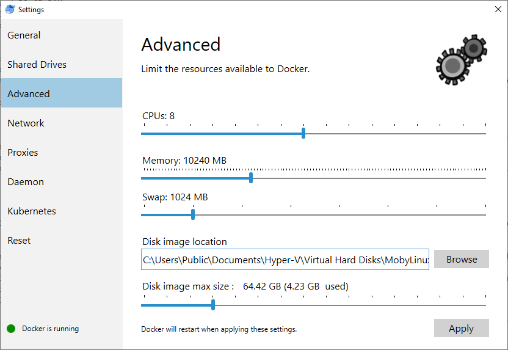
3. Navigate to "Shared Drives" and turn on sharing for the drive used for processing.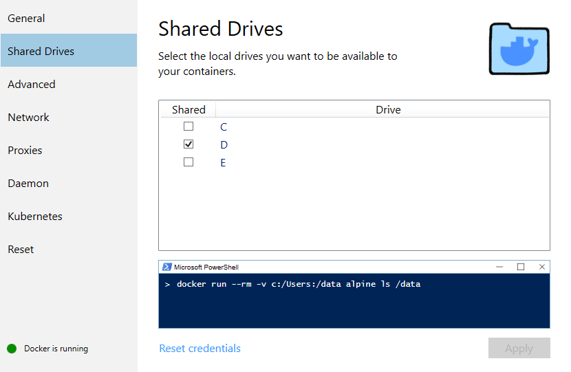

### Run local bake
1. Click on "Prepare Local Bake" button on the **Bake** tab and select a folder where the input files and execution scripts will be saved. You can then run the bake on any machine as long as it meets the minimum hardware requirements and has Docker installed by copying the folder to that machine.
2. Launch the simulation using the "runlocalbake.bat" script. This script will fetch the Project Acoustics Docker image with the toolset necessary for simulation processing and start the simulation. 
3. Once the simulation has finished, copy the resulting .ace file back to your Unity project. To make sure Unity recognizes this as a binary file, append ".bytes" to the file extension (for example, "Scene1.ace.bytes"). The detailed logs for the simulation are stored in "AcousticsLog.txt." If you run into any issues, share this file to assist with diagnosis.

##  Data files added by the bake process

There are four data files created during the bake process. One contains the simulation results and ships with your title. The others store Unity Editor-related data.

Simulation result:
* **Assets/AcousticsData/Acoustics\_[SceneName].ace.bytes**: This is the runtime lookup table and contains simulation results and the voxelized acoustic scene elements. The location and name of this file can be changed using the fields on the **Probes** Tab.

Take care not to delete the simulation result file. It isn't recoverable except by rebaking the scene.

Editor data files:
* **Assets/Editor/[SceneName]\_AcousticsParameters.asset**: This file stores the data you enter in fields in the Acoustics UI. The location and name of this file can't be changed.
* **Assets/AcousticsData/Editor/Acoustics_[SceneName].vox**: This file stores the voxelized acoustics geometry and the material properties that are computed using the **Calculate...** button on the Probes Tab. The location and name of this file can be changed using the fields on the **Probes** Tab.
* **Assets/AcousticsData/Editor/Acoustics\_[SceneName]\_config.xml**: This file stores simulation parameters computed using the **Calculate...** button on the **Probes** Tab. The location and name of this file can be changed using the fields on the **Probes** Tab.

## Set up the acoustics lookup table
Drag and drop the **Project Acoustics** prefab from the project panel into your scene:

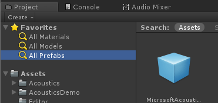

Click on the **ProjectAcoustics** Game Object and go to its inspector panel. Specify the location of your bake result (the .ACE file, in **Assets/AcousticsData**) by drag-and-dropping it into the Acoustics Manager script, or by clicking on the circle button next to the text box.

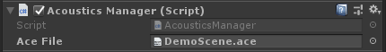  

## Next steps
* Explore the [design controls for Unity](unity-workflow.md)
* Explore the [Project Acoustics design concepts](design-process.md)

