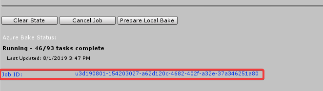
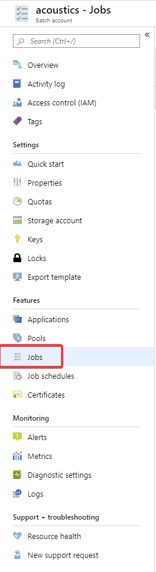
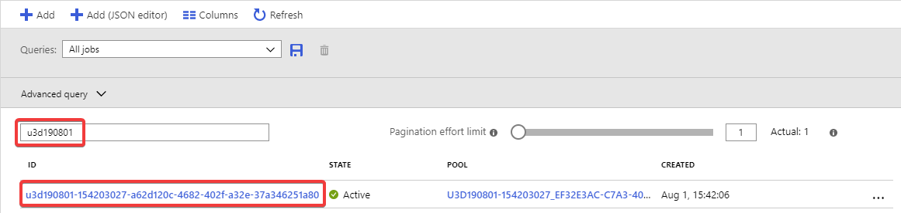
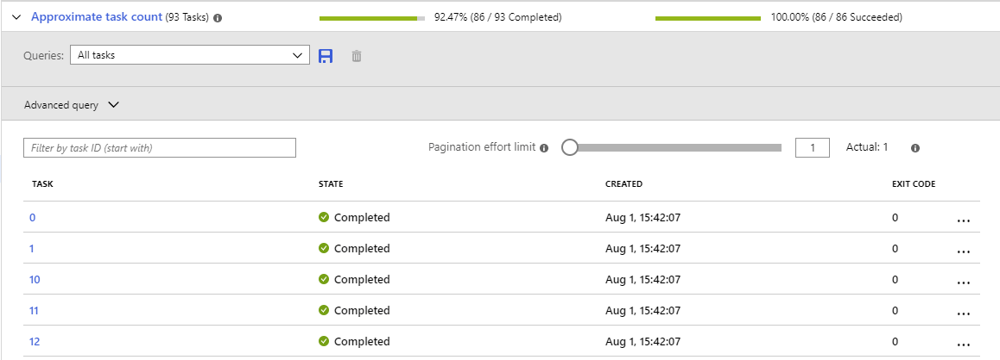

# Project Acoustics Unity Bake Tutorial
This tutorial describes acoustics baking by using Project Acoustics in Unity.

Software requirements:
* [Unity 2018.2+](https://unity3d.com) for Windows or MacOS
* [Project Acoustics plug-in integrated in your Unity project](unity-integration.md) or the [Project Acoustics Unity sample content](unity-quickstart.md)
* *Optional:* An [Azure Batch account](create-azure-account.md) to accelerate bakes by using cloud computing

## Open the Project Acoustics bake window
In Unity, select **Acoustics** from the **Window** menu.

## Create a navigation mesh
Project Acoustics uses a navigation mesh to place listener probe points for simulation. You can use the Unity [navigation mesh workflow](https://docs.unity3d.com/Manual/nav-BuildingNavMesh.html). Or you can use a different 3D modeling package to design your own mesh.

## Mark acoustic scene objects
Project Acoustics relies on two types of scene objects for simulation:
- The objects that reflect and occlude sound in the simulation
- The player navigation mesh that constrains listener probe points in simulation

Both object types are marked by using the **Objects** tab.

Because marking objects simply adds the *AcousticsGeometry* or *AcousticsNavigation* components to the object, you can also use the [standard Unity component workflow](https://docs.unity3d.com/Manual/UsingComponents.html) to mark or unmark objects. You can only mark mesh renderers and terrains. All other object types will be ignored. The check boxes mark or unmark all affected objects.

### Mark acoustic occlusion and reflection geometry
Open the **Objects** tab of the **Acoustics** window. Mark any objects as *Acoustics Geometry* if they should occlude, reflect, or absorb sound. Acoustics geometry can include things like ground, walls, roofs, windows and window glass, rugs, and large furniture. You can use any arbitrary level of complexity for these objects. Because the scene is voxelized before simulation, highly detailed meshes, such as trees that have many leaves, aren't more costly to bake than simplified objects.

Don't include things that shouldn't affect the acoustics, such as invisible collision meshes.

An object's transform during probe calculation (through the **Probes** tab) is fixed in the bake results. If any marked objects in the scene are moved later, probe calculation and baking have to be redone.

### Mark the navigation mesh
Navigation meshes that were created through the Unity workflow will be picked up by the Acoustics system. To use your own meshes, mark them from the **Objects** tab.

### For reference: The Objects tab parts
The parts of the tab page (pictured after the descriptions) are:

1. The tab selection buttons (with the **Objects** tab selected). Use these buttons to move through the various steps of an acoustics bake, from left to right.
1. A brief description of what you can do by using this tab.
1. Available filters for the hierarchy window. Use these options to filter the hierarchy window to objects of the specified type so that you can easily mark them. If you haven't yet marked anything for acoustics, selecting the last two options will show you nothing. However, these options help you find objects after they're marked.
1. When no objects are selected, this section shows the status of all objects in the scene.
    * Total: The total number of active, non-hidden objects.
    * Ignored: The number of objects that aren't mesh renderers or terrains.
    * Mesh: The number of mesh renderer objects.
    * Terrain: The number of terrain objects.
    * Geometry: The number of mesh or terrain objects that are marked as **Acoustics Geometry**.
    * Navigation: The number of mesh or terrain objects marked as **Acoustics Navigation**. This number doesn't include the Unity NavMesh.
1. The total number of "markable" objects in the scene, which are only mesh renderers and terrains. Use the check boxes to mark (add the appropriate component to) those objects as geometry or navigation for acoustics.
1. When nothing is selected, this note reminds you to select objects for marking, if needed. You can also select one or both check boxes to mark all the objects in the scene.
1. When objects are selected, this section shows the status of only the selected objects.
1. The total number of "markable" selected objects. Selecting or clearing the check boxes marks or unmarks only the selected objects.

If you have nothing selected in your scene, the **Objects** tab looks like the following picture.

If you have something selected in your scene or hierarchy window, the tab looks like the following picture.

If some objects are marked and some aren't, the appropriate check boxes show a "mixed" value, like the following picture.

Select the check box to mark all the items. Unselect it to unmark all the objects.

Objects can be marked for both geometry and navigation.

## Select acoustic materials
After your objects are marked, select the **Materials** button. Then assign acoustic materials. The Project Acoustics materials system is tied to the Unity visual materials system. For two objects to have separate acoustic materials, they must have separate visual materials.

The acoustic material selection determines the amount of sound energy that's reflected back from each surface. The default acoustic material has absorption similar to steel. Project Acoustics suggests materials based on the visual material name. You can also assign the acoustic material **Custom** to a material to activate an adjustable absorption-coefficient slider.

The reverberation time of a given material in a room is inversely related to its absorption coefficient. Most materials have absorption values in a range of 0.01 to 0.20. Materials that have absorption coefficients outside this range are very absorbent.

### For reference: Parts of the Materials tab

1. The **Materials** button displays this tab.
2. A brief description of what you can do by using this tab.
3. When this check box is selected, only materials that are used by objects marked as **Acoustics Geometry** are listed. Otherwise, all materials that are used in the scene are listed.
4. Use these options to change the order of the options on a menu in the **Acoustics** column (#6). Sort acoustic materials by **Name** or by **Absorptivity**, from low to high.
5. An alphabetically sorted list of materials that are used in the scene. If the **Show Marked Only** check box is selected (#3), only materials used by objects marked as **Acoustics Geometry** are shown. Select a material here to select all objects in the scene that use that material.
6. The acoustic material that the scene material has been assigned to. Select any item to change the acoustic material assigned to that scene material. To change the sorting order of these menus, use the **Sort Acoustics By** options (#4).
7. The acoustic absorption coefficient of the material selected in the column to the left (#6). A value of 0 means perfectly reflective (no absorption), while 1 means perfectly absorptive (no reflection). The absorption coefficient can't be changed unless the selected material is **Custom.**
8. For a material marked as **Custom**, the slider is activated. You can move the slider or type a value to assign an absorption coefficient.

## Calculate and review listener probe locations
After you assign the materials, switch to the **Probes** tab. Select **Calculate** to place listener probe points for simulation.

### What the "Calculate" button does
The **Calculate** button uses your selected acoustic scene geometry to prepare your scene for simulation:

- It takes the geometry from the scene meshes and calculates a *voxel volume*. The voxel volume is a volume of your entire scene comprised of small cubic "voxels." Voxel size is determined by the simulation frequency, which is controlled by the **Simulation Resolution** setting. Each voxel is marked as "open air" or containing scene geometry. If a voxel contains geometry, the voxel is tagged with the absorption coefficient of the material that's assigned to that geometry.
- It uses the navigation meshes to place listener probe points. The algorithm balances the competing concerns of spatial coverage and simulation time and file size. It aims to ensure that narrow corridors and small spaces always have some coverage. Typical probe point counts range from 100 for small scenes to a few thousand for large scenes.

Depending on the size of your scene and the speed of your machine, these calculations can take several minutes.

### Review voxel and probe placement
Preview both the voxel data and probe point locations to make sure you're ready to bake your scene. An incomplete navigation mesh or missing or extra acoustic geometry is usually easily visible in the preview. Enable or disable voxel and probe placement by using the **Gizmos** menu.

Voxels that contain acoustic geometry are shown as green cubes. Explore your scene, and verify that everything that should be geometry has voxels. The scene camera has to be within about 5 meters of the object for the voxels to show.

If you compare voxels created with coarse resolution versus fine resolution, you'll see that the coarse voxels are twice as large.

Simulation results are interpolated between listener probe point locations at runtime. Check that there are probe points near any places where the player is expected go in the scene.

### Take care with scene renames
The scene name is used to connect the scene to files that store the probe point placement and voxelization. If you rename the scene after probe points are calculated, the material assignment and placement data are lost and should be rerun.

### For reference: Parts of the Probes tab

1. The **Probes** button brings up this tab.
2. A brief description of what you can do on this tab.
3. Use these options to set coarse or fine simulation resolution. Coarse is faster, but there are  tradeoffs. For details, see [Bake resolution](bake-resolution.md).
4. Specifies where to put acoustics data files. Select the "**...**" button to access a folder picker. The default location is *Assets/AcousticsData*. An *Editor* subfolder is also created at this location. For more information, see [Data files added by the bake process](#Data-Files), later in this article.
5. The prefix that's specified here is used to name the  data files for this scene. The default is "Acoustics_*[Scene Name]*".
6. After the probes are calculated, the controls that we just described are disabled. Select the **Clear** button to erase the calculations and enable the controls so you can recalculate with new settings.
7. Select **Calculate** to voxelize the scene and calculate probe point locations. Calculation is done locally on your machine. It must be done before doing a bake.

In this version of Project Acoustics, probes can't be placed manually. Use the automated process on the **Probes** tab.

For more information about coarse versus fine resolution, see [Bake resolution](bake-resolution.md).

## Bake your scene by using Azure Batch
You can bake your scene on a compute cluster in the cloud by using the Azure Batch service. The Project Acoustics Unity plug-in connects directly to Azure Batch to instantiate, manage, and tear down an Azure Batch cluster for each bake. On the **Bake** tab, enter your Azure credentials, select a cluster machine type and size, and then select **Bake**.

### For reference: Parts of the Bake tab

1. The **Bake** button displays this tab.
2. A brief description of what you can do on this page.
3. Enter your Azure credentials in these fields, after your Azure account is created. For more information, see [Create an Azure Batch account](create-azure-account.md).
4. The Docker image tag field for the Acoustics toolset.
5. Opens the Azure portal to manage your subscriptions, monitor usage, and view billing information.
6. Specifies the Azure Batch compute node type to use for calculation. The node type must be supported by your Azure datacenter location. If you're not sure, leave as **Standard_F8s_v2**.
7. The number of nodes to use for the calculation. This number affects the bake time. It's limited by your Azure Batch core allocation. The default allocation only allows for two 8-core nodes or one 16-core node, but it can be expanded. For more information about core allocation constraints, see [Create an Azure Batch account](create-azure-account.md).
8. Select this check box to configure your compute pool to use [low-priority nodes](https://docs.microsoft.com/azure/batch/batch-low-pri-vms). Low-priority compute nodes have much lower cost. But they may not always be available or may be preempted at any time.
9. The probe count for your scene as calculated on the **Probes** tab. The number of probes determines the number of simulations that have to be run in the cloud. You can't specify more nodes than there are probes.
10. An estimate of the time that your job will take to run in the cloud, excluding node startup time. After the job starts running, this field shows an estimate of how long until you get back the results.
11. The total amount of computing time needed to run the simulations. This value is the total amount of node compute time that will be used in Azure. For more information, see [Estimate Azure bake cost](#Estimating-bake-cost) later in this article.
12. This message tells you where the results of the bake will be saved when the job is finished.
13. *(Advanced use only:)* This button forces Unity to forget about a bake that you submitted. For example, if you downloaded the results by using another machine, select the **Clear State** button to forget that job. The result file, when ready, will *not* be downloaded. *This is not the same as canceling the job. The job, if running, will continue to run in the cloud.*
14. Select this button to submit the bake to the cloud. While a job is running, this button becomes **Cancel Job**.
15. Select this button to prepare for processing [acoustics simulation on your PC](#Local-bake).
16. This area shows the status of the bake. When the bake is completed, it shows "Downloaded."

You can always get complete information about active jobs, compute pools, and storage in the [Azure portal](https://portal.azure.com).

While a job is running, the **Bake** button label changes to **Cancel Job**. Use this button to cancel the job that's in progress. You'll be prompted to confirm. Canceling a job can't be undone. When you cancel, no results will be available, but you'll still be charged for any Azure compute time used.

After you've started a bake, you can close Unity. Depending on the project, node type, and number of nodes, a cloud bake can take several hours. The bake job status will be updated when you reload the project and open the Acoustics window. If the job is completed, the output file will be downloaded.

For security, Azure credentials are stored on your local machine and associated with your Unity editor. They're used only to establish a secure connection to Azure.

## Find the status of a running job on the Azure portal

1. Find the bake job ID on the **Bake** tab.

      

2. Open the [Azure portal](https://portal.azure.com), go to the Batch account that was used for the bake, and select **Jobs**.

      

3. Search for the job ID in the list of jobs.

     

4. Select the job ID to see the status of the related tasks and the overall job status.

     

###  Estimate Azure bake cost

To estimate what a bake will cost, start with the **Estimated Compute Cost** value, which is a duration. Multiply that value by the hourly cost in your local currency for the **VM Node Type** that you select. Note that the result won't include the node time that's needed to get the nodes up and running.

For example, say you select **Standard_F8s_v2** for your node type, which has a cost of $0.40/hr. If the **Estimated Compute Cost** is 3 hours and 57 minutes, the estimated cost to run the job will be $0.40 * ~4 hours = ~$1.60. The actual cost will likely be a bit higher because of the extra time to get the nodes started.

Find hourly nodes cost at [Azure Batch pricing](https://azure.microsoft.com/pricing/details/virtual-machines/linux). (Select **Compute optimized** or **High performance compute** as the category.)

##  Bake your scene on your PC
You can also bake your scene on your own PC. This method can be useful for experimenting with acoustics for small scenes before you create an Azure Batch account. But note that local acoustics simulation can take a long time depending on the size of the scene.

### Minimum hardware requirements
* An x86-64 processor with at least 8 cores and 32 GB of RAM
* [Hyper-V enabled](https://docs.microsoft.com/virtualization/hyper-v-on-windows/quick-start/enable-hyper-v) to run Docker

As an example, in our testing on an 8-core machine, Intel Xeon E5-1660 @ 3 GHz and 32 GB of RAM:
* A small scene with 100 probes took about 2 hours for a coarse bake or 32 hours for a fine bake.
* A medium-sized scene with 1,000 probes took about 20 hours for a coarse bake or 21 days for a fine bake.

### Set up Docker
Install and configure Docker on the PC that will process the simulation:
1. Install [Docker Desktop](https://www.docker.com/products/docker-desktop).
2. Open Docker settings, go to **Advanced**, and configure the resources for at least 8 GB of RAM. The more CPUs that you can allocate to Docker, the faster the bake will be completed.  

1. Go to **Shared Drives**, and turn on sharing for the drive that's used for processing.  

### Run the local bake
1. Select the **Prepare Local Bake** button on the **Bake** tab. Then, select a folder location to save the input files and execution scripts to. You can then run the bake on any machine as long as it meets the minimum hardware requirements and you install Docker by copying the folder to that machine.
2. To start the simulation, run the *runlocalbake.bat* script on Windows or the *runlocalbake.sh* script on MacOS. This script fetches the Project Acoustics Docker image with the toolset necessary for simulation processing and starts the simulation.
3. After the simulation has finished, copy the resulting *.ace* file back to your Unity project. To make sure that Unity recognizes it as a binary file, append ".bytes" to the file extension (for example, "Scene1.ace.bytes"). The detailed logs for the simulation are stored in *AcousticsLog.txt.* If you run into any issues, inspect this file to help diagnose the problem.

##  Data files added by the bake process

The following four data files are created during the bake process. One contains the simulation results and ships with your title. The others store Unity editor-related data.

Simulation result:
* *Assets/AcousticsData/Acoustics\_[SceneName].ace.bytes*: This file is the runtime lookup table. It contains the simulation results and voxelized acoustic scene elements. You can change the name and location of this file on the **Probes** tab.

   *Be careful not to delete the simulation result file. It's not recoverable except by rebaking the scene.*

Editor data files:
* *Assets/Editor/[SceneName]\_AcousticsParameters.asset*: This file stores the data that you enter in fields in the Acoustics UI. You can't change the name and location of this file.
* *Assets/AcousticsData/Editor/Acoustics_[SceneName].vox*: This file stores the voxelized acoustics geometry and the material properties that are computed when you select the **Calculate**  button on the **Probes** tab. You can change the name and location of this file on the **Probes** tab.
* *Assets/AcousticsData/Editor/Acoustics\_[SceneName]\_config.xml*: This file stores simulation parameters that are computed when you select **Calculate**. You can change the name and location of this file on the **Probes** tab.

## Set up the acoustics lookup table
Drag the **Project Acoustics** prefab from the project panel into your scene:

Select the **ProjectAcoustics** game object, and go to its inspector panel. Specify the location of your bake result (the .ace file, in *Assets/AcousticsData*): Drag it into the Acoustics Manager script or select the circle button next to the text box.

## Next steps
* Explore the [Unity design controls](unity-workflow.md).
* Explore [Project Acoustics design concepts](design-process.md).
