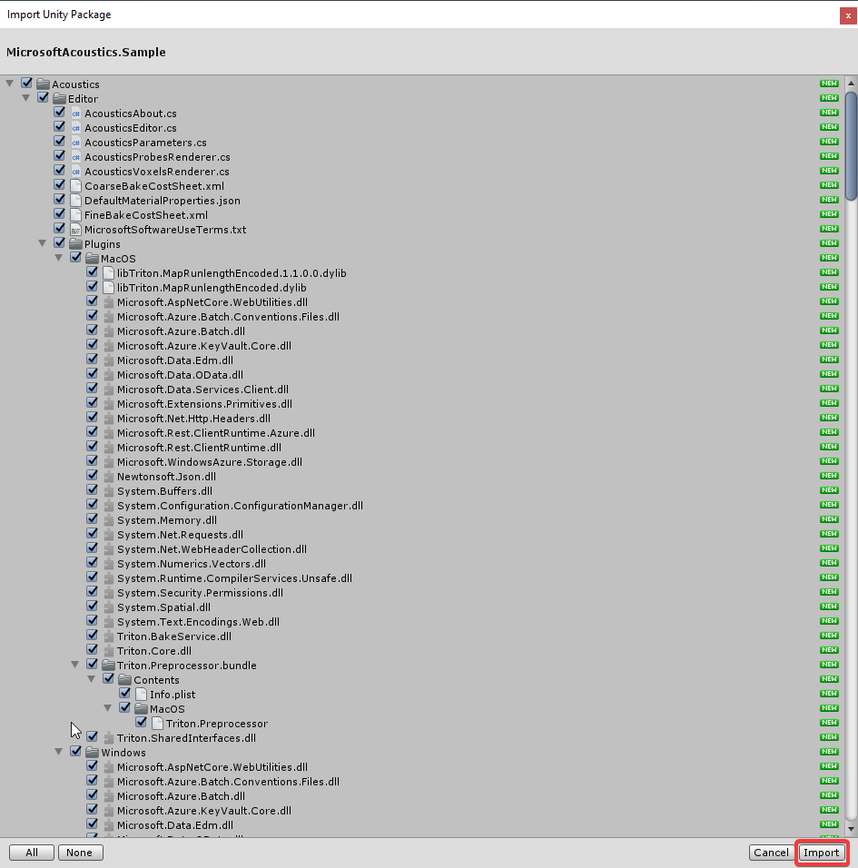

# Project Acoustics Unity integration
This article describes how to integrate the Project Acoustics Unity plug-in into your Unity project.

Software requirements:
* [Unity 2018.2+](https://unity3d.com) for Windows
* [Project Acoustics Unity package](https://www.microsoft.com/download/details.aspx?id=57346)

## Import the plug-in
1. Import the acoustics UnityPackage into your project. 
 In Unity, go to **Assets** > **Import Package** > **Custom Package**.

      

1. Choose **ProjectAcoustics.unitypackage**.

1. Select the **Import** button to integrate the Unity package into your project.

      

If you're importing the plug-in into an existing project, your project may already have an *mcs.rsp* file in the project root. This file specifies options to the C# compiler. Merge the contents of that file with the mcs.rsp file that comes with the Project Acoustics plug-in.

## Enable the plug-in
The bake portion of the acoustics toolkit requires the .NET 4.*x* scripting runtime version. Package import updates your Unity player settings. Restart Unity for this setting to take effect.

## Set up audio DSP
Project Acoustics includes audio runtime DSP that integrates into the Unity audio engine spatializer framework. It includes both HRTF-based and panning spatialization. To enable the Project Acoustics DSP, go to **Edit** > **Project Settings** > **Audio** to open the Unity audio settings. Select **Project Acoustics** as the **Spatializer Plugin** for your project. Make sure that **DSP Buffer Size** is set to *Best performance*.

  

Next, open the Audio Mixer (**Window** > **Audio Mixer**). Make sure that you have at least one mixer, with one group. If you don't have one, select the **+** button to the right of **Mixers**. Right-click the bottom of the channel strip in the effects section, and add the **Microsoft Acoustics Mixer** effect. Only one Project Acoustics mixer is supported at a time.

## Enable acoustics on sound sources
Create an audio source: Select the **Spatialize** check box at the bottom of the AudioSource inspector panel. Make sure that **Spatial Blend** is set to full *3D*.  

## Enable acoustic design
Attach the *AcousticsAdjust* script to a sound source in your scene to enable additional source design parameters: Select **Add Component** and choose **Scripts** > **Acoustics Adjust**.

## Next steps
* [Bake your scene with Project Acoustics for Unity](unity-baking.md).
* [Create an Azure Batch account](create-azure-account.md) to bake your scene in the cloud.
* Explore the [Project Acoustics Unity design process](unity-workflow.md).
