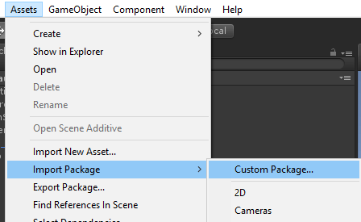
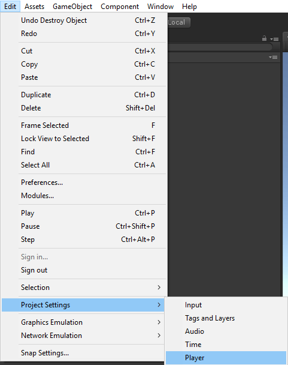
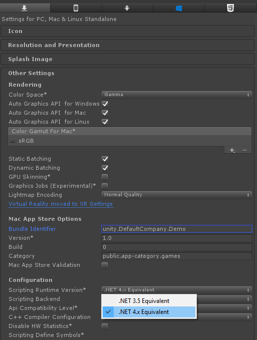
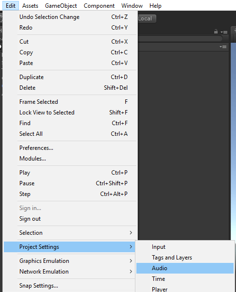
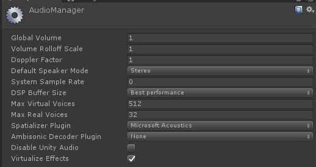
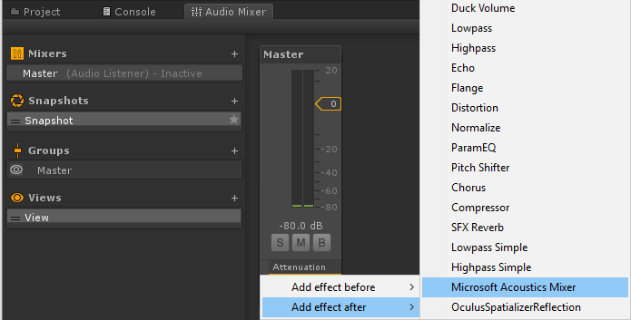
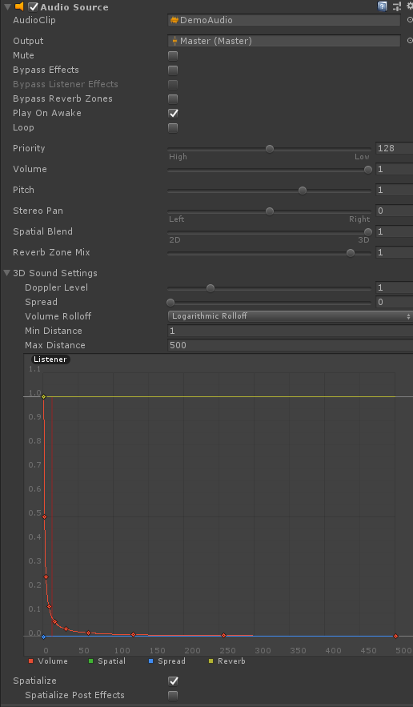

# Project Acoustics Unity Integration
This how-to explains integration of the Project Acoustics Unity plugin into your Unity project.

Software requirements:
* [Unity 2018.2+](https://unity3d.com) for Windows
* [Project Acoustics Unity package](https://www.microsoft.com/download/details.aspx?id=57346)

## Import the plugin
Import the acoustics UnityPackage to your project. 
* In Unity, go to **Assets > Import Package > Custom Package...**

      

* Choose **ProjectAcoustics.unitypackage**

If you're importing the plugin into an existing project, your project may already have an **mcs.rsp** file in the project root, which specifies options to the C# compiler. You'll need to merge the contents of that file with the mcs.rsp file that comes with the Project Acoustics plugin.

## Enable the plugin
The bake portion of the acoustics toolkit requires the .NET 4.x scripting runtime version. Package import will update your Unity player settings. Restart Unity for this setting to take effect.

## Set up audio DSP
Project Acoustics includes audio runtime DSP that integrates into the Unity audio engine spatializer framework. It includes both HRTF-based and panning spatialization. Enable the Project Acoustics DSP by opening the Unity audio settings using **Edit > Project Settings > Audio**, then selecting **Project Acoustics** as the **Spatializer Plugin** for your project. Make sure the **DSP Buffer Size** is set to Best Performance.

  

Then open the Audio Mixer (**Window > Audio Mixer**). Make sure you have at least one Mixer, with one group. If you don't, Click the '+' button to the right of **Mixers**. Right-click the bottom of the channel strip in the effects section, and add the **Project Acoustics Mixer** effect. Note that only one Project Acoustics Mixer is supported at a time.

## Enable acoustics on sound sources
Create an audio source. Click the checkbox at the bottom of the AudioSource's inspector panel that says **Spatialize**. Make sure **Spatial Blend** is set to full 3D.  

## Enable acoustic design
Attach the script **AcousticsAdjust** to a sound source in your scene to enable additional source design parameters, by clicking **Add Component** and choosing **Scripts > Acoustics Adjust**:

## Next steps
* [Bake your scene with Project Acoustics for Unity](unity-baking.md)
* [Create an Azure Batch account](create-azure-account.md) to bake your scene in the cloud
* Explore the [Project Acoustics Unity design process](unity-workflow.md).

