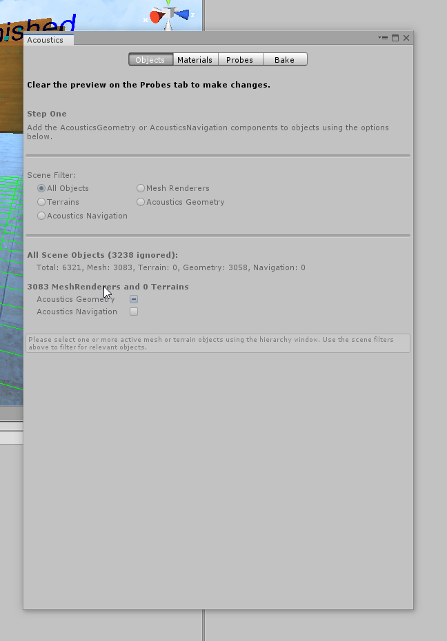

# Project Acoustics Unity Quickstart
Use Project Acoustics sample content for Unity to experiment with simulation-backed design controls.

Software requirements:
* [Unity 2018.2+](https://unity3d.com) for Windows
* [Project Acoustics sample content package](https://www.microsoft.com/download/details.aspx?id=57346)

What's included in the sample package?
* Unity scene with geometry, sound sources, and gameplay controls
* Project Acoustics plug-in
* Baked acoustics assets for the scene

## Import the sample package
Import the sample package into a new Unity project.
1. In Unity, go to **Assets** > **Import Package** > **Custom Package**.

      

1. Choose **ProjectAcoustics.unitypackage**.

1. Select the **Import** button to integrate the Unity package into your project.  
  
      

To import the package into an existing project, see [Unity integration](unity-integration.md) for additional steps and notes.

>[!NOTE]
>Several error messages will appear in the console log after the import is complete. Continue to the next step and restart Unity.

## Restart Unity
The bake portion of the acoustics toolkit requires the .NET 4.*x* scripting runtime version. The package import updates your Unity player settings. Restart Unity for this setting to take effect. To verify that the setting took effect, open the **Player** settings:

  

  

>[!NOTE]
>This screenshot was taken from Unity 2018.*x*. The image may differ in newer versions of Unity.

## Open the Project Acoustics bake window
In Unity, select **Acoustics** on the **Window** menu.

A floating **Acoustics** window will open. This window is where you set the properties of the acoustic simulation.

  

## Experiment with the design controls
Open the sample scene in the *ProjectAcousticsSample* folder, and select the play button in the Unity editor. Use the W, A, S, and D keys and the mouse to move around. To compare how the scene sounds with and without acoustics, select the R key until the overlay text turns red and shows "Acoustics: Disabled." To see keyboard shortcuts for more controls, select F1. You can also right-click to select an action and then left-click to do that action.

The *AcousticsAdjust* script is attached to the sound sources in the sample scene. It enables the per-source design parameters.

The following sections explore some of the effects that you can create by using the available controls. For detailed information about each control, see the [Project Acoustics Unity Design Tutorial](unity-workflow.md).

### Modify distance-based attenuation
The audio digital signal processing in the **Project Acoustics** Unity spatializer plug-in respects the per-source distance-based attenuation that's built into the Unity editor. The controls for distance-based attenuation are in the **Audio Source** component, which is in the **Inspector** panel of sound sources under **3D Sound Settings**:

Project Acoustics computes in a "simulation region" box that's centered around the player location. The acoustics assets in the sample package were baked at a simulation region size of 45 meters around the player. So, the sound attenuation should be designed to fall to 0 at about 45 m.

### Modify occlusion and transmission
* If the **Occlusion** multiplier is greater than 1 (the default is 1), occlusion is exaggerated. To make the occlusion effect more subtle, set it to less than 1.

* To enable through-wall transmission, move the **Transmission (dB)** slider away from the lowest setting.

### Modify wetness for a source
* To change how rapidly wetness changes with distance, use **Perceptual Distance Warp**. Through simulation, Project Acoustics computes wet levels, which provide perceptual distance cues and vary smoothly with distance. Increasing the distance warp exaggerates this effect by increasing distance-related wet levels. Warping values of less than 1 make the distance-based reverberation change more subtle.

   To make finer adjustments to this effect, change the **Wetness (dB)** setting.

* To increase the decay time throughout the space, adjust the **Decay Time Scale**. If the simulation result for a particular source-listener location pair is a decay time of 1.5 seconds and the **Decay Time Scale** is set to 2, the decay time that's applied to the source is 3 seconds.

## Next steps
* Read details on the [Unity-based Project Acoustics design controls](unity-workflow.md).
* Further explore the concepts behind the [design process](design-process.md).
* [Create an Azure account](create-azure-account.md) to explore the pre-bake and bake processes.
