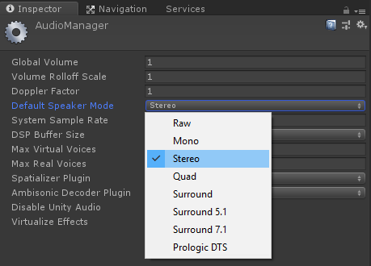
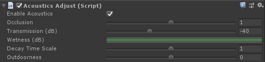
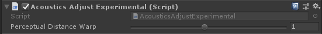
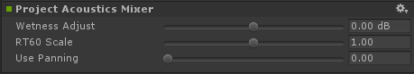
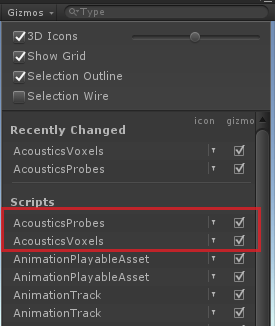
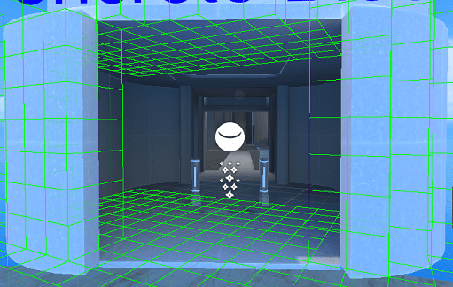
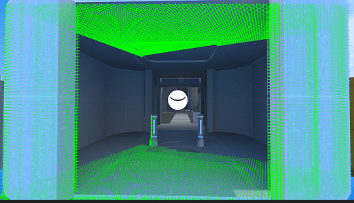

# Project Acoustics Unity Design Tutorial
This tutorial describes the design tools and workflow for Project Acoustics in Unity.

Prerequisites:
* Unity 2018.2+ for Windows
* A Unity scene with a baked acoustics asset

For this tutorial, you can get a Unity scene with a baked acoustics asset in two ways:
* [Add Project Acoustics to your Unity project](unity-integration.md), then [get an Azure Batch account](create-azure-account.md), then [bake your Unity scene](unity-baking.md)
* Or, use the [Project Acoustics Unity sample content](unity-quickstart.md).

## Review design process concepts
Project Acoustics uses common audio digital signal processing (DSP) methods to process your sources, and gives you control over familiar acoustics properties including occlusion, wet/dry mix, and reverberation tail length (RT60). But the core [Project Acoustics design process concept](design-process.md) is that rather than setting these properties directly, you control how simulation results are used to drive these properties. The default settings for each control represent physically accurate acoustics.

## Design acoustics for each source
Project Acoustics provides a number of source-specific acoustics design controls. This lets you control the mix in a scene by emphasizing some sources and de-emphasizing others.

### Adjust distance-based attenuation
The audio DSP provided by the **Project Acoustics** Unity spatializer plugin respects the per-source distance-based attenuation built into the Unity Editor. Controls for distance-based attenuation are in the **Audio Source** component found in the **Inspector** panel of sound sources, under **3D Sound Settings**:

Acoustics performs computation in a "simulation region" box centered around the player location. If a sound source is distant from the player, located outside this simulation region, only geometry within the box will affect the sound propagation (such as causing occlusion) which works reasonably well when occluders are in the vicinity of the player. However, in cases when the player is in open space but the occluders are near the distant sound source, the sound can become unrealistically disoccluded. Our suggested workaround is to ensure in such cases that the sound attenuation falls off to 0 at about 45 m, the default horizontal distance of the player to the edge of the box.

### Adjust occlusion and transmission
Attaching the **AcousticsAdjust** script to a source enables tuning parameters for that source. To attach the script, click **Add Component** on the bottom of the **Inspector** panel and navigate to **Scripts > Acoustics Adjust**. The script has six controls:

* **Enable Acoustics** - Controls whether acoustics is applied to this source. When unchecked, the source will be spatialized with HRTFs or panning but there will be no acoustics. This means no obstruction, occlusion, or dynamic reverberation parameters such as level and decay time. Reverberation is still applied with a fixed level and decay time.
* **Occlusion** - Apply a multiplier to the occlusion dB level computed by the acoustics system. If this multiplier is greater than 1, occlusion will be exaggerated, while values less than 1 make the occlusion effect more subtle, and a value of 0 disables occlusion.
* **Transmission (dB)** - Set the attenuation (in dB) caused by transmission through geometry. Set this slider to its lowest level to disable transmission. Acoustics spatializes the initial dry audio as arriving around scene geometry (portaling). Transmission provides an additional dry arrival that is spatialized in the line-of-sight direction. Note that the distance attenuation curve for the source is also applied.

### Adjust reverberation
* **Wetness (dB)** - Adjusts the reverb power, in dB, according to distance from source. Positive values make a sound more reverberant, while negative values make a sound more dry. Click on the curve control (green line) to bring up the curve editor. Modify the curve by left-clicking to add points and dragging those points to form the function you want. The x-axis is distance from source and the y-axis is reverb adjustment in dB. For more information on editing curves, see this [Unity Manual](https://docs.unity3d.com/Manual/EditingCurves.html). To reset the curve back to default, right click on **Wetness** and select **Reset**.
* **Decay Time Scale** - Adjusts a multiplier for the decay time. For example, if the bake result specifies a decay time of 750 milliseconds, but this value is set to 1.5, the decay time applied to the source is 1,125 milliseconds.
* **Outdoorness** - An additive adjustment on the acoustics system's estimate of how "outdoors" the reverberation on a source should sound. Setting this value to 1 will make a source always sound completely outdoors, while setting it to -1 will make a source sound completely indoors.

Attaching the **AcousticsAdjustExperimental** script to a source enables additional experimental tuning parameters for that source. To attach the script, click **Add Component** on the bottom of the **Inspector** panel and navigate to **Scripts > Acoustics Adjust Experimental**. There is currently one experimental control:

* **Perceptual Distance Warp** - Apply an exponential warping to the distance used to compute the dry-wet ratio. The acoustics system computes wet levels throughout the space, which vary smoothly with distance and provide perceptual distance cues. Warping values greater than 1 exaggerate this effect by increasing distance-related reverberation levels, making the sound "distant". Warping values less than 1 make the distance-based reverberation change more subtle, making the sound more "present".

## Design acoustics for all sources
To adjust parameters for all sources, click on the channel strip in Unity's **Audio Mixer**, and adjust the parameters on the **Project Acoustics Mixer** effect.

* **Wetness Adjust** - Adjusts the reverb power, in dB, across all sources in the scene based on source-listener distance. Positive values make a sound more reverberant, while negative values make a sound more dry.
* **RT60 Scale** - Multiplicative scalar for reverb time.
* **Use Panning** - Controls whether audio is output as binaural (0) or multichannel panning (1). Any value besides 1 indicates binaural. Binaural output is spatialized with HRTFs for use with headphones and multichannel output is spatialized with VBAP for use with multichannel surround speaker systems. If using the multichannel panner, be sure to select the speaker mode that matches your device settings, found under **Project Settings** > **Audio**.

## Check proper sound source placement
Sound sources placed inside occupied voxels will not get acoustic treatment. Because voxels extend past the visible scene geometry, it's possible to place a source inside a voxel while it appears unoccluded by visual geometry. You can view Project Acoustics voxels by toggling the voxel grid checkbox in the **Gizmos** menu, in the upper right of the **Scene** view.

  

The voxel display can also help determine if visual components in the game have a transform applied to them. If so, apply the same transform to the GameObject hosting the **Acoustics Manager**.

### Bake time vs. run time voxels
It's possible to view voxels in the editor window at game design time and in the game window at runtime. The size of the voxels is different in these views. This is because the acoustics runtime interpolation uses a finer voxel grid for smoother interpolation results. Sound source placement should be verified using the runtime voxels.

Design time voxels:

Runtime voxels:

## Next steps
* Explore case studies highlighting the concepts behind the [design process](design-process.md)

