# Project Acoustics Unreal Bake Tutorial
This document describes the process of submitting an acoustics bake using the Unreal editor extension.

There are five steps to doing a bake:

1. Create or tag your player navigation mesh
2. Tag acoustics geometry
3. Assign acoustic materials properties to geometry
4. Preview probe placement
5. Bake

## Open the Project Acoustics editor mode

Import the Project Acoustics plugin package to your project. For help with this, see the [Unreal Integration](unreal-integration.md) topic. Once the plugin is integrated, open the Acoustics UI by clicking the new Acoustics Mode icon.

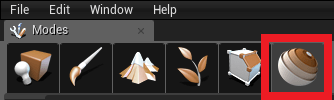

## Tag actors for acoustics

The objects tab is the first tab that gets displayed when you open the Acoustics Mode. Use this tab to tag actors in your level, which adds the **AcousticsGeometry** or **AcousticsNavigation** tags to the actors.

Select one or more objects in the World Outliner, or use the **Bulk Selection** section to help select all objects of a specific category. Once objects are selected, use the **Tagging** section to apply the desired tag to the selected objects.

If something has neither **AcousticsGeometry** nor **AcousticsNavigation** tag, it will be ignored in the simulation. Only static meshes, nav meshes and landscapes are supported. If you tag anything else, it will be ignored.

### For reference: The Objects tab parts

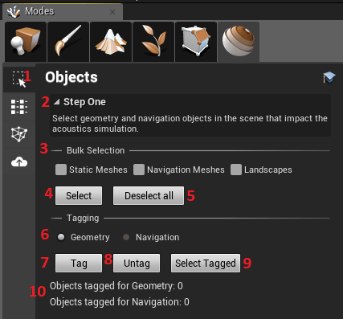

1. The tab selection buttons (**Objects** tab selected). Use these buttons to walk through the various steps of doing an acoustics bake, from top to bottom.
2. A brief description of what you need to do using this page.
3. Available selectors for actors in the level.
4. Clicking **Select** will select all objects in the level that match at least one of the checked actor types.
5. Clicking **Deselect all** will clear the current selection. This is the same as hitting the escape key.
6. Use these radio buttons to choose whether to apply the Geometry or Navigation tag to the selected actors.
7. Clicking **Tag** will add the selected tag to all currently selected actors.
8. Clicking **Untag** will remove the selected tag from all currently selected actors.
9. Clicking **Select Tagged** will clear the current selection, and select all actors with the currently selected tag.
10. These stats show how many actors are tagged with each tag type.

### Tag acoustics occlusion and reflection geometry

Open the Objects tab of the Acoustics window. Mark any objects as Acoustics Geometry if they should occlude, reflect, or absorb sound. Acoustics geometry can include things like ground, walls, roofs, windows & window glass, rugs, and large furniture. You can use any arbitrary level of complexity for these objects. Because the scene is voxelized before simulation, highly detailed meshes, such as trees with many small leaves, aren't more costly to bake than simplified objects.

Don't include things that shouldn't affect the acoustics, such as invisible collision meshes.

An object's transform at the time of the probe calculation (via the Probes tab, below) is fixed in the bake results. Moving any of the marked objects in the scene will require redoing the probe calculation and rebaking the scene.

### Create or tag a navigation mesh

A navigation mesh is used to place probe points for simulation. You can use Unreal's [Nav Mesh Bounds Volume](https://api.unrealengine.com/INT/Engine/AI/BehaviorTrees/QuickStart/2/index.html), or you can specify your own navigation mesh. You must tag at least one object as **Acoustics Navigation**. If you use Unreal's Navigation mesh, make sure you have it built first.

### Acoustics Volumes ###

There is further, advanced customization you can make on your navigation areas with **Acoustics Volumes**. **Acoustics Volumes** are actors you can add to your scene that allow you to select areas to include and ignore from the navigation mesh. The actor exposes a property that can be switched between "Include" and "Exclude". "Include" volumes ensure only areas of the navigation mesh inside them are considered and "Exclude" volumes mark those areas to be ignored. "Exclude" volumes are always applied after "Include" volumes. Make sure to tag **Acoustics Volumes** as **Acoustics Navigation** through the usual process in the Objects tab. These actors are ***not*** automatically tagged.

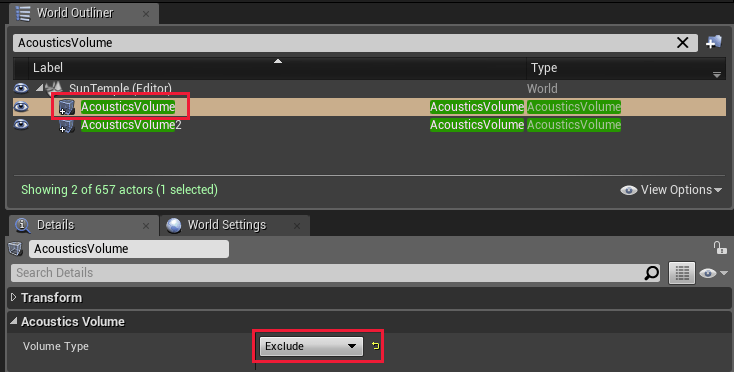

"Exclude" volumes are mainly meant to give fine-grained control on where not to place probes for tightening resource usage.

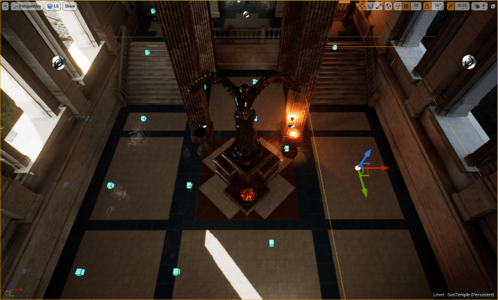

"Include" volumes are useful for creating manual sections of a scene, such as if you want to break up your scene into multiple acoustic zones. For example, if you have a large scene, many kilometers squared, and you have two areas of interest you want to bake acoustics on. You can draw two big "Include" volumes in the scene and produce ACE files for each of them one at a time. Then in game, you can use trigger volumes combined with blueprint calls to load the appropriate ACE file when the player approaches each tile.

**Acoustics Volumes** only restrict the navigation and ***not*** the geometry. Each probe inside an "Include" **Acoustics Volume** will still pull in all the necessary geometry outside of the volume when performing wave simulations. Therefore, there shouldn't be any discontinuities in occlusion or other acoustics resulting from the player crossing from one section to another.

## Select acoustic materials

Once your objects are tagged, click the **Materials** button to go to the Materials Tab. This tab will be used to specify material properties for each material in the level. Before any actors are tagged, it will be blank.

The acoustic materials control the amount of sound energy reflected back from each surface. The default acoustic material has absorption similar to concrete. Project Acoustics suggests materials based on the scene material name.

The reverberation time of a given material in a room is inversely related to its absorption coefficient, with most materials having absorption values in the 0.01 to 0.20 range. Materials with absorption coefficients above this range are very absorbent. For example, if a room sounds too reverberant, change the acoustic material of the walls, floor, or ceiling to something of higher absorptivity. The acoustic material assignment applies to all actors that use that scene material.

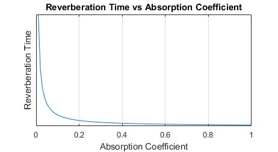

### For reference: Parts of the Materials tab

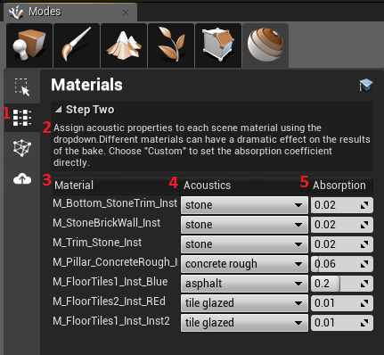

1. The **Materials** tab button, used to bring up this page.
2. A brief description of what you need to do using this page.
3. The list of materials used in the level, taken from the actors tagged as **AcousticsGeometry**. Clicking on a material here will select all objects in the scene that use that material.
4. Shows the acoustic material that the scene material has been assigned to. Click a dropdown to reassign a scene material to a different acoustic material.
5. Shows the acoustic absorption coefficient of the material selected in the previous column. A value of zero means perfectly reflective (no absorption), while a value of 1 means perfectly absorptive (no reflection). Changing this value will update the Acoustics Material (step #4) to **Custom**.

If you make changes to the materials in your scene, you will need to switch tabs in the Project Acoustics plugin to see those changes reflected in the **Materials** tab.

## Calculate and review listener probe locations

After assigning the materials, switch to the **Probes** tab.

### For reference: Parts of the Probes tab

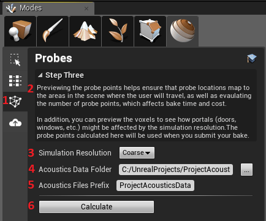

1. The **Probes** tab button used to bring up this page
2. A brief description of what you need to do using this page
3. Use this to choose a coarse or fine simulation resolution. Coarse is faster, but has certain tradeoffs. See [Bake Resolution](bake-resolution.md) below for details.
4. Choose the location where the acoustics data files should be placed using this field. Click the button with "..." to use a folder picker. For more information about data files, see [Data Files](#Data-Files) below.
5. The data files for this scene will be named using the prefix provided here. The default is "[Level Name]_AcousticsData".
6. Click the **Calculate** button to voxelize the scene and calculate the probe point locations. This is done locally on your machine, and must be done prior to doing a bake. After the probes have been calculated, the controls above will be disabled, and this button will change to say **Clear**. Click the **Clear** button to erase the calculations and enable the controls so that you can recalculate using new settings.

Probes must be placed through the automated process provided in the **Probes** tab.

### What the "Calculate" button calculates

The **Calculate** button takes all the data you have provided so far (geometry, navigation, materials, and the coarse/fine setting) and goes through several steps:

1. It takes the geometry from the scene meshes and calculates a voxel volume. The voxel volume is a 3-dimensional volume that encloses your entire scene, and is made up of small cubic "voxels". The size of the voxels is determined by the simulation frequency, which is set by the **Simulation Resolution** setting. Each voxel is marked as being either "open air" or containing scene geometry. If a voxel contains geometry then the voxel is tagged with the absorption coefficient of the material assigned to that geometry.
2. It then uses the navigation data to calculate acoustically interesting locations where the player might go. It tries to find a reasonably small set of these locations that includes smaller areas such as doorways and hallways, and then to rooms, to open spaces. For small scenes this typically is fewer than 100 locations, while large scenes may have up to one thousand.
3. For each of the final listener locations it computes, it determines a number of parameters such as how "open" is the space, the size of the room it is in, etc.
4. The results of these calculations are stored in files at the location you specify (See [Data Files](#Data-Files) below)

Depending on the size of your scene and the speed of your machine, these calculations can take several minutes.

Once these calculations are complete, you can preview both the voxel data and the probe point locations to help ensure that the bake will give you good results. Things like a bad navigation mesh or missing/extra geometry will typically be quickly visible in the preview so you can correct it.

## Debug display

After probe calculation is completed, a new actor will appear in the World Outliner called **AcousticsDebugRenderer**. Checking the **Render Probes** and **Render Voxels** checkboxes will enable the debug display inside the editor viewport.

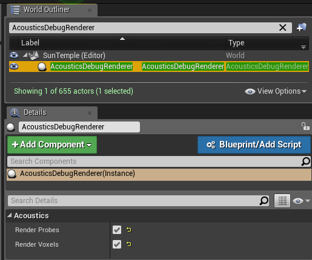

If you don't see any voxels or probes overlaid on your level, make sure real-time rendering is enabled in the viewport.

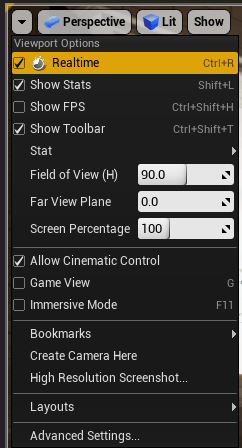

### Voxels

Voxels are shown in the scene window as green cubes around participating geometry. Voxels that contain only air are not shown. There is a large green box around your entire scene that denotes the complete voxel volume that will be used in the simulation.
Move around your scene and verify that the acoustically-occluding geometry has voxels. Also, check that non-acoustics objects such as collision meshes haven't been voxelized. The scene camera has to be within about 5 meters of the object for the voxels to show.

If you compare the voxels created with coarse resolution vs fine resolution, you will see that the coarse voxels are twice as large.

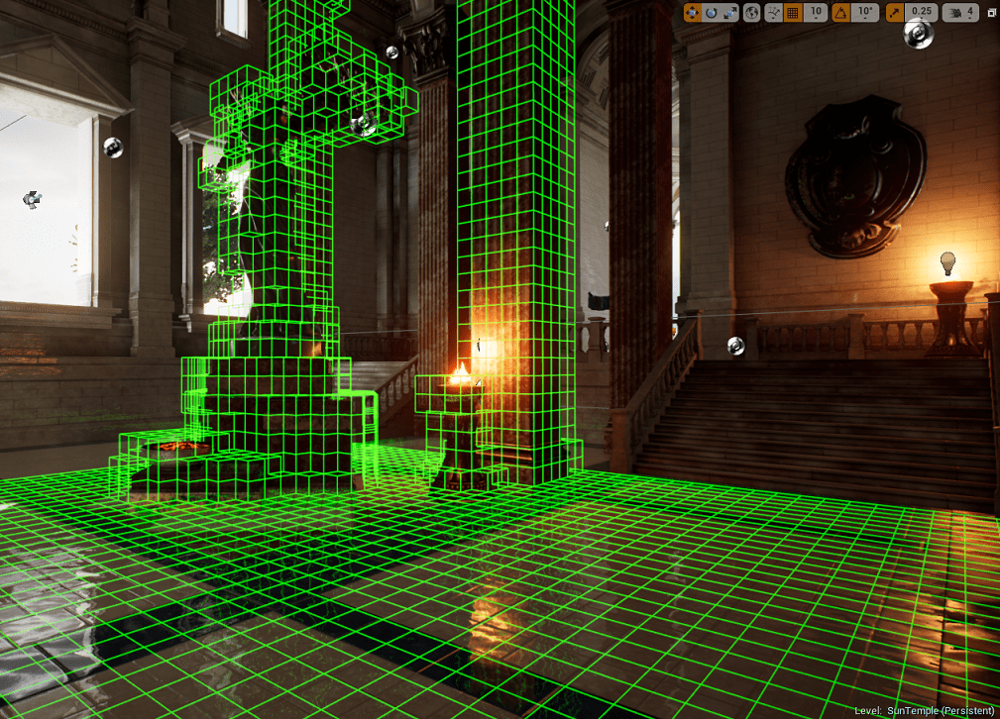

### Probe points

Probe points are synonymous with possible player (listener) locations. When baking, the simulation calculates the acoustics connecting all possible source locations to each probe point. At runtime, the listener location is interpolated among nearby probe points.

It's important to check that probe points exist anywhere the player is expected to travel in the scene. Probe points are placed on the navigation mesh by the Project Acoustics engine and can't be moved or edited, so ensure the navigation mesh covers all possible player locations by inspecting the probe points.

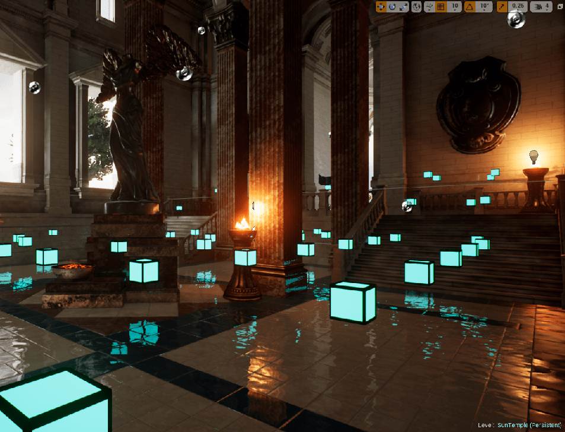

See [Bake Resolution](bake-resolution.md) for more details on coarse vs fine resolution.

## Bake your level using Azure Batch

You can bake your scene with a compute cluster in the cloud using the Azure Batch service. The Project Acoustics Unreal plugin connects directly to Azure Batch to instantiate, manage, and tear down an Azure Batch cluster for each bake. On the Bake tab, enter your Azure credentials, select a cluster machine type and size, and click Bake.

### For reference: Parts of the bake tab

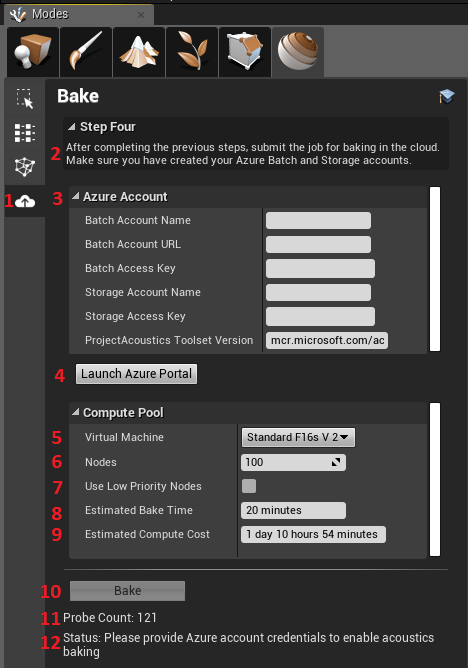

1. The Bake Tab button used to bring up this page.
2. A brief description of what to do on this page.
3. Fields to enter your Azure Credentials once your Azure account has been created. For more information, see [Create an Azure Batch Account](create-azure-account.md).
4. Launch Azure portal to manage your subscriptions, monitor usage and view billing information etc. 
5. Azure batch compute node type to use for the calculation. The node type must be supported by your Azure data center location. If not sure, leave at **Standard_F8s_v2**.
6. Number of nodes to use for this calculation. The number you enter here affects the time to complete the bake and is limited by your Azure Batch core allocation. The default allocation only allows for two 8 core nodes or one 16 core node, but can be expanded. For more information on core allocation constraints, see [Create an Azure Batch Account](create-azure-account.md).
7. Select this checkbox to configure your compute pool to use [low-priority nodes](https://docs.microsoft.com/azure/batch/batch-low-pri-vms). Low-priority compute nodes have much lower cost but they may not always be available or may be preempted at any time.
8. The amount of elapsed time it is expected to take for your job to run in the cloud. This does not include node startup time. Once the job starts running, this is about how long it should be before you get back the results. Note that this is only an estimate.
9. The total amount of computing time needed to run the simulations. This is the total amount of node compute time that will be used in Azure. See [Estimating bake cost](#Estimating-bake-cost) below for more information on using this value.
10. Click the Bake button to submit the bake to the cloud. While a job is running, this shows **Cancel Job** instead. If there are any errors on this tab, or if the workflow on the **Probes** tab has not been completed, this button will be disabled.
11. The probe count for your scene as calculated on the **Probes** tab. The number of probes determines the number of simulations that need to be run in the cloud. You cannot specify more nodes than there are probes.
12. This message tells you the current status of the job, or if there are any errors in this tab, what those errors are.

You can always get complete information about active jobs, compute pools, and storage at the [Azure portal](https://portal.azure.com).

While a job is running the **Bake** button changes to **Cancel Job**. Use this button to cancel the job in progress. Canceling a job cannot be undone, no results will be available, and you will still be charged for any Azure compute time used prior to cancellation.

Once you've started a bake, you can close Unreal. Depending on the project, node type, and number of nodes, a cloud bake can take several hours. The bake job status will be updated when you reload the project and open the Acoustics window. If the job has completed, the output file will be downloaded.

The Azure credentials are stored securely on your local machine and associated with your Unreal project. They are used solely to establish a secure connection to Azure.

###  Estimating Azure bake cost

To estimate what a given bake will cost, take the value shown for **Estimated Compute Cost**, which is a duration, and multiply that by the hourly cost in your local currency of the **VM Node Type** you selected. The result will not include the node time needed to get the nodes up and running. For example, if you select **Standard_F8s_v2** for your node type, which has a cost of $0.40/hr, and the Estimated Compute Cost is 3 hours and 57 minutes, the estimated cost to run the job will be $0.40 * ~4 hours = ~$1.60. The actual cost will likely be a bit higher due to the extra time to get the nodes started. You can find the hourly node cost on the [Azure Batch Pricing](https://azure.microsoft.com/pricing/details/virtual-machines/linux) page (select "Compute optimized" or "High performance compute" for the category).

### Reviewing the bake results

After the bake completes, check that the voxels and probe points are in their expected locations by running the runtime plugin.

## Data files

There are four data files created by this plugin at various points. Only one of them is needed at runtime and is placed in your project's Content/Acoustics folder, which is automatically added to your project's packaging path. The other three are inside the Acoustics Data folder and are not packaged.

* **[Project]/Config/ProjectAcoustics.cfg**: This file stores the data you enter in fields in the Acoustics Mode UI. The location and name of this file can't be changed. There are other values stored in this file that affect the bake, but they are for advanced users and should not be changed.
* **[Project]/Content/Acoustics/[LevelName]\_AcousticsData.ace**: This file is what is created during the bake simulation, and contains the lookup data used by the runtime to render the acoustics of your scene. The location and name of this file can be changed using the fields on the **Probes** Tab. If you want to rename this file after it has been created, delete the UAsset from your Unreal project, rename the file outside of Unreal in File Explorer, and then re-import this file into Unreal to produce a new UAsset. Renaming the UAsset by itself will not work.
* **[Project]/Plugins/ProjectAcoustics/AcousticsData/[LevelName]\_AcousticsData.vox**: This file stores the voxelized acoustics geometry and the material properties. Computed using the **Calculate** button on the **Probes** Tab. The location and name of this file can be changed using the fields on the **Probes** Tab.
* **[Project]/Plugins/ProjectAcoustics/AcousticsData/[LevelName]\_AcousticsData\_config.xml**: This file stores parameters computed using the **Calculate** button on the **Probes** Tab. The location and name of this file can be changed using the fields on the **Probes** Tab.

Take care not to delete the *.ace file downloaded from Azure. This file isn't recoverable except by rebaking the scene.

## Next steps
* Explore the [design controls for Unreal](unreal-workflow.md)
* Explore the [Project Acoustics design concepts](design-process.md)

