# Project Acoustics Unreal and Wwise Integration
This how-to provides detailed integration steps of the Project Acoustics plugin package into your existing Unreal and Wwise game project. 

Software requirements:
* [Unreal Engine](https://www.unrealengine.com/) 4.20 or 4.21
* [AudioKinetic Wwise](https://www.audiokinetic.com/products/wwise/) 2018.1.\*
* [Wwise plugin for Unreal](https://www.audiokinetic.com/library/?source=UE4&id=index.html)
  * If you're using a direct integration of the Wwise SDK instead of using the Wwise Unreal plugins, consult the Project Acoustics Unreal plugin and adjust Wwise API calls.

If you'd like to use Project Acoustics with an audio engine other than Wwise, make an enhancement request on the [Project Acoustics discussion forum](https://github.com/microsoft/ProjectAcoustics/issues). You can use the Project Acoustics Unreal plugin to query acoustics data and then make API calls to your engine.

## Download Project Acoustics
If you haven't already, download the [Project Acoustics Unreal & Wwise plugin package](https://www.microsoft.com/download/details.aspx?id=58090)). 

We've included an Unreal Engine plugin and a Wwise mixer plugin in the package. The Unreal plugin provides editor and runtime integration. During gameplay, the Project Acoustics Unreal plugin computes parameters such as occlusion for each game object each frame. These parameters are translated to Wwise API calls.

## Review integration steps

There are these main steps to install the package and deploy it in your game.
1. Install the Project Acoustics Wwise mixer plugin
2. (Re)deploy Wwise to your game. This step propagates the mixer plugin into your game project.
3. Add the Project Acoustics Unreal plugin to your game
4. Extend Wwise's Unreal plugin functionality
5. Build game and check Python is enabled
6. Set up your Wwise project to use Project Acoustics
7. Audio setup in Unreal

## 1. Install the Project Acoustics mixer plugin
* Open Wwise Launcher, then in the **Plugins** tab, under **Install New Plugins**, select **Add From Directory**. 

    

* Choose the `AcousticsWwisePlugin\ProjectAcoustics` directory that was included in the package you downloaded. It contains the Wwise mixer plugin bundle.

* Wwise will install the plugin. Project Acoustics should now show up in the installed plugins list in Wwise.
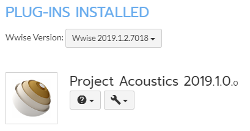

## 2. (Re)deploy Wwise into your game
Re-deploy Wwise to your game even if you've already integrated Wwise. This picks up the Project Acoustics Wwise plugin.

* **Engine plugin:** If you have Wwise installed as a game plugin in an Unreal C++ project, skip this step. If it's installed instead as an engine plugin, for instance because your Unreal project is Blueprint only, Wwise deployment with our mixer plugin is more complex. Create a dummy, empty Unreal C++ project, close it if Unreal editor opens, and follow the remaining procedure to deploy Wwise into this dummy project. Then copy out the deployed Wwise plugin.
 
* From Wwise Launcher, click the **Unreal Engine** tab, then click the hamburger menu next to **Recent Unreal Engine Projects** and select **Browse for project**. Open your game's Unreal project `.uproject` file.

    

* Then click **Integrate Wwise in Project** or **Modify Wwise in Project**. This step (re)integrates Wwise binaries into your project, now including the Project Acoustics mixer plugin.

* **Engine plugin:** If you're using Wwise as an engine plugin and created the dummy project as above, copy the folder Wwise deployed: `[DummyUProject]\Plugins\Wwise` and paste it over `[UESource]\Engine\Plugins\Wwise`. `[DummyUProject]` is the empty Unreal C++ project path, and `[UESource]` is where you have the Unreal Engine sources installed. Once you're done copying, you can delete the dummy project.

## 3. Add the Project Acoustics Unreal plugin to your game
 
* Copy the `Unreal\ProjectAcoustics` folder in the plugin package and create a new folder `[UProjectDir]\Plugins\ProjectAcoustics`, where `UProjectDir` is your game's project folder containing the `.uproject` file.
  * **Engine plugin**: If you're using Wwise as an engine plugin, you should use Project Acoustics as an Unreal engine plugin as well. Instead of the above destination directory, use: `[UESource]\Engine\Plugins\ProjectAcoustics`.

* Confirm you see a `Wwise` folder alongside the `ProjectAcoustics` folder. It contains the Wwise plugin along with binaries for the mixer plugin that you (re-) deployed in Step 2 above.

## 4. Extend Wwise's Unreal plugin functionality
* The Project Acoustics Unreal plugin requires additional behavior be exposed from the Wwise Unreal plugin API per [these guidelines](https://www.audiokinetic.com/library/?source=UE4&id=using__initialsetup.html). We've included a batch file to automate the patching procedure. 
* Inside `Plugins\ProjectAcoustics\Resources`, run `PatchWwise.bat`. The example image below uses our AcousticsGame sample project.

    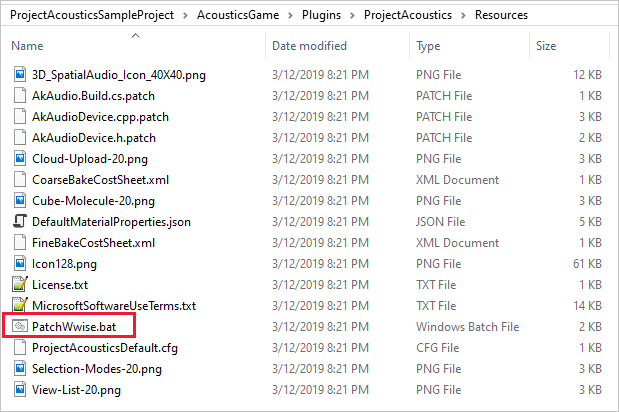

* If you don't have the DirectX SDK installed, you'll need to comment out the line containing DXSDK_DIR in `[UProject]\Plugins\Wwise\Source\AkAudio\AkAudio.Build.cs`

    

## 5. Build game and check Python is enabled

* Compile your game and ensure that it builds correctly. Otherwise, check the previous steps carefully before proceeding. 
* Open your project in Unreal Editor. 
* **Engine plugin:** If using ProjectAcoustics as engine plugin, also ensure that it's enabled, listed under "built-in" plugins.
* You should see a new mode, which indicates Project Acoustics has been integrated.

    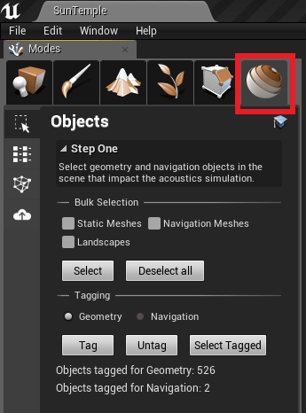

* Confirm you have the Python plugin for Unreal enabled. This is required for the editor integration to function correctly.

    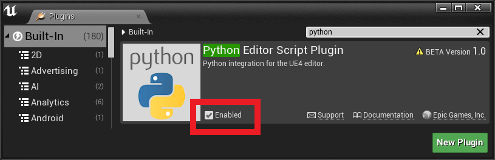

## 6. Wwise project setup

An example Wwise project is included with the samples download. We recommend looking at it alongside these instructions. The screenshots below are taken from this project.

### Bus Setup
* The Project Acoustics Unreal plugin will look for the associated mixer plugin on a bus with this ***exact*** name: `Project Acoustics Bus`. Create a new audio bus with this name. The mixer plugin can work in various configurations, but for now we assume it will be used to do only reverb processing. This bus will carry the mixed reverb signal for all sources that use Acoustics. It can mix upstream into any bus mixing structure, an example is shown below, taken from our Wwise sample project included in the sample download.

    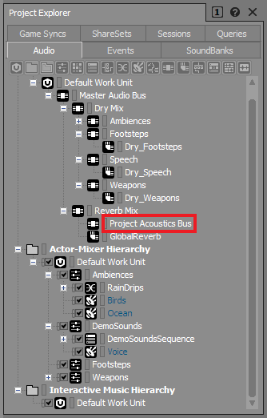

* The channel configuration on the bus needs to be set to one of: `1.0, 2.0, 4.0, 5.1 or 7.1`. Other configs will result in no output on this bus.

    

* Now go into the Project Acoustics bus details, and ensure you can see the Mixer Plug-in tab

    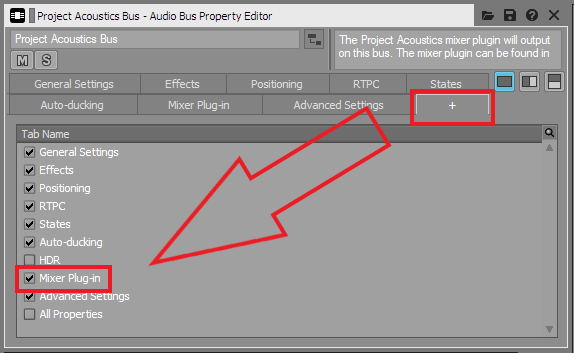

* Then go to the Mixer Plug-in tab and add the project acoustics mixer plug-in to the bus

    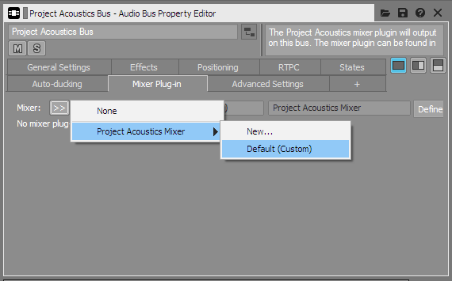

### Actor-mixer hierarchy setup
* For performance reasons, Project Acoustics applies audio DSP to all sources simultaneously. This requires the plugin to operate as a mixer plugin. Wwise requires mixer plugins to be on the output bus, though the output bus usually carries the dry output signal. Project Acoustics requires the dry signal be routed through aux busses while the wet signal is carried on the `Project Acoustics Bus`. The following process supports gradual migration to this signal flow.

* Say you have an existing project with an actor-mixer hierarchy containing Footsteps, Weapons, and others at the top level. Each has corresponding output bus for its dry mix. Lets say you want to migrate Footsteps to use acoustics. First create a corresponding aux bus to carry their dry submix that is a child of the Footsteps output bus. For instance, we've used a "Dry" prefix in image below to organize these, although the exact name isn't important. Any meters or effects you had on the Footsteps bus will still function as before.

    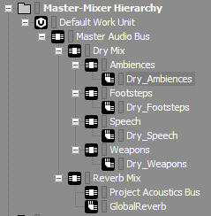

* Then modify the bus output structure for the Footsteps actor-mixer as follows, with Project Acoustics Bus set as Output Bus, and Dry_Footsteps set as a user-defined aux bus.

    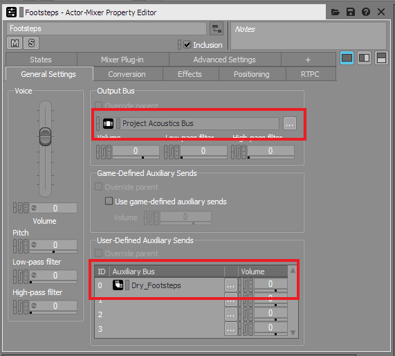

* Now all footsteps get acoustics treatment and output their reverb on the Project Acoustics Bus. The dry signal is routed through Dry_Footsteps and spatialized as usual.

* Project Acoustics only applies to sounds that have a 3D location in the world. Following [Wwise documentation](https://blog.audiokinetic.com/out-with-the-old-in-with-the-new-positioning-revamped-in-wwise-2018.1/), the positioning properties must be set as shown. The "3D Spatialization" setting can be either "Position" or "Position + Orientation" as needed.

    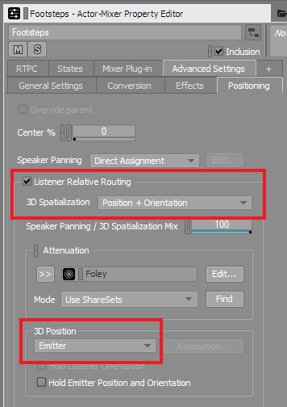

* Setting the Output Bus to some other bus that mixes upstream into **Project Acoustics Bus** won't work. Wwise imposes this requirement on mixer plugins.

* If you want a child in the Footsteps actor-mixer hierarchy to not use acoustics, you can always use "override parent" on it to opt it out.

* If you're using game- or user-defined sends for reverb on any actor-mixer in the game, turn those off on this actor-mixer to avoid applying reverb twice.

### Spatialization
By default, the Project Acoustics Wwise mixer plugin applies convolution reverb, leaving Wwise to do panning spatialization. When using Project Acoustics in this default reverb-only configuration, you're free to use any channel configuration and spatialization method on your dry mix, allowing you to mix and match almost any spatializer with Project Acoustics' reverb. Your options include [Ambisonics-based binaural spatializers](https://www.audiokinetic.com/products/ambisonics-in-wwise/) and [Windows Sonic](https://docs.microsoft.com/windows/desktop/CoreAudio/spatial-sound).
 
Project Acoustics includes an optional spatializer that supports both object-based high-resolution HRTF rendering, and panning. Check the "Perform Spatialization" checkbox on the mixer plugin settings, and choose between HRTF or Panning and disable user-defined aux sends set up above to all the dry busses to avoid spatializing twice, both with Project Acoustics mixer plugin and Wwise. The spatialization mode can't be changed in real time, because it requires a sound bank regeneration. You must restart Unreal, then regenerate soundbanks before hitting play to pick up mixer plugin config changes such as the 'Perform Spatialization' checkbox.

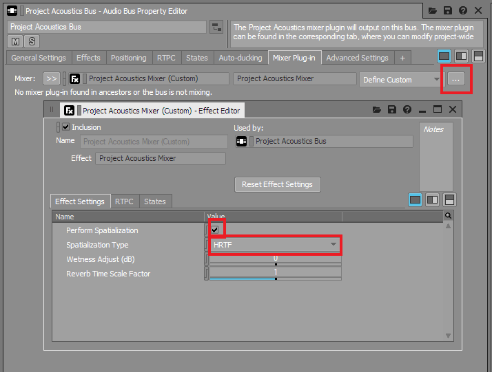

Unfortunately, other object-based spatializer plugins can't be supported at this time as they are implemented as mixer plugins, and Wwise doesn't currently allow multiple mixer plugins assigned to a single actor-mixer.  

## 7. Audio setup in Unreal
* First you'll need to bake your game level to produce an acoustics asset, which will be placed in `Content\Acoustics`. Consult the [Unreal Bake Tutorial](unreal-baking.md) and resume here. Some pre-baked levels are included in the sample package.
* Create an Acoustics Space actor in your scene. Only create one of these actors in a level as it represents the acoustics for the whole level. 

    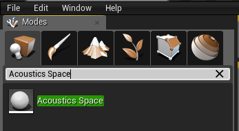

* Now assign the baked acoustic data asset to the Acoustics Data slot on the Acoustics Space actor. Your scene now has acoustics!

    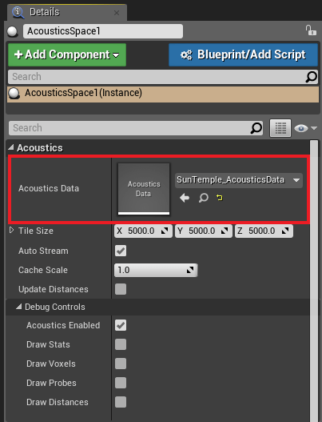

* Now add an empty actor and do the following:

    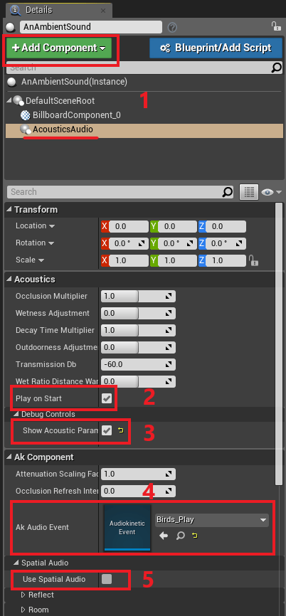

1. Add an Acoustics Audio component to the actor. This component extends the Wwise audio component with functionality for Project Acoustics.
2. The Play on Start box is checked by default, which will trigger associated Wwise event on level startup.
3. Use the Show Acoustics Parameters checkbox to print on-screen debug information about the source.
    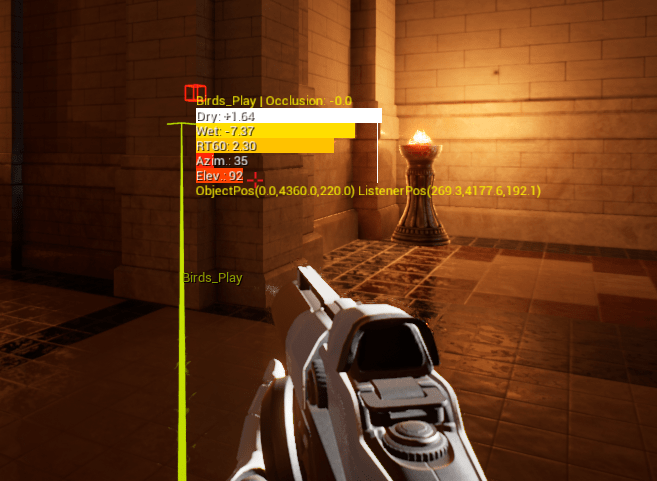
4. Assign a Wwise event per the usual Wwise workflow
5. Ensure that Use Spatial Audio is turned off. At this time, if you use Project Acoustics for a particular audio component, you can't simultaneously use Wwise's Spatial Audio engine for acoustics.

You're all set. Move around the scene and explore the acoustic effects!

## Next steps
* [Design](unreal-workflow.md) tutorial for Project Acoustics in Unreal/Wwise
* [Learn how to do bakes](unreal-baking.md) for your game scenes 
