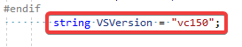

# Project Acoustics Unreal and Wwise integration
This article describes how to integrate the Project Acoustics plug-in package into your existing Unreal and Wwise game project.

Software requirements:
* [Unreal Engine](https://www.unrealengine.com/) 4.20+
* [AudioKinetic Wwise](https://www.audiokinetic.com/products/wwise/) 2018.1
* [Wwise plug-in for Unreal](https://www.audiokinetic.com/library/?source=UE4&id=index.html)
  
  If you're using a direct integration of the Wwise SDK instead of the Wwise Unreal plug-in, consult the Project Acoustics Unreal plug-in and adjust Wwise API calls.

To use Project Acoustics with an audio engine other than Wwise, make an enhancement request in the [Project Acoustics discussion forum](https://github.com/microsoft/ProjectAcoustics/issues). You can use the Project Acoustics Unreal plug-in to query acoustics data and make API calls to your engine.

## Download Project Acoustics
Download the [Project Acoustics Unreal and Wwise plug-in package](https://www.microsoft.com/download/details.aspx?id=58090) if you haven't already.

An Unreal Engine plug-in and a Wwise mixer plug-in are included in the package. The Unreal plug-in provides editor and runtime integration. During gameplay, the Project Acoustics Unreal plug-in computes parameters such as occlusion for each game object for each frame. These parameters are translated into Wwise API calls.

## Integration steps

Follow these steps to install the package and deploy it in your game.

### Install the Project Acoustics mixer plug-in
1. Open the Wwise launcher. On the **Plug-ins** tab, under **Install New Plug-ins**, select **Add from Directory**.

    

1. Select the *AcousticsWwisePlugin\ProjectAcoustics* directory that's in the download package. It contains the Wwise mixer plug-in bundle.

   Wwise will install the plug-in. Project Acoustics should appear on the installed plug-ins list in Wwise.  

### Dedeploy Wwise into your game
Redeploy Wwise into your game even if you've already integrated Wwise. This step integrates the Project Acoustics Wwise plug-in.

   > [!NOTE]
   > **Engine plug-in:** If you have Wwise installed as a game plug-in in an Unreal C++ project, skip this step. If it's installed instead as an engine plug-in, for instance because your Unreal project is Blueprint only, Wwise deployment with our mixer plug-in is more complex. Create a dummy empty Unreal C++ project. Close the Unreal editor if it opens and follow the remaining procedure to deploy Wwise into the dummy project. Then, copy out the deployed Wwise plug-in.
 
1. From the Wwise launcher, select the **Unreal Engine** tab. Select the "hamburger" (icon) menu next to **Recent Unreal Engine Projects** and then select **Browse for project**. Open your game's Unreal project *.project* file.

    

1. Select **Integrate Wwise in Project** or **Modify Wwise in Project**. This step integrates Wwise binaries into your project, including the Project Acoustics mixer plug-in.

   > [!NOTE]
   > **Engine plug-in:** If you're using Wwise as an engine plug-in and you created the dummy project as described earlier, copy the folder that Wwise deployed: *[DummyUProject]\Plugins\Wwise*. Paste it over *[UESource]\Engine\Plugins\Wwise*. *[DummyUProject]* is the empty Unreal C++ project path, and *[UESource]* is where the Unreal Engine sources are installed. After you copy the folder, you can delete the dummy project.

### Add the Project Acoustics Unreal plug-in to your game
 
1. Copy the *Unreal\ProjectAcoustics* folder in the plug-in package. Create a new folder *[UProjectDir]\Plugins\ProjectAcoustics*, where *[UProjectDir]* is your game's project folder that contains the *.uproject* file.

   > [!NOTE]
   > **Engine plug-in**: If you're using Wwise as an engine plug-in, you should use Project Acoustics as an Unreal engine plug-in as well. Instead of the destination directory cited previously, use *[UESource]\Engine\Plugins\ProjectAcoustics*.

1. Confirm that you see a *Wwise* folder alongside the *ProjectAcoustics* folder. It contains the Wwise plug-in along with binaries for the mixer plug-in that you deployed earlier.

### Extend Wwise Unreal plug-in functionality
The Project Acoustics Unreal plug-in requires additional behavior exposed from the Wwise Unreal plug-in API per [these guidelines](https://www.audiokinetic.com/library/?source=UE4&id=using__initialsetup.html). We've included a batch file to automate the patching procedure.

* Inside *Plugins\ProjectAcoustics\Resources*, run *PatchWwise.bat*. The following example image uses our AcousticsGame sample project.

    

* If you don't have the DirectX SDK installed: Depending on the version of Wwise you're using, you might need to comment out the line that contains `DXSDK_DIR` in *AcousticsGame\Plugins\Wwise\Source\AkAudio\AkAudio.Build.cs*:

    

* If you compile by using Visual Studio 2019: To work around a linking error with Wwise, manually change the default `VSVersion` value in *AcousticsGame\Plugins\Wwise\Source\AkAudio\AkAudio.Build.cs* to **vc150**:

    

### Build the game and check that Python is enabled

1. Compile your game, and make sure that it builds correctly. If it doesn't build, check the previous steps carefully before you continue.

1. Open your project in Unreal Editor.

    > [!NOTE]
    > **Engine plug-in:** If you're using ProjectAcoustics as an engine plug-in, also make sure that it's enabled under "built-in" plug-ins.

    You should see a new mode, which indicates that Project Acoustics has been integrated.

    

1. Confirm that the Python plug-in for Unreal is enabled so that editor integration functions correctly.

    

### Set up your Wwise project to use Project Acoustics

An example Wwise project is included in the samples download. We recommend that you view it along with these instructions. The screenshots later in this article are from this project.

#### Bus setup
The Project Acoustics Unreal plug-in will look for the associated mixer plug-in on a bus that has the exact name `Project Acoustics Bus`. Create a new audio bus that has this same name. The mixer plug-in can work in various configurations. But for now, we assume that it will be used only for reverb processing. This bus will carry the mixed reverb signal for all sources that use Acoustics. It can mix upstream into any bus-mixing structure. An example is shown here from the Wwise sample project that's included in the sample download.

1. Set the channel configuration on the bus to *1.0*, *2.0*, *4.0*, *5.1*, or *7.1*. Any other setting will result in no output on the bus.

    

1. Go into the Project Acoustics Bus details, and make sure that you can see the **Mixer Plug-in** tab.

    

1. Go to the **Mixer Plug-in** tab, and add the project acoustics mixer plug-in to the bus.

    

#### Actor-mixer hierarchy setup
For best performance, Project Acoustics applies audio digital signal processing to all sources simultaneously. So, the plug-in must operate as a mixer plug-in. Wwise requires mixer plug-ins to be on the output bus, although the output bus usually carries the dry output signal. Project Acoustics requires that the dry signal is routed through aux buses, while the wet signal is carried on the `Project Acoustics Bus`. The following process supports gradual migration to this signal flow.

Say you have an existing project with an actor-mixer hierarchy that contains *footsteps*, *weapons*, and others at the top level. Each has a corresponding output bus for its dry mix. Let's say you want to migrate footsteps to use acoustics. First, create a corresponding aux bus to carry the dry submix that's a child of the footsteps output bus. For instance, we used a "Dry" prefix in the following image to organize the buses, although the exact name isn't important. Any meters or effects that you had on the footsteps bus will still function as before.

Next, modify the bus output structure for the Footsteps actor-mixer as follows, with *Project Acoustics Bus* set as the **Output Bus**, and *Dry_Footsteps* set as a user-defined aux bus.

Now all footsteps get acoustics treatment and output their reverb on the Project Acoustics Bus. The dry signal is routed through Dry_Footsteps and spatialized as usual.

Project Acoustics only applies to sounds that have a 3D location in the world. Following [Wwise documentation](https://blog.audiokinetic.com/out-with-the-old-in-with-the-new-positioning-revamped-in-wwise-2018.1/), the positioning properties must be set as shown. The **3D Spatialization** setting can be either *Position* or *Position + Orientation* as needed.

You can't set  **Output Bus** to some other bus that mixes upstream into *Project Acoustics Bus*. Wwise imposes this requirement on mixer plug-ins.

If you want a child in the footsteps actor-mixer hierarchy to not use acoustics, you can use "override parent" on it to opt it out.

If you're using game-defined or user-defined sends for reverb on any actor-mixer in the game, turn them off on that actor-mixer to avoid applying reverb twice.

#### Spatialization
The Project Acoustics Wwise mixer plug-in applies convolution reverb by default, leaving Wwise to do panning spatialization. When you use Project Acoustics in this default reverb-only configuration, you can use any channel configuration and spatialization method on your dry mix. So, you can mix and match almost any spatializer with the Project Acoustics reverb. Your options include [Ambisonics-based binaural spatializers](https://www.audiokinetic.com/products/ambisonics-in-wwise/) and [Windows Sonic](https://docs.microsoft.com/windows/desktop/CoreAudio/spatial-sound).
 
Project Acoustics includes an optional spatializer that supports both object-based high-resolution HRTF rendering and panning. Select the **Perform Spatialization** check box in the mixer plug-in settings, and choose between *HRTF* or *Panning*. Also, disable user-defined aux sends to all the dry buses to avoid spatializing twice by the Project Acoustics mixer plug-in and Wwise. The spatialization mode can't be changed in real time because it requires a sound bank regeneration. Restart Unreal, and then regenerate soundbanks before you select play to integrate mixer plug-in config changes, such as the **Perform Spatialization** check box setting.

Unfortunately, other object-based spatializer plug-ins aren't currently supported. They're implemented as mixer plug-ins, and Wwise doesn't allow multiple mixer plug-ins to be assigned to a single actor-mixer.  

### Audio setup in Unreal
1. First, you need to bake your game level to produce an acoustics asset, which will be placed in *Content\Acoustics*. Consult the [Unreal Bake Tutorial](unreal-baking.md). Some pre-baked levels are included in the sample package.

1. Create an Acoustics space actor in your scene. Only create one of these actors in a level, because it represents the acoustics for the whole level.

    

1. Assign the baked acoustic data asset to the Acoustics data slot on the Acoustics space actor. Your scene now has acoustics!

    

1. Add an empty actor. Configure it as follows.

    

       
    1 Add an Acoustics audio component to the actor. This component adds Project Acoustics functionality to the Wwise audio component.
        
    2 The **Play on Start** box is selected by default. This setting triggers an associated Wwise event at level startup.</li>
         
    3 Use the **Show Acoustics Parameters** check box to print on-screen debug information about the source.

    

    4 Assign a Wwise event per the usual Wwise workflow.
       
    5 Make sure that **Use Spatial Audio** is turned off. If you use Project Acoustics for a particular audio component, you can't simultaneously use Wwise's Spatial Audio engine for acoustics.</li>
       
You're all set. Move around the scene and explore the acoustic effects!

## Next steps
* Try the [Project Acoustics Unreal/Wwise Design Tutorial](unreal-workflow.md).
* Learn [how to do bakes](unreal-baking.md) for your game scenes.
