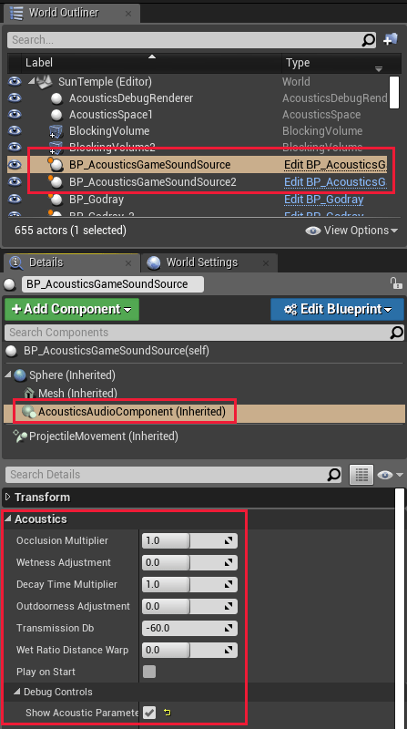
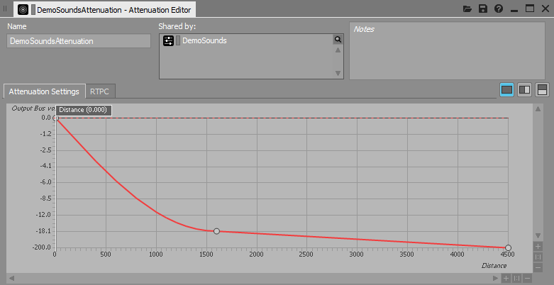

# Project Acoustics Unreal/Wwise Quickstart
In this quickstart, you'll experiment with Project Acoustics design controls using provided sample content for the Unreal Engine and Wwise.

Software requirements:
* [Unreal Engine](https://www.unrealengine.com/) 4.21
* [AudioKinetic Wwise](https://www.audiokinetic.com/products/wwise/) 2018.1.6

## Download the sample package
Download the [Project Acoustics Unreal + Wwise sample package](https://www.microsoft.com/download/details.aspx?id=58090). The sample package contains an Unreal Engine project, the Wwise project for that Unreal project, and the Project Acoustics Wwise plugin.

## Set up the Project Acoustics sample project
To set up the Project Acoustics Unreal/Wwise sample project, you'll need to first install the Project Acoustics plugin into Wwise. Then deploy the Wwise binaries to the Unreal project, and adjust the Wwise's Unreal plugin to support Project Acoustics.

### Install the Project Acoustics Wwise plugin
Open Wwise Launcher, then in the **Plugins** tab, under **Install New Plugins**, select **Add From Directory**. Choose the `AcousticsWwisePlugin\ProjectAcoustics` directory that was included in the package you downloaded.

### Add Wwise binaries to the Project Acoustics Unreal sample project
From Wwise Launcher, click the **Unreal Engine** tab, then click the hamburger menu next to **Recent Unreal Engine Projects** and select **Browse for project**. Open the sample Unreal project `.uproject` file in the package `AcousticsSample\AcousticsGame\AcousticsGame.uproject`.

Then, next to the Project Acoustics sample project, click **Integrate Wwise in Project**.

### Extend Wwise's Unreal plugin functionality
The Project Acoustics Unreal plugin requires additional behavior be exposed from the Wwise Unreal plugin API. Run the batch file provided with the Project Acoustics Unreal plugin to automate these modifications:
* Inside `AcousticsGame\Plugins\ProjectAcoustics\Resources`, run `PatchWwise.bat`.

    

* If you don't have the DirectX SDK installed, depending on the version of Wwise you're using, you might need to comment out the line that contains `DXSDK_DIR` in `AcousticsGame\Plugins\Wwise\Source\AkAudio\AkAudio.Build.cs`:

    

### Open the Unreal Project. 
It will ask you to rebuild modules; click Yes.

>If opening the project fails on build failures, check that you've installed the Project Acoustics Wwise plugin to the same version of Wwise used in the Project Acoustics sample project.

>If not using [AudioKinetic Wwise](https://www.audiokinetic.com/products/wwise/) 2018.1.6, you will need to regenerate sound banks before audio will play in the sample project.

## Experiment with Project Acoustics design controls
Listen to how the scene sounds by clicking the play button in the Unreal editor. On desktop, use W, A, S, D, and the mouse to move around. To see keyboard shortcuts for more controls, press **F1**. Here are some design activities to try:

### Modify occlusion and transmission
There are per-source Project Acoustics design controls on each Unreal sound actor:

If the **Occlusion** multiplier is greater than 1 (the default is 1), occlusion will be exaggerated. Setting it less than 1 makes the occlusion effect more subtle.

To enable through-wall transmission, move the **Transmission (dB)** slider off its lowest level. 

### Modify wetness for a source
To change how rapidly wetness changes with distance, use the **Perceptual Distance Warp**. Project Acoustics computes wet levels throughout the space from simulation, which vary smoothly with distance and provide perceptual distance cues. Increasing the distance warp exaggerates this effect by increasing distance-related wet levels. Warping values less than 1 make the distance-based reverberation change more subtle. This effect can also be adjusted in finer-grained detail by adjusting the **Wetness (dB)**.

Increase the decay time throughout the space by adjusting **Decay Time Scale**. Consider the case where the simulation result is a decay time of 1.5 s. Setting the **Decay Time Scale** to 2 will result in a decay time applied to the source of 3 s.

### Modify distance-based attenuation
The Project Acoustics Wwise mixer plugin respects the per-source distance-based attenuation built in Wwise. Changing this curve will change the dry-path level. The Project Acoustics plugin will adjust the wet level to maintain the wet-dry mix specified by simulation and design controls.

Project Acoustics does computation in a "simulation region" box centered around each simulated player location. The acoustics assets in the sample package were baked with a simulation region radius of 45 m, and the attenuations were designed to fall to 0 before 45 m. While this falloff isn't a strict requirement, it carries the caveat that only geometry within 45 m of the listener will occlude sounds.

## Next steps
* [Integrate the Project Acoustics](unreal-integration.md) plugin into your Unreal project
* [Create an Azure account](create-azure-account.md) for your own bakes

