# Project Acoustics Unreal/Wwise Design Tutorial
This tutorial describes the design setup and workflow for Project Acoustics in Unreal and Wwise.

Software prerequisites:
* An Unreal project with the Project Acoustics Wwise and Unreal plugins

To get an Unreal project with Project Acoustics, you can:
* Follow the [Project Acoustics Unreal integration](unreal-integration.md) instructions to add Project Acoustics to your Unreal project
* Or, use the [Project Acoustics sample project](unreal-quickstart.md).

## Setup project-wide Wwise properties
Wwise has global obstruction and occlusion curves that affect how the Project Acoustics plugin drives the Wwise audio DSP.

### Design Wwise occlusion curves
When Project Acoustics is active it responds to the occlusion volume, low-pass filter (LPF) and high-pass filter (HPF) curves you set in Wwise. We recommend setting your volume curve type to linear with a value of -100 dB for an Occlusion value of 100.

With this setting, if the Project Acoustics simulation computes an occlusion of -18 dB, it will input to the below curve at X=18, and the corresponding Y value is the attenuation applied. To do half occlusion, set the endpoint to -50 dB instead of -100 dB, or to -200 dB to exaggerate occlusion. You can tailor and fine-tune any curve that works best for your game.
 
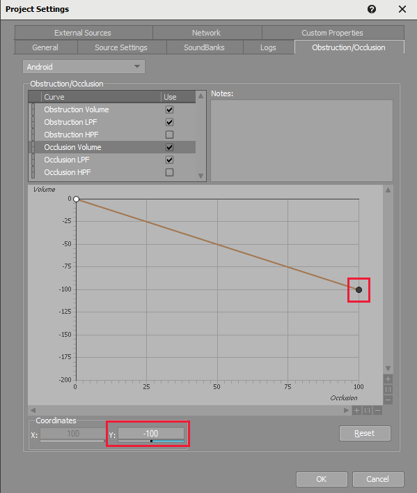

### Disable Wwise obstruction curves
The Wwise obstruction curves affect the dry level in isolation but Project Acoustics uses design controls and simulation to enforce wet/dry ratios. We recommend disabling the obstruction volume curve. To design the wetness, use the Wetness Adjust control described later.
 
If you're using obstruction LPF/HPF curves for other purposes, ensure that you have set them to Y=0 at X=0 (that is, there is no LPF or HPF when there is no obstruction).

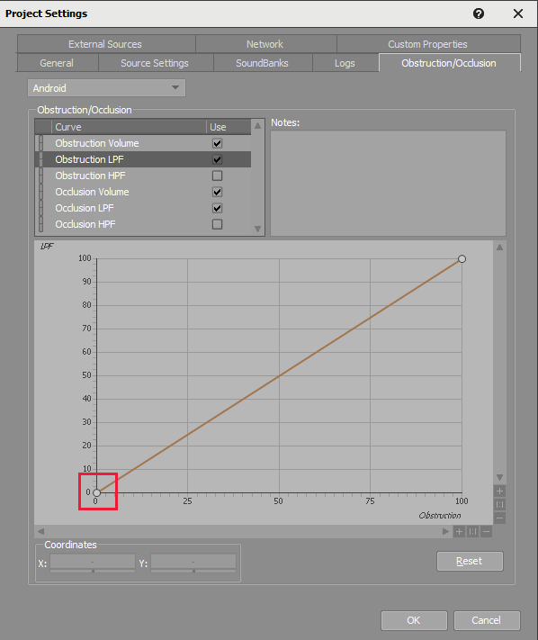

### Design Project Acoustics mixer parameters
You can control global reverb properties by visiting the mixer plugin tab of the Project Acoustics Bus. Double-click on "Project Acoustics Mixer (Custom)" to open the mixer plugin's settings panel.

You can also see that the mixer plugin has a "Perform Spatialization" option. If you'd rather use Project Acoustic's built-in spatialization, check the "Perform Spatialization" checkbox, and choose from either HRTF or Panning. Make sure to disable any Dry Aux busses you have set up, otherwise you'll hear the direct path twice. Use the "Wetness Adjust" and "Reverb Time Scale Factor" to exercise global control on the reverb mix. Note you must restart Unreal, then regenerate soundbanks before hitting play to pick up mixer plugin config changes such as the 'Perform Spatialization' checkbox.

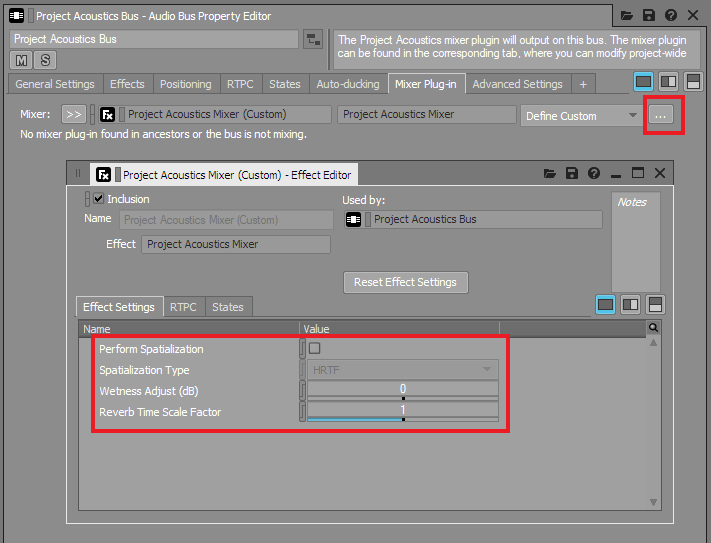

## Set Project Acoustics design controls in the Wwise actor-mixer hierarchy
To control parameters of an individual actor-mixer, double-click on the Actor-Mixer, then click on its Mixer Plug-in tab. Here you'll be able to change any parameters at the per-sound level. These values combine with the ones set from the Unreal side (described below). For example, if the Project Acoustics Unreal plugin sets Outdoorness Adjustment on an object to 0.5, and Wwise sets it to -0.25, the resulting Outdoorness Adjustment applied to that sound is 0.25.

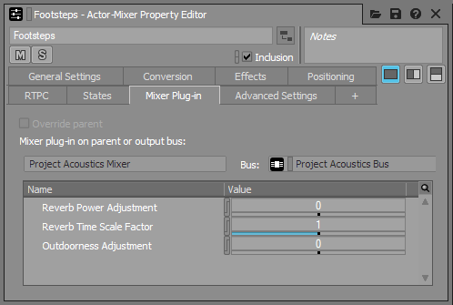

### Ensure the aux bus has dry send, and output bus has wet send
Remember that the required actor-mixer setup interchanges the usual dry and wet routing in Wwise. It produces reverb signal on the actor-mixer's output bus (set to Project Acoustics Bus) and dry signal along the user-defined aux bus. This routing is required due to features of the Wwise mixer plugin API that the Project Acoustics Wwise plugin uses.

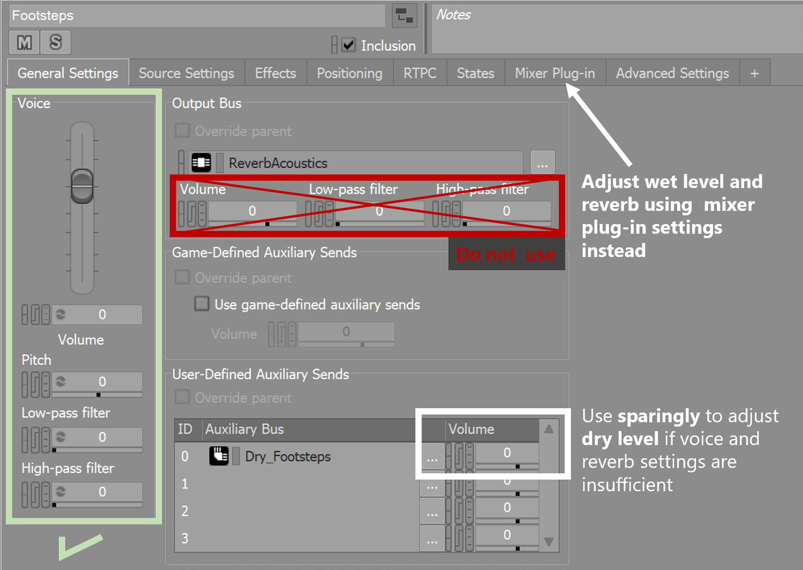
 
### Set up distance attenuation curves
Ensure any attenuation curve used by actor-mixers using Project Acoustics have user-defined aux send set to "output bus volume." Wwise does this by default for newly created attenuation curves. If you're migrating an existing project, check your curve settings.

By default, the Project Acoustics simulation has a radius of 45 meters around the player location. We generally recommend setting your attenuation curve to -200 dB around that distance. This distance isn't a hard constraint. For some sounds like weapons you might want a larger radius. In such cases, the caveat is that only geometry within 45 m of the player location will participate. If the player is in a room and a sound source is outside the room and 100m away, it will be properly occluded. If the source is in a room and the player is outside and 100 m away, it won't be properly occluded.

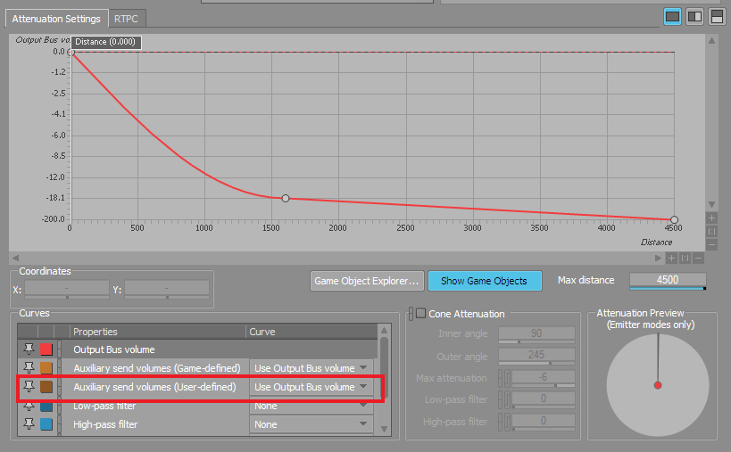

### Post Mixer Equalization ###
 One other thing you may want to do is add a post mixer equalizer. You can treat the Project Acoustics bus as a typical reverb bus (in default reverb mode) and put a filter on it to do equalization. You can see a sample of this in the Project Acoustics Wwise Sample Project.

For example, a high pass filter can help handle the bass from near-field recordings that yield boomy, unrealistic reverb. You can also achieve more post-bake control by adjusting the EQ through RTPCs, allowing you to alter the color of reverb at game-time.

## Set up scene-wide Project Acoustics properties

The Acoustics Space actor exposes many controls that modify the behavior of the system and are useful in debugging.

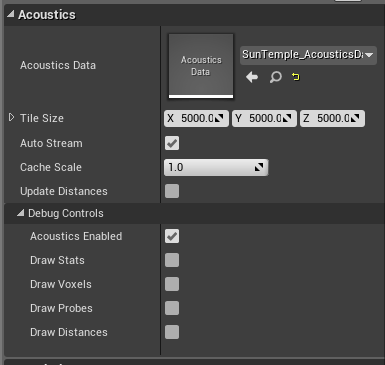

* **Acoustics Data:** This field must be assigned a baked acoustics asset from the Content/Acoustics directory. The Project Acoustics plugin will automatically add the Content/Acoustics directory to your project's packaged directories.
* **Tile size:** The extents of the region around the listener that you want acoustics data loaded into RAM. As long as listener probes immediately around the player are loaded in, the results are same as loading acoustic data for all probes. Larger tiles use more RAM, but reduce disk I/O
* **Auto Stream:** When enabled, automatically loads in new tiles as the listener reaches the edge of a loaded region. When disabled, you'll need to load new tiles manually via code or blueprints
* **Cache Scale:** controls the size of the cache used for acoustic queries. A smaller cache uses less RAM, but may increase CPU usage for each query.
* **Acoustics Enabled:** A debug control to enable quick A/B toggling of the Acoustics simulation. This control is ignored in shipping configurations. The control is useful for finding if a particular audio bug originates in the acoustics calculations or some other issue in the Wwise project.
* **Update Distances:** Use this option if you'd like to use the pre-baked acoustics information for distance queries. These queries are similar to ray casts, but they have been pre-computed so take much less CPU. An example usage is for discrete reflections off the closest surface to the listener. To fully leverage this, you'll need to use code or Blueprints to query distances.
* **Draw Stats:** While UE's `stat Acoustics` can provide you with CPU information, this status display will show the currently loaded ACE file, RAM usage, and other status information in the top left of the screen.
* **Draw Voxels:** Overlay voxels close to the listener showing the voxel grid used during runtime interpolation. If an emitter is inside a runtime voxel, it will fail acoustic queries.
* **Draw Probes:** Show all the probes for this scene. They will be different colors depending on their load state.
* **Draw Distances:** If Update Distances is enabled, this will show a box on the closest surface to the listener in quantized directions around the listener.

## Actor-specific acoustics design controls
These design controls are scoped to an individual audio component in Unreal.

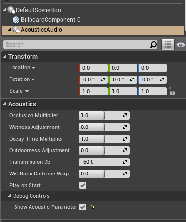

* **Occlusion Multiplier:** Controls the occlusion effect. Values > 1 will amplify the occlusion. Values <1 will minimize it.
* **Wetness Adjustment:** Additional reverb dB
* **Decay Time Multiplier:** Controls the RT60 multiplicatively, based on the output of the acoustics simulation
* **Outdoorness Adjustment:** Controls how outdoors the reverberation is. Values closer to 0 are more indoors, closer to 1 are more outdoors. This adjustment is additive, so setting it to -1 will enforce indoors, setting it to +1 will enforce outdoors.
* **Transmission Db:** Render an additional through-the-wall sound with this loudness combined with line-of-sight based distance attenuation.
* **Wet Ratio Distance Warp:** Adjusts the reverberation characteristics on the source as if it were closer/further away, without affecting the direct path.
* **Play on Start:** Toggle to specify whether the sound should automatically play on scene start. Enabled by default.
* **Show Acoustic Parameters:** Display debug information directly on top of the component in-game. (only for non-shipping configurations)

## Blueprint functionality
The Acoustics Space actor is accessible via blueprint, providing functionality such as loading a map or modifying settings via level scripting. We provide two examples here.

### Add finer-grained control over streaming load
To manage the acoustic data streaming yourself instead of streaming automatically based on player position, you can use the Force Load Tile blueprint function:

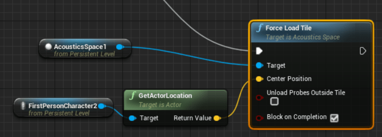

* **Target:** The AcousticsSpace actor
* **Center Position:** The center of the region that needs data loaded
* **Unload Probes Outside Tile:** If checked, all probes not in the new region will be unloaded from RAM. If unchecked, the new region is loaded into memory while leaving the existing probes also loaded into memory
* **Block on Completion:** Makes the tile load a synchronous operation

Tile size must already be set before calling Force Load Tile. For example, you could do something like this to load an ACE file, set your tile size, and stream in a region:

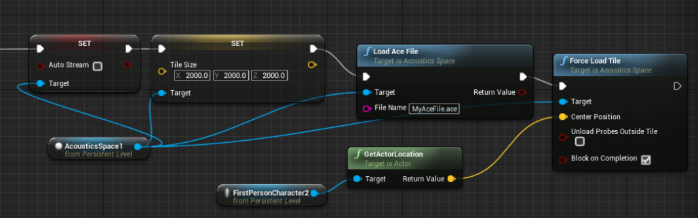

The Load Acoustics Data blueprint function used in this example has the following parameters:

* **Target:** The AcousticsSpace actor.
* **New Bake:** The acoustics data asset to be loaded. Leaving this blank/setting it to null will unload the current bake without loading a new one.

### Optionally query for surface proximity
If you want to see how close surfaces are in a particular direction around the listener, you can use the Query Distance function. This function can be useful for driving directional delayed reflections, or for other game logic driven by surface proximity. The query is less expensive than a ray-cast because the results are pulled from the acoustics lookup table.

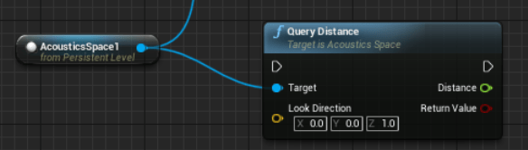

* **Target:** The AcousticsSpace actor
* **Look Direction:** The direction to query in, centered at the listener
* **Distance:** If query succeeds, the distance to the closest surface
* **Return Value:** Boolean - true if query succeeded, otherwise false

## Next steps
* Explore the concepts behind the [design process](design-process.md)
* [Create an Azure account](create-azure-account.md) to bake your own scene

