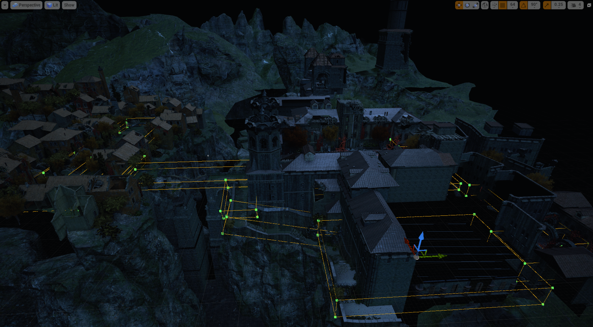

# What is acoustics?
The Unity plugin developed as part of Project Acoustics provides occlusion, obstruction, reverberation, and spatialization for VR and traditional titles on Windows and Android. It provides a way to design game acoustics that layers designer intentions over a physics-based wave simulation.

## Why use acoustics in games?
Humans use audio-visual cues to understand the world around them. In virtual worlds, combining spatial audio with acoustics increases user immersion. The acoustics tool described here analyzes virtual worlds to create a realistic acoustic simulation, and supports a post-simulation design process. The analysis includes both the geometry and the materials for each surface in the world. The simulation includes parameters such as arrival direction (portaling), reverb power and decay times, and occlusion and obstruction effects.

## How does this approach to acoustics work?
The system relies on an offline compute of the virtual world, allowing it to perform a more complex simulation than if the analysis was done in real-time. The offline compute produces a lookup table of acoustical parameters. The query result is processed through designer-specified rules before being applied to the audio engine at run-time. Tweaking these rules can achieve hyper-realistic effects for high emotional intensity or hypo-realistic scenes for more background audio sounds.

## Design process comparison
### Today's approach to acoustics
In a common approach to acoustics today, you draw reverb volumes:

Then you tweak parameters for each zone:

Finally, you add ray-tracing logic to get the right occlusion/obstruction filtering throughout the scene, and path-searching logic for portaling. The resulting logic has a run-time cost, in addition to problems with smoothness around corners and with edge cases in irregularly-shaped scenes.

### Physics-based design
With the approach provided by Project Acoustics' Unity plugin, you provide a static scene’s shape and materials. Because the scene is voxelized and the process doesn't use ray-tracing, it's not necessary to provide a simplified or watertight acoustics mesh. It's also not necessary to mark up the scene with other acoustics volumes or metadata. The plugin uploads the scene to Azure, where it analyzes the scene’s acoustics using wave simulation. The result is integrated into the title as a lookup table, and can be modified for aesthetic or gameplay effects globally, and on a per-sound-source basis.

## Requirements
* Unity 2018.2+ for bakes, and Unity 5.2+ for sound design and deployment
* Windows 64-bit Unity Editor
* Azure Batch subscription for bakes

## Platform support
* Windows desktop (x86 and AMD64)
* Windows UWP (x86, AMD64, and ARM)
* Android (x86 and ARM64)

## Next steps
* Learn more about the [design process](designprocess.md)
* Get started [integrating acoustics in your Unity title](gettingstarted.md)