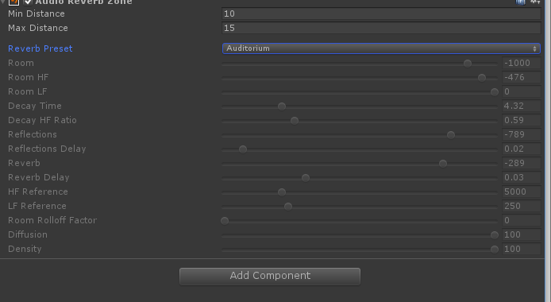
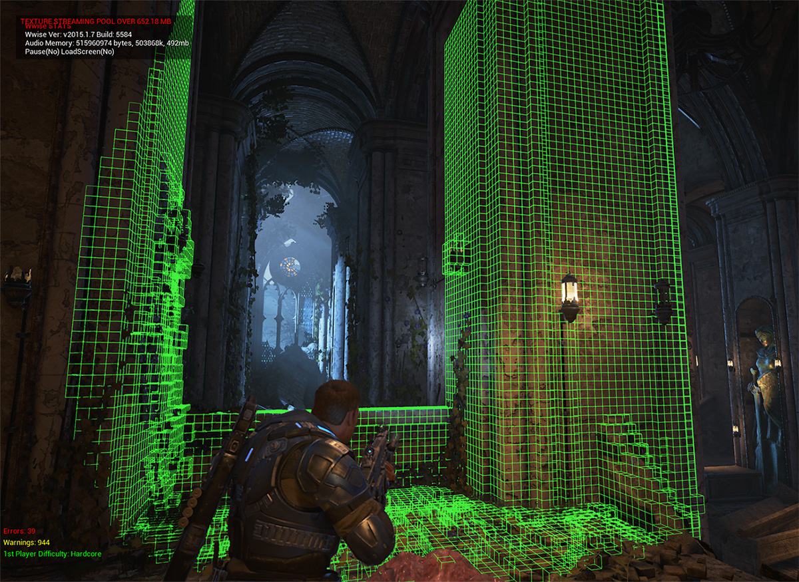

# What is Project Acoustics?
The Project Acoustics Unity plugin provides occlusion, reverberation, and spatialization for projects targeting VR and traditional screens. It provides a way to design game acoustics that layers designer intentions over a physics-based wave simulation.

## Why use acoustics in virtual environments?
Humans use audio-visual cues to understand the world around them. In virtual worlds, combining spatial audio with acoustics increases user immersion. The acoustics tool described here analyzes virtual worlds to create a realistic acoustic simulation, and supports a post-simulation design process. The analysis includes both the geometry and the materials for each surface in the world. The simulation includes parameters such as arrival direction (portaling), reverb power, decay times, and occlusion and obstruction effects.

## How does this approach to acoustics work?
The system relies on an offline compute of the virtual world, which allows a more complex simulation than if the analysis was done at run-time. The offline compute produces a lookup table of acoustic parameters. A designer specifies rules applied to the parameters at run-time. Tweaking these rules can achieve hyper-realistic effects for high emotional intensity or hypo-realistic scenes for more background audio sounds.

## Design process comparison
The Project Acoustics plugin supports a new design process for acoustics in Unity scenes. To explain this new design process, let's compare it to one of today's popular approaches to acoustics.

### Typical approach to acoustics today
In a typical approach to acoustics today, you draw reverb volumes:

Then tweak parameters for each zone:

Finally, add ray-tracing logic to get the right occlusion and obstruction filtering throughout the scene, and path-searching logic for portaling. This code can add a run-time cost. It also has problems with smoothness around corners and has edge cases in irregularly shaped scenes.

### An alternative approach with physics-based design
With the approach provided by Project Acoustics' Unity plugin, you provide a static scene’s shape and materials. Because the scene is voxelized and the process doesn't use ray-tracing, you don't need to provide a simplified or watertight acoustics mesh. It also isn't necessary to mark up the scene with reverb volumes. The plugin uploads the scene to the cloud, where it uses physics based wave simulation. The result is integrated into your project as a lookup table, and can be modified for aesthetic or gameplay effects.

## Requirements
* Unity 2018.2+ for acoustics bakes, and Unity 5.2+ for sound design and deployment
* Windows 64-bit Unity Editor
* Azure Batch subscription for acoustics bakes
* Unity scripting runtime must be set to '.NET 4.x equivalent'

## Platform support
* Windows desktop (x86 and AMD64)
* Windows UWP (x86, AMD64, and ARM)
* Android (x86 and ARM64)

## Download
If you're interested in evaluating the acoustics plugin, register [here](https://forms.office.com/Pages/ResponsePage.aspx?id=v4j5cvGGr0GRqy180BHbRwMoAEhDCLJNqtVIPwQN6rpUOFRZREJRR0NIQllDOTQ1U0JMNVc4OFNFSy4u) to join the Designer Preview.

## Next steps
* Learn more about the [design process](design-process.md)
* Get started [integrating acoustics in your Unity project](getting-started.md)

